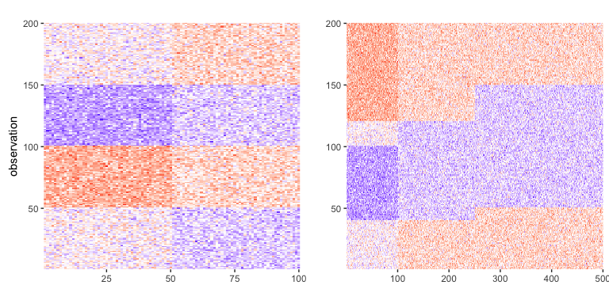

<!-- README.md is generated from README.Rmd. Please edit that file -->

## ajive: Angle based Joint and Individual Variation Explained

**Author:** [Iain Carmichael](https://idc9.github.io/)<br/> **License:**
[MIT](https://opensource.org/licenses/MIT)

Additional documentation, examples and code revisions are coming soon.
For questions, issues or feature requests please reach out to Iain:
<iain@unc.edu>.

# Overview

Angle based Joint and Individual Variation Explained (AJIVE) is a
dimensionality reduction algorithm for the multi-block setting i.e.
\(K\) different data matrices, with the same set of observations and
(possibly) different numbers of variables. **AJIVE finds *joint* modes
of variation which are common to all \(K\) data blocks as well as modes
of *individual* variation which are specific to each block.** For a
detailed discussion of AJIVE see [Angle-Based Joint and Individual
Variation Explained](https://arxiv.org/pdf/1704.02060.pdf).

A python version of this package can be found
[**here**](https://github.com/idc9/py_jive).

# Installation

The `ajive` package is currently available using devtools

``` r
# install.packages('devtools')
devtools::install_github("idc9/r_jive")
```

# Example

Consider the following two block toy example: the first block has 200
observations (rows) and 100 variables; the second block has the same set
of 200 observations and 500 variables (similar to Figure 2 of the AJIVE
paper).

``` r
library(ajive)

# sample a toy dataset with true joint rank of 1
blocks <- sample_toy_data(n=200, dx=100, dy=500)

data_blocks_heatmap(blocks, show_color_bar=FALSE)
```

<!-- -->

After selecting the initial signal ranks we can compute the AJIVE
decomposition using the `ajive` function.

``` r
initial_signal_ranks <- c(2, 3) # set by looking at scree plots
jive_results <- ajive(blocks, initial_signal_ranks, 
                      n_wedin_samples = 100, n_rand_dir_samples = 100)

# estimated joint rank
jive_results$joint_rank
#> [1] 1
```

The heatmap below shows that AJIVE separates the joint and individual
signals for this toy data set.

``` r
decomposition_heatmaps(blocks, jive_results)
```

<!-- -->

Using notation from Section 3 of the [AJIVE
paper](https://arxiv.org/pdf/1704.02060.pdf) (where *u* means scores and
*v* means loadings) we can get the jive data out as follows

``` r
# common normalized scores
jive_results$joint_scores
#>               [,1]
#>   [1,]  0.08289902
#>   [2,]  0.07365768
#>   [3,]  0.07758189
#>   [4,]  0.06846966
#>   [5,]  0.06190489
#>   [6,]  0.06584475
#>   [7,]  0.06948912
#>   [8,]  0.07110537
#>   [9,]  0.07219533
#>  [10,]  0.06711245
#>  [11,]  0.06912087
#>  [12,]  0.07521206
#>  [13,]  0.06618379
#>  [14,]  0.07394044
#>  [15,]  0.07226710
#>  [16,]  0.06944545
#>  [17,]  0.07561901
#>  [18,]  0.06859184
#>  [19,]  0.06870860
#>  [20,]  0.06710415
#>  [21,]  0.07198889
#>  [22,]  0.07939995
#>  [23,]  0.07868561
#>  [24,]  0.06731595
#>  [25,]  0.07290929
#>  [26,]  0.07176442
#>  [27,]  0.07149334
#>  [28,]  0.07159344
#>  [29,]  0.06770447
#>  [30,]  0.06607116
#>  [31,]  0.07762507
#>  [32,]  0.07368172
#>  [33,]  0.07848856
#>  [34,]  0.06707946
#>  [35,]  0.07221749
#>  [36,]  0.07138017
#>  [37,]  0.07222768
#>  [38,]  0.06654191
#>  [39,]  0.07172846
#>  [40,]  0.07307130
#>  [41,]  0.07356884
#>  [42,]  0.07038734
#>  [43,]  0.07297533
#>  [44,]  0.06620587
#>  [45,]  0.06475904
#>  [46,]  0.06940927
#>  [47,]  0.07069499
#>  [48,]  0.06885678
#>  [49,]  0.06536144
#>  [50,]  0.07179502
#>  [51,]  0.07426115
#>  [52,]  0.07304222
#>  [53,]  0.07535481
#>  [54,]  0.07581757
#>  [55,]  0.07549121
#>  [56,]  0.06184827
#>  [57,]  0.06328030
#>  [58,]  0.06710291
#>  [59,]  0.07082665
#>  [60,]  0.07037682
#>  [61,]  0.06883293
#>  [62,]  0.07219425
#>  [63,]  0.07308062
#>  [64,]  0.07372787
#>  [65,]  0.06247343
#>  [66,]  0.07256318
#>  [67,]  0.07640435
#>  [68,]  0.07294898
#>  [69,]  0.06988700
#>  [70,]  0.07448284
#>  [71,]  0.07912025
#>  [72,]  0.07173161
#>  [73,]  0.07405916
#>  [74,]  0.06770134
#>  [75,]  0.07823158
#>  [76,]  0.06993820
#>  [77,]  0.07499589
#>  [78,]  0.07274035
#>  [79,]  0.07825434
#>  [80,]  0.06570408
#>  [81,]  0.07633469
#>  [82,]  0.06925849
#>  [83,]  0.06800676
#>  [84,]  0.06980866
#>  [85,]  0.07368929
#>  [86,]  0.06570699
#>  [87,]  0.06824128
#>  [88,]  0.07579270
#>  [89,]  0.06559352
#>  [90,]  0.07214193
#>  [91,]  0.06496797
#>  [92,]  0.06819736
#>  [93,]  0.06711978
#>  [94,]  0.07071551
#>  [95,]  0.07773620
#>  [96,]  0.07110486
#>  [97,]  0.06460403
#>  [98,]  0.07079343
#>  [99,]  0.07492566
#> [100,]  0.06748370
#> [101,] -0.07145785
#> [102,] -0.07332191
#> [103,] -0.07332440
#> [104,] -0.06935923
#> [105,] -0.07554948
#> [106,] -0.06718705
#> [107,] -0.07029341
#> [108,] -0.07299302
#> [109,] -0.07150860
#> [110,] -0.07062298
#> [111,] -0.07323879
#> [112,] -0.07576319
#> [113,] -0.07011181
#> [114,] -0.07195537
#> [115,] -0.06907013
#> [116,] -0.06881288
#> [117,] -0.07371918
#> [118,] -0.06084986
#> [119,] -0.07093074
#> [120,] -0.06883096
#> [121,] -0.06691849
#> [122,] -0.07573232
#> [123,] -0.07132604
#> [124,] -0.06713928
#> [125,] -0.07969112
#> [126,] -0.07679718
#> [127,] -0.07735770
#> [128,] -0.07190898
#> [129,] -0.07239643
#> [130,] -0.07647297
#> [131,] -0.06909218
#> [132,] -0.06707939
#> [133,] -0.07462695
#> [134,] -0.07075679
#> [135,] -0.06716498
#> [136,] -0.07042592
#> [137,] -0.06787790
#> [138,] -0.08073323
#> [139,] -0.07048303
#> [140,] -0.06193529
#> [141,] -0.07855108
#> [142,] -0.07123190
#> [143,] -0.07729958
#> [144,] -0.06245337
#> [145,] -0.07302163
#> [146,] -0.07341684
#> [147,] -0.06890293
#> [148,] -0.06601861
#> [149,] -0.07391882
#> [150,] -0.07387306
#> [151,] -0.07037271
#> [152,] -0.06887715
#> [153,] -0.06542130
#> [154,] -0.06769365
#> [155,] -0.08014780
#> [156,] -0.07466444
#> [157,] -0.07731297
#> [158,] -0.06690259
#> [159,] -0.06160206
#> [160,] -0.06454365
#> [161,] -0.07112077
#> [162,] -0.06368060
#> [163,] -0.07149803
#> [164,] -0.06476192
#> [165,] -0.05575944
#> [166,] -0.07549203
#> [167,] -0.06565008
#> [168,] -0.06970400
#> [169,] -0.06812108
#> [170,] -0.07024545
#> [171,] -0.06415392
#> [172,] -0.06569351
#> [173,] -0.06425524
#> [174,] -0.06250468
#> [175,] -0.07128410
#> [176,] -0.07093512
#> [177,] -0.06343237
#> [178,] -0.06939514
#> [179,] -0.06631033
#> [180,] -0.06165473
#> [181,] -0.07210751
#> [182,] -0.07233201
#> [183,] -0.07080548
#> [184,] -0.07301382
#> [185,] -0.06471819
#> [186,] -0.06913830
#> [187,] -0.06665156
#> [188,] -0.06083857
#> [189,] -0.07421936
#> [190,] -0.07000908
#> [191,] -0.06848481
#> [192,] -0.06773584
#> [193,] -0.06973942
#> [194,] -0.07890015
#> [195,] -0.06788314
#> [196,] -0.06835933
#> [197,] -0.07172846
#> [198,] -0.06854336
#> [199,] -0.07539657
#> [200,] -0.06361625

# Full matrix representation of the joint signal for the first block
jive_results$block_decomps[[1]][['joint']][['full']]
#>             [,1]      [,2]      [,3]      [,4]      [,5]      [,6]
#>   [1,] -5778.882 -5934.680 -5614.810 -5831.154 -5965.123 -5856.416
#>   [2,] -5134.669 -5273.100 -4988.888 -5181.115 -5300.149 -5203.561
#>   [3,] -5408.225 -5554.031 -5254.677 -5457.145 -5582.521 -5480.787
#>   [4,] -4773.012 -4901.693 -4637.499 -4816.186 -4926.837 -4837.051
#>   [5,] -4315.383 -4431.726 -4192.863 -4354.417 -4454.459 -4373.282
#>   [6,] -4590.031 -4713.778 -4459.713 -4631.549 -4737.958 -4651.615
#>   [7,] -4844.079 -4974.675 -4706.548 -4887.895 -5000.193 -4909.071
#>   [8,] -4956.748 -5090.382 -4816.018 -5001.584 -5116.494 -5023.252
#>   [9,] -5032.729 -5168.411 -4889.842 -5078.252 -5194.923 -5100.252
#>  [10,] -4678.401 -4804.531 -4545.574 -4720.719 -4829.177 -4741.171
#>  [11,] -4818.408 -4948.312 -4681.606 -4861.993 -4973.696 -4883.056
#>  [12,] -5243.025 -5384.377 -5094.167 -5290.450 -5411.997 -5313.370
#>  [13,] -4613.665 -4738.049 -4482.676 -4655.398 -4762.354 -4675.566
#>  [14,] -5154.380 -5293.342 -5008.039 -5201.004 -5320.495 -5223.536
#>  [15,] -5037.732 -5173.549 -4894.703 -5083.300 -5200.088 -5105.323
#>  [16,] -4841.035 -4971.549 -4703.590 -4884.824 -4997.051 -4905.986
#>  [17,] -5271.393 -5413.509 -5121.730 -5319.075 -5441.279 -5342.118
#>  [18,] -4781.530 -4910.439 -4645.775 -4824.780 -4935.628 -4845.683
#>  [19,] -4789.669 -4918.799 -4653.683 -4832.994 -4944.030 -4853.932
#>  [20,] -4677.823 -4803.937 -4545.012 -4720.136 -4828.580 -4740.585
#>  [21,] -5018.338 -5153.632 -4875.859 -5063.731 -5180.068 -5085.668
#>  [22,] -5534.962 -5684.184 -5377.816 -5585.028 -5713.342 -5609.224
#>  [23,] -5485.165 -5633.045 -5329.433 -5534.781 -5661.941 -5558.759
#>  [24,] -4692.588 -4819.100 -4559.358 -4735.034 -4843.820 -4755.548
#>  [25,] -5082.499 -5219.523 -4938.199 -5128.472 -5246.297 -5150.690
#>  [26,] -5002.690 -5137.563 -4860.656 -5047.942 -5163.917 -5069.811
#>  [27,] -4983.793 -5118.156 -4842.296 -5028.874 -5144.411 -5050.660
#>  [28,] -4990.771 -5125.322 -4849.075 -5035.915 -5151.613 -5057.732
#>  [29,] -4719.671 -4846.914 -4585.673 -4762.363 -4871.777 -4782.995
#>  [30,] -4605.813 -4729.986 -4475.047 -4647.475 -4754.249 -4667.609
#>  [31,] -5411.235 -5557.122 -5257.602 -5460.182 -5585.628 -5483.837
#>  [32,] -5136.345 -5274.821 -4990.516 -5182.805 -5301.879 -5205.259
#>  [33,] -5471.429 -5618.939 -5316.087 -5520.920 -5647.762 -5544.838
#>  [34,] -4676.102 -4802.170 -4543.340 -4718.399 -4826.803 -4738.841
#>  [35,] -5034.274 -5169.997 -4891.343 -5079.811 -5196.518 -5101.818
#>  [36,] -4975.904 -5110.054 -4834.630 -5020.913 -5136.267 -5042.665
#>  [37,] -5034.984 -5170.727 -4892.033 -5080.527 -5197.251 -5102.538
#>  [38,] -4638.630 -4763.687 -4506.932 -4680.588 -4788.123 -4700.865
#>  [39,] -5000.184 -5134.988 -4858.221 -5045.412 -5161.329 -5067.270
#>  [40,] -5093.793 -5231.121 -4949.172 -5139.868 -5257.955 -5162.136
#>  [41,] -5128.476 -5266.740 -4982.871 -5174.865 -5293.756 -5197.284
#>  [42,] -4906.694 -5038.978 -4767.385 -4951.077 -5064.827 -4972.527
#>  [43,] -5087.103 -5224.251 -4942.672 -5133.117 -5251.049 -5155.356
#>  [44,] -4615.204 -4739.630 -4484.171 -4656.951 -4763.943 -4677.126
#>  [45,] -4514.346 -4636.052 -4386.176 -4555.180 -4659.834 -4574.914
#>  [46,] -4838.513 -4968.959 -4701.140 -4882.279 -4994.448 -4903.430
#>  [47,] -4928.140 -5061.003 -4788.222 -4972.717 -5086.964 -4994.260
#>  [48,] -4799.999 -4929.407 -4663.720 -4843.417 -4954.693 -4864.400
#>  [49,] -4556.339 -4679.178 -4426.978 -4597.553 -4703.180 -4617.471
#>  [50,] -5004.823 -5139.753 -4862.729 -5050.094 -5166.118 -5071.972
#>  [51,] -5176.737 -5316.302 -5029.761 -5223.563 -5343.572 -5246.193
#>  [52,] -5091.766 -5229.039 -4947.202 -5137.823 -5255.863 -5160.081
#>  [53,] -5252.975 -5394.596 -5103.835 -5300.491 -5422.268 -5323.454
#>  [54,] -5285.235 -5427.725 -5135.179 -5333.042 -5455.567 -5356.146
#>  [55,] -5262.484 -5404.361 -5113.074 -5310.086 -5432.083 -5333.090
#>  [56,] -4311.436 -4427.673 -4189.028 -4350.435 -4450.385 -4369.282
#>  [57,] -4411.263 -4530.191 -4286.020 -4451.165 -4553.429 -4470.448
#>  [58,] -4677.737 -4803.848 -4544.928 -4720.049 -4828.490 -4740.497
#>  [59,] -4937.318 -5070.428 -4797.140 -4981.978 -5096.438 -5003.562
#>  [60,] -4905.961 -5038.225 -4766.673 -4950.337 -5064.070 -4971.784
#>  [61,] -4798.336 -4927.699 -4662.104 -4841.739 -4952.977 -4862.715
#>  [62,] -5032.654 -5168.334 -4889.769 -5078.176 -5194.846 -5100.176
#>  [63,] -5094.442 -5231.788 -4949.803 -5140.523 -5258.625 -5162.793
#>  [64,] -5139.562 -5278.124 -4993.641 -5186.051 -5305.199 -5208.518
#>  [65,] -4355.016 -4472.427 -4231.370 -4394.409 -4495.369 -4413.447
#>  [66,] -5058.372 -5194.745 -4914.757 -5104.127 -5221.393 -5126.239
#>  [67,] -5326.139 -5469.732 -5174.922 -5374.316 -5497.790 -5397.599
#>  [68,] -5085.266 -5222.364 -4940.887 -5131.264 -5249.153 -5153.494
#>  [69,] -4871.816 -5003.160 -4733.497 -4915.883 -5028.824 -4937.180
#>  [70,] -5192.191 -5332.173 -5044.777 -5239.157 -5359.525 -5261.854
#>  [71,] -5515.464 -5664.161 -5358.871 -5565.354 -5693.216 -5589.464
#>  [72,] -5000.403 -5135.214 -4858.434 -5045.634 -5161.556 -5067.493
#>  [73,] -5162.656 -5301.841 -5016.081 -5209.355 -5329.038 -5231.923
#>  [74,] -4719.453 -4846.690 -4585.461 -4762.143 -4871.552 -4782.774
#>  [75,] -5453.515 -5600.542 -5298.681 -5502.844 -5629.270 -5526.684
#>  [76,] -4875.384 -5006.825 -4736.965 -4919.484 -5032.508 -4940.797
#>  [77,] -5227.956 -5368.901 -5079.526 -5275.245 -5396.442 -5298.098
#>  [78,] -5070.722 -5207.429 -4926.756 -5116.589 -5234.141 -5138.755
#>  [79,] -5455.102 -5602.171 -5300.223 -5504.445 -5630.909 -5528.292
#>  [80,] -4580.225 -4703.707 -4450.185 -4621.655 -4727.836 -4641.677
#>  [81,] -5321.283 -5464.745 -5170.204 -5369.417 -5492.777 -5392.678
#>  [82,] -4828.002 -4958.165 -4690.927 -4871.673 -4983.598 -4892.779
#>  [83,] -4740.744 -4868.554 -4606.147 -4783.626 -4893.528 -4804.350
#>  [84,] -4866.354 -4997.551 -4728.191 -4910.372 -5023.186 -4931.645
#>  [85,] -5136.872 -5275.362 -4991.029 -5183.337 -5302.423 -5205.793
#>  [86,] -4580.427 -4703.916 -4450.382 -4621.859 -4728.045 -4641.882
#>  [87,] -4757.093 -4885.344 -4622.031 -4800.122 -4910.404 -4820.918
#>  [88,] -5283.501 -5425.944 -5133.494 -5331.292 -5453.777 -5354.389
#>  [89,] -4572.517 -4695.792 -4442.696 -4613.877 -4719.880 -4633.866
#>  [90,] -5029.007 -5164.588 -4886.225 -5074.496 -5191.081 -5096.480
#>  [91,] -4528.910 -4651.010 -4400.327 -4569.876 -4674.868 -4589.674
#>  [92,] -4754.031 -4882.199 -4619.056 -4797.033 -4907.243 -4817.815
#>  [93,] -4678.912 -4805.056 -4546.071 -4721.235 -4829.704 -4741.689
#>  [94,] -4929.571 -5062.472 -4789.613 -4974.161 -5088.441 -4995.710
#>  [95,] -5418.982 -5565.078 -5265.129 -5467.999 -5593.625 -5491.688
#>  [96,] -4956.712 -5090.345 -4815.984 -5001.548 -5116.457 -5023.216
#>  [97,] -4503.540 -4624.955 -4375.677 -4544.276 -4648.680 -4563.963
#>  [98,] -4935.002 -5068.050 -4794.890 -4979.642 -5094.047 -5001.215
#>  [99,] -5223.060 -5363.873 -5074.769 -5270.304 -5391.388 -5293.137
#> [100,] -4704.282 -4831.109 -4570.720 -4746.834 -4855.891 -4767.398
#> [101,]  4981.319  5115.616  4839.892  5026.377  5141.857  5048.153
#> [102,]  5111.262  5249.062  4966.146  5157.496  5275.988  5179.840
#> [103,]  5111.436  5249.240  4966.315  5157.671  5276.167  5180.016
#> [104,]  4835.025  4965.377  4697.751  4878.760  4990.848  4899.896
#> [105,]  5266.546  5408.532  5117.020  5314.184  5436.276  5337.206
#> [106,]  4683.602  4809.872  4550.627  4725.967  4834.545  4746.441
#> [107,]  4900.146  5032.254  4761.023  4944.470  5058.068  4965.891
#> [108,]  5088.335  5225.517  4943.870  5134.362  5252.322  5156.605
#> [109,]  4984.857  5119.249  4843.329  5029.947  5145.509  5051.738
#> [110,]  4923.121  5055.848  4783.346  4967.652  5081.783  4989.173
#> [111,]  5105.468  5243.111  4960.516  5151.649  5270.007  5173.968
#> [112,]  5281.444  5423.831  5131.495  5329.217  5451.654  5352.304
#> [113,]  4887.487  5019.253  4748.723  4931.696  5045.000  4953.061
#> [114,]  5016.001  5151.232  4873.589  5061.373  5177.656  5083.300
#> [115,]  4814.871  4944.680  4678.169  4858.424  4970.044  4879.472
#> [116,]  4796.939  4926.264  4660.746  4840.329  4951.534  4861.298
#> [117,]  5138.956  5277.503  4993.053  5185.440  5304.574  5207.905
#> [118,]  4241.837  4356.197  4121.405  4280.206  4378.543  4298.749
#> [119,]  4944.575  5077.880  4804.191  4989.300  5103.928  5010.915
#> [120,]  4798.199  4927.558  4661.970  4841.600  4952.835  4862.576
#> [121,]  4664.881  4790.646  4532.438  4707.077  4815.220  4727.469
#> [122,]  5279.292  5421.622  5129.405  5327.046  5449.433  5350.124
#> [123,]  4972.130  5106.179  4830.964  5017.105  5132.372  5038.841
#> [124,]  4680.272  4806.452  4547.392  4722.607  4831.107  4743.066
#> [125,]  5555.259  5705.029  5397.537  5605.509  5734.294  5629.793
#> [126,]  5353.523  5497.854  5201.528  5401.948  5526.056  5425.350
#> [127,]  5392.597  5537.981  5239.493  5441.375  5566.389  5464.949
#> [128,]  5012.767  5147.911  4870.447  5058.110  5174.318  5080.023
#> [129,]  5046.747  5182.807  4903.462  5092.397  5209.393  5114.459
#> [130,]  5330.923  5474.644  5179.570  5379.143  5502.727  5402.447
#> [131,]  4816.408  4946.258  4679.663  4859.975  4971.631  4881.029
#> [132,]  4676.097  4802.165  4543.336  4718.394  4826.798  4738.836
#> [133,]  5202.237  5342.489  5054.537  5249.293  5369.894  5272.034
#> [134,]  4932.449  5065.427  4792.409  4977.065  5091.411  4998.627
#> [135,]  4682.063  4808.292  4549.132  4724.415  4832.957  4744.882
#> [136,]  4909.383  5041.740  4769.998  4953.790  5067.602  4975.252
#> [137,]  4731.761  4859.329  4597.419  4774.562  4884.256  4795.246
#> [138,]  5627.905  5779.633  5468.120  5678.811  5809.280  5703.414
#> [139,]  4913.365  5045.829  4773.867  4957.808  5071.712  4979.287
#> [140,]  4317.502  4433.902  4194.922  4356.556  4456.647  4375.430
#> [141,]  5475.787  5623.414  5320.321  5525.318  5652.260  5549.255
#> [142,]  4965.568  5099.440  4824.588  5010.484  5125.598  5032.190
#> [143,]  5388.545  5533.821  5235.556  5437.287  5562.207  5460.843
#> [144,]  4353.618  4470.991  4230.012  4392.998  4493.926  4412.029
#> [145,]  5090.330  5227.565  4945.808  5136.374  5254.381  5158.627
#> [146,]  5117.880  5255.858  4972.576  5164.174  5282.819  5186.546
#> [147,]  4803.216  4932.710  4666.845  4846.663  4958.014  4867.660
#> [148,]  4602.150  4726.224  4471.488  4643.778  4750.468  4663.896
#> [149,]  5152.873  5291.794  5006.575  5199.483  5318.939  5222.008
#> [150,]  5149.683  5288.518  5003.475  5196.264  5315.646  5218.775
#> [151,]  4905.674  5037.931  4766.394  4950.048  5063.773  4971.493
#> [152,]  4801.419  4930.865  4665.099  4844.849  4956.158  4865.839
#> [153,]  4560.512  4683.463  4431.032  4601.764  4707.488  4621.700
#> [154,]  4718.917  4846.139  4584.939  4761.601  4870.998  4782.230
#> [155,]  5587.094  5737.722  5428.468  5637.632  5767.155  5662.056
#> [156,]  5204.850  5345.173  5057.077  5251.930  5372.592  5274.683
#> [157,]  5389.479  5534.779  5236.463  5438.229  5563.170  5461.789
#> [158,]  4663.772  4789.507  4531.360  4705.958  4814.076  4726.345
#> [159,]  4294.273  4410.046  4172.352  4333.116  4432.668  4351.889
#> [160,]  4499.331  4620.633  4371.588  4540.029  4644.335  4559.698
#> [161,]  4957.821  5091.484  4817.061  5002.666  5117.601  5024.339
#> [162,]  4439.168  4558.847  4313.133  4479.322  4582.233  4498.727
#> [163,]  4984.120  5118.492  4842.613  5029.203  5144.748  5050.991
#> [164,]  4514.547  4636.259  4386.372  4555.383  4660.041  4575.118
#> [165,]  3886.984  3991.777  3776.627  3922.144  4012.254  3939.136
#> [166,]  5262.541  5404.419  5113.130  5310.143  5432.142  5333.148
#> [167,]  4576.460  4699.842  4446.528  4617.856  4723.950  4637.862
#> [168,]  4859.059  4990.059  4721.102  4903.011  5015.656  4924.252
#> [169,]  4748.714  4876.739  4613.890  4791.668  4901.755  4812.426
#> [170,]  4896.803  5028.821  4757.775  4941.097  5054.617  4962.503
#> [171,]  4472.163  4592.732  4345.191  4512.616  4616.292  4532.165
#> [172,]  4579.487  4702.950  4449.469  4620.911  4727.075  4640.930
#> [173,]  4479.226  4599.985  4352.054  4519.742  4623.582  4539.323
#> [174,]  4357.194  4474.664  4233.487  4396.607  4497.618  4415.654
#> [175,]  4969.207  5103.176  4828.123  5014.155  5129.354  5035.878
#> [176,]  4944.879  5078.193  4804.487  4989.608  5104.243  5011.224
#> [177,]  4421.864  4541.077  4296.321  4461.862  4564.372  4481.192
#> [178,]  4837.528  4967.947  4700.183  4881.285  4993.431  4902.432
#> [179,]  4622.486  4747.108  4491.247  4664.299  4771.460  4684.506
#> [180,]  4297.945  4413.817  4175.919  4336.821  4436.459  4355.610
#> [181,]  5026.606  5162.124  4883.893  5072.074  5188.604  5094.048
#> [182,]  5042.257  5178.196  4899.099  5087.866  5204.758  5109.908
#> [183,]  4935.842  5068.913  4795.706  4980.489  5094.914  5002.066
#> [184,]  5089.786  5227.006  4945.279  5135.825  5253.819  5158.075
#> [185,]  4511.498  4633.128  4383.410  4552.307  4656.895  4572.029
#> [186,]  4819.624  4949.560  4682.787  4863.219  4974.950  4884.288
#> [187,]  4646.273  4771.537  4514.359  4688.301  4796.013  4708.612
#> [188,]  4241.050  4355.389  4120.640  4279.412  4377.730  4297.952
#> [189,]  5173.824  5313.310  5026.931  5220.623  5340.566  5243.241
#> [190,]  4880.326  5011.899  4741.766  4924.470  5037.608  4945.804
#> [191,]  4774.069  4902.778  4638.526  4817.252  4927.927  4838.122
#> [192,]  4721.858  4849.159  4587.797  4764.569  4874.034  4785.211
#> [193,]  4861.527  4992.594  4723.501  4905.502  5018.204  4926.754
#> [194,]  5500.121  5648.404  5343.964  5549.872  5677.378  5573.915
#> [195,]  4732.127  4859.705  4597.774  4774.931  4884.633  4795.617
#> [196,]  4765.321  4893.794  4630.027  4808.426  4918.898  4829.257
#> [197,]  5000.183  5134.988  4858.220  5045.412  5161.329  5067.270
#> [198,]  4778.150  4906.969  4642.491  4821.371  4932.140  4842.258
#> [199,]  5255.887  5397.585  5106.664  5303.428  5425.273  5326.404
#> [200,]  4434.682  4554.241  4308.775  4474.796  4577.603  4494.182
#>             [,7]      [,8]      [,9]     [,10]     [,11]     [,12]
#>   [1,] -5946.035 -5463.934 -5836.253 -5867.810 -5581.306 -6018.477
#>   [2,] -5283.189 -4854.831 -5185.645 -5213.684 -4959.119 -5347.555
#>   [3,] -5564.657 -5113.478 -5461.916 -5491.449 -5223.322 -5632.453
#>   [4,] -4911.071 -4512.884 -4820.398 -4846.462 -4609.827 -4970.904
#>   [5,] -4440.205 -4080.195 -4358.225 -4381.790 -4167.843 -4494.301
#>   [6,] -4722.797 -4339.875 -4635.599 -4660.664 -4433.101 -4780.336
#>   [7,] -4984.193 -4580.077 -4892.169 -4918.622 -4678.463 -5044.917
#>   [8,] -5100.121 -4686.606 -5005.957 -5033.025 -4787.280 -5162.257
#>   [9,] -5178.300 -4758.446 -5082.692 -5110.175 -4860.663 -5241.388
#>  [10,] -4813.724 -4423.429 -4724.847 -4750.395 -4518.450 -4872.370
#>  [11,] -4957.780 -4555.806 -4866.244 -4892.556 -4653.670 -5018.182
#>  [12,] -5394.679 -4957.281 -5295.076 -5323.707 -5063.770 -5460.404
#>  [13,] -4747.115 -4362.221 -4659.468 -4684.662 -4455.927 -4804.950
#>  [14,] -5303.470 -4873.467 -5205.551 -5233.698 -4978.155 -5368.084
#>  [15,] -5183.448 -4763.177 -5087.745 -5115.255 -4865.495 -5246.599
#>  [16,] -4981.061 -4577.199 -4889.095 -4915.531 -4675.523 -5041.747
#>  [17,] -5423.867 -4984.103 -5323.726 -5352.511 -5091.168 -5489.948
#>  [18,] -4919.835 -4520.937 -4828.999 -4855.110 -4618.052 -4979.774
#>  [19,] -4928.210 -4528.633 -4837.220 -4863.375 -4625.914 -4988.251
#>  [20,] -4813.129 -4422.883 -4724.263 -4749.807 -4517.892 -4871.768
#>  [21,] -5163.493 -4744.839 -5068.158 -5095.562 -4846.764 -5226.401
#>  [22,] -5695.060 -5233.308 -5589.912 -5620.136 -5345.725 -5764.444
#>  [23,] -5643.823 -5186.225 -5539.620 -5569.573 -5297.631 -5712.583
#>  [24,] -4828.321 -4436.843 -4739.175 -4764.800 -4532.152 -4887.145
#>  [25,] -5229.510 -4805.504 -5132.957 -5160.711 -4908.732 -5293.222
#>  [26,] -5147.392 -4730.045 -5052.355 -5079.674 -4831.652 -5210.104
#>  [27,] -5127.949 -4712.178 -5033.271 -5060.486 -4813.401 -5190.424
#>  [28,] -5135.129 -4718.775 -5040.318 -5067.571 -4820.140 -5197.691
#>  [29,] -4856.187 -4462.450 -4766.527 -4792.300 -4558.309 -4915.351
#>  [30,] -4739.036 -4354.797 -4651.539 -4676.690 -4448.344 -4796.773
#>  [31,] -5567.755 -5116.324 -5464.956 -5494.506 -5226.229 -5635.588
#>  [32,] -5284.913 -4856.415 -5187.337 -5215.385 -4960.737 -5349.301
#>  [33,] -5629.689 -5173.237 -5525.748 -5555.626 -5284.365 -5698.277
#>  [34,] -4811.358 -4421.256 -4722.525 -4748.060 -4516.230 -4869.976
#>  [35,] -5179.889 -4759.907 -5084.252 -5111.743 -4862.155 -5242.997
#>  [36,] -5119.831 -4704.718 -5025.303 -5052.475 -4805.781 -5182.208
#>  [37,] -5180.620 -4760.578 -5084.970 -5112.464 -4862.841 -5243.737
#>  [38,] -4772.801 -4385.825 -4684.681 -4710.011 -4480.038 -4830.950
#>  [39,] -5144.813 -4727.675 -5049.824 -5077.129 -4829.231 -5207.494
#>  [40,] -5241.130 -4816.182 -5144.363 -5172.178 -4919.640 -5304.984
#>  [41,] -5276.817 -4848.975 -5179.390 -5207.396 -4953.137 -5341.106
#>  [42,] -5048.620 -4639.280 -4955.406 -4982.200 -4738.938 -5110.128
#>  [43,] -5234.246 -4809.857 -5137.606 -5165.385 -4913.178 -5298.017
#>  [44,] -4748.699 -4363.677 -4661.023 -4686.225 -4457.414 -4806.553
#>  [45,] -4644.923 -4268.315 -4559.163 -4583.814 -4360.003 -4701.513
#>  [46,] -4978.466 -4574.815 -4886.548 -4912.970 -4673.087 -5039.120
#>  [47,] -5070.686 -4659.557 -4977.065 -5003.976 -4759.650 -5132.463
#>  [48,] -4938.838 -4538.400 -4847.652 -4873.864 -4635.890 -4999.010
#>  [49,] -4688.131 -4308.019 -4601.573 -4626.454 -4400.561 -4745.247
#>  [50,] -5149.587 -4732.061 -5054.510 -5081.840 -4833.712 -5212.326
#>  [51,] -5326.473 -4894.606 -5228.130 -5256.399 -4999.748 -5391.367
#>  [52,] -5239.044 -4814.265 -5142.315 -5170.120 -4917.682 -5302.873
#>  [53,] -5404.917 -4966.689 -5305.126 -5333.811 -5073.380 -5470.767
#>  [54,] -5438.110 -4997.191 -5337.705 -5366.566 -5104.536 -5504.364
#>  [55,] -5414.701 -4975.680 -5314.729 -5343.466 -5082.564 -5480.670
#>  [56,] -4436.144 -4076.464 -4354.239 -4377.783 -4164.031 -4490.191
#>  [57,] -4538.858 -4170.850 -4455.057 -4479.146 -4260.445 -4594.156
#>  [58,] -4813.040 -4422.801 -4724.176 -4749.720 -4517.808 -4871.678
#>  [59,] -5080.130 -4668.235 -4986.334 -5013.296 -4768.515 -5142.022
#>  [60,] -5047.865 -4638.587 -4954.666 -4981.456 -4738.229 -5109.365
#>  [61,] -4937.128 -4536.828 -4845.973 -4872.175 -4634.285 -4997.278
#>  [62,] -5178.223 -4758.375 -5082.616 -5110.098 -4860.591 -5241.310
#>  [63,] -5241.798 -4816.796 -5145.018 -5172.837 -4920.266 -5305.660
#>  [64,] -5288.223 -4859.457 -5190.586 -5218.651 -4963.844 -5352.651
#>  [65,] -4480.985 -4117.669 -4398.252 -4422.033 -4206.121 -4535.577
#>  [66,] -5204.685 -4782.692 -5108.590 -5136.212 -4885.430 -5268.095
#>  [67,] -5480.197 -5035.866 -5379.016 -5408.100 -5144.042 -5546.964
#>  [68,] -5232.357 -4808.120 -5135.751 -5163.520 -4911.404 -5296.104
#>  [69,] -5012.732 -4606.303 -4920.182 -4946.785 -4705.252 -5073.804
#>  [70,] -5342.375 -4909.218 -5243.738 -5272.091 -5014.674 -5407.462
#>  [71,] -5674.998 -5214.872 -5570.220 -5600.338 -5326.894 -5744.138
#>  [72,] -5145.039 -4727.882 -5050.046 -5077.351 -4829.443 -5207.722
#>  [73,] -5311.986 -4881.293 -5213.910 -5242.102 -4986.149 -5376.703
#>  [74,] -4855.963 -4462.244 -4766.307 -4792.078 -4558.099 -4915.124
#>  [75,] -5611.257 -5156.299 -5507.656 -5537.436 -5267.063 -5679.621
#>  [76,] -5016.404 -4609.677 -4923.786 -4950.409 -4708.698 -5077.520
#>  [77,] -5379.174 -4943.033 -5279.857 -5308.406 -5049.215 -5444.709
#>  [78,] -5217.392 -4794.369 -5121.063 -5148.753 -4897.358 -5280.957
#>  [79,] -5612.890 -5157.800 -5509.259 -5539.047 -5268.596 -5681.273
#>  [80,] -4712.707 -4330.603 -4625.696 -4650.707 -4423.630 -4770.123
#>  [81,] -5475.201 -5031.275 -5374.112 -5403.170 -5139.352 -5541.907
#>  [82,] -4967.651 -4564.877 -4875.933 -4902.297 -4662.936 -5028.173
#>  [83,] -4877.869 -4482.374 -4787.809 -4813.697 -4578.661 -4937.298
#>  [84,] -5007.113 -4601.139 -4914.666 -4941.239 -4699.977 -5068.116
#>  [85,] -5285.456 -4856.914 -5187.870 -5215.921 -4961.246 -5349.850
#>  [86,] -4712.916 -4330.795 -4625.901 -4650.913 -4423.826 -4770.334
#>  [87,] -4894.691 -4497.832 -4804.320 -4830.297 -4594.451 -4954.324
#>  [88,] -5436.326 -4995.551 -5335.954 -5364.806 -5102.862 -5502.558
#>  [89,] -4704.777 -4323.316 -4617.912 -4642.881 -4416.186 -4762.096
#>  [90,] -5174.470 -4754.927 -5078.933 -5106.395 -4857.068 -5237.512
#>  [91,] -4659.908 -4282.086 -4573.872 -4598.603 -4374.070 -4716.681
#>  [92,] -4891.540 -4494.937 -4801.227 -4827.188 -4591.494 -4951.135
#>  [93,] -4814.250 -4423.913 -4725.363 -4750.914 -4518.944 -4872.903
#>  [94,] -5072.158 -4660.910 -4978.510 -5005.429 -4761.032 -5133.953
#>  [95,] -5575.726 -5123.649 -5472.781 -5502.372 -5233.711 -5643.656
#>  [96,] -5100.085 -4686.573 -5005.921 -5032.988 -4787.246 -5162.220
#>  [97,] -4633.804 -4258.098 -4548.250 -4572.842 -4349.567 -4690.259
#>  [98,] -5077.747 -4666.046 -4983.996 -5010.944 -4766.278 -5139.610
#>  [99,] -5374.136 -4938.404 -5274.913 -5303.434 -5044.487 -5439.611
#> [100,] -4840.352 -4447.899 -4750.984 -4776.673 -4543.445 -4899.324
#> [101,]  5125.403  4709.838  5030.772  5057.974  4811.011  5187.847
#> [102,]  5259.105  4832.700  5162.006  5189.917  4936.512  5323.178
#> [103,]  5259.284  4832.864  5162.181  5190.093  4936.680  5323.359
#> [104,]  4974.877  4571.517  4883.026  4909.428  4669.719  5035.488
#> [105,]  5418.880  4979.520  5318.831  5347.590  5086.486  5484.900
#> [106,]  4819.075  4428.346  4730.099  4755.675  4523.473  4877.786
#> [107,]  5041.882  4633.089  4948.793  4975.552  4732.613  5103.309
#> [108,]  5235.515  4811.022  5138.851  5166.637  4914.369  5299.301
#> [109,]  5129.043  4713.183  5034.345  5061.566  4814.428  5191.532
#> [110,]  5065.521  4654.811  4971.996  4998.880  4754.803  5127.236
#> [111,]  5253.143  4827.221  5156.154  5184.033  4930.916  5317.144
#> [112,]  5434.209  4993.606  5333.877  5362.717  5100.875  5500.415
#> [113,]  5028.857  4621.120  4936.008  4962.697  4720.387  5090.124
#> [114,]  5161.088  4742.630  5065.798  5093.189  4844.507  5223.967
#> [115,]  4954.141  4552.462  4862.672  4888.964  4650.254  5014.498
#> [116,]  4935.689  4535.506  4844.561  4870.756  4632.935  4995.822
#> [117,]  5287.600  4858.884  5189.974  5218.037  4963.259  5352.020
#> [118,]  4364.532  4010.658  4283.949  4307.112  4096.811  4417.706
#> [119,]  5087.596  4675.096  4993.663  5020.664  4775.523  5149.579
#> [120,]  4936.986  4536.698  4845.834  4872.035  4634.152  4997.135
#> [121,]  4799.812  4410.646  4711.193  4736.666  4505.392  4858.289
#> [122,]  5431.995  4991.572  5331.704  5360.532  5098.797  5498.175
#> [123,]  5115.949  4701.150  5021.492  5048.644  4802.137  5178.278
#> [124,]  4815.648  4425.198  4726.736  4752.294  4520.256  4874.318
#> [125,]  5715.945  5252.499  5610.410  5640.746  5365.329  5785.583
#> [126,]  5508.373  5061.757  5406.671  5435.905  5170.490  5575.483
#> [127,]  5548.577  5098.702  5446.133  5475.581  5208.228  5616.177
#> [128,]  5157.761  4739.572  5062.532  5089.906  4841.384  5220.599
#> [129,]  5192.724  4771.700  5096.850  5124.409  4874.202  5255.988
#> [130,]  5485.119  5040.389  5383.847  5412.957  5148.662  5551.946
#> [131,]  4955.722  4553.915  4864.224  4890.525  4651.739  5016.099
#> [132,]  4811.353  4421.251  4722.520  4748.055  4516.225  4869.971
#> [133,]  5352.711  4918.716  5253.883  5282.291  5024.376  5417.924
#> [134,]  5075.119  4663.631  4981.417  5008.351  4763.812  5136.951
#> [135,]  4817.492  4426.892  4728.546  4754.113  4521.987  4876.184
#> [136,]  5051.386  4641.823  4958.122  4984.931  4741.535  5112.929
#> [137,]  4868.627  4473.881  4778.737  4804.575  4569.985  4927.942
#> [138,]  5790.691  5321.185  5683.777  5714.509  5435.490  5861.241
#> [139,]  5055.483  4645.587  4962.143  4988.974  4745.380  5117.075
#> [140,]  4442.386  4082.199  4360.365  4383.942  4169.890  4496.508
#> [141,]  5634.174  5177.358  5530.149  5560.051  5288.574  5702.816
#> [142,]  5109.197  4694.946  5014.865  5041.980  4795.799  5171.443
#> [143,]  5544.409  5094.871  5442.041  5471.467  5204.315  5611.957
#> [144,]  4479.545  4116.346  4396.839  4420.613  4204.770  4534.121
#> [145,]  5237.567  4812.908  5140.866  5168.662  4916.295  5301.378
#> [146,]  5265.915  4838.957  5168.689  5196.637  4942.904  5330.070
#> [147,]  4942.148  4541.442  4850.901  4877.130  4638.997  5002.360
#> [148,]  4735.267  4351.334  4647.839  4672.970  4444.806  4792.958
#> [149,]  5301.919  4872.042  5204.029  5232.168  4976.700  5366.514
#> [150,]  5298.637  4869.026  5200.807  5228.928  4973.619  5363.191
#> [151,]  5047.570  4638.316  4954.376  4981.164  4737.952  5109.066
#> [152,]  4940.299  4539.742  4849.086  4875.305  4637.261  5000.488
#> [153,]  4692.424  4311.965  4605.788  4630.691  4404.591  4749.593
#> [154,]  4855.411  4461.737  4765.765  4791.534  4557.580  4914.566
#> [155,]  5748.700  5282.599  5642.561  5673.071  5396.075  5818.738
#> [156,]  5355.400  4921.187  5256.523  5284.945  5026.900  5420.646
#> [157,]  5545.369  5095.753  5442.984  5472.414  5205.216  5612.929
#> [158,]  4798.671  4409.597  4710.073  4735.540  4504.321  4857.135
#> [159,]  4418.484  4060.236  4336.905  4360.355  4147.455  4472.316
#> [160,]  4629.474  4254.119  4543.999  4568.569  4345.502  4685.876
#> [161,]  5101.225  4687.621  5007.041  5034.114  4788.317  5163.375
#> [162,]  4567.570  4197.234  4483.238  4507.479  4287.396  4623.218
#> [163,]  5128.285  4712.486  5033.601  5060.818  4813.716  5190.764
#> [164,]  4645.130  4268.505  4559.366  4584.019  4360.198  4701.722
#> [165,]  3999.415  3675.144  3925.573  3946.799  3754.091  4048.141
#> [166,]  5414.760  4975.734  5314.786  5343.524  5082.619  5480.729
#> [167,]  4708.834  4327.044  4621.894  4646.885  4419.994  4766.203
#> [168,]  4999.606  4594.241  4907.298  4933.832  4692.931  5060.518
#> [169,]  4886.070  4489.910  4795.857  4821.789  4586.358  4945.598
#> [170,]  5038.443  4629.928  4945.417  4972.157  4729.385  5099.827
#> [171,]  4601.520  4228.431  4516.561  4540.983  4319.263  4657.581
#> [172,]  4711.948  4329.906  4624.951  4649.958  4422.918  4769.355
#> [173,]  4608.787  4235.109  4523.694  4548.154  4326.084  4664.937
#> [174,]  4483.226  4119.728  4400.451  4424.245  4208.225  4537.846
#> [175,]  5112.941  4698.386  5018.540  5045.675  4799.313  5175.233
#> [176,]  5087.910  4675.385  4993.971  5020.973  4775.817  5149.897
#> [177,]  4549.766  4180.873  4465.763  4489.910  4270.684  4605.197
#> [178,]  4977.453  4573.883  4885.553  4911.970  4672.136  5038.094
#> [179,]  4756.191  4370.562  4668.377  4693.619  4464.447  4814.137
#> [180,]  4422.262  4063.708  4340.614  4364.083  4151.001  4476.140
#> [181,]  5172.001  4752.657  5076.509  5103.958  4854.750  5235.012
#> [182,]  5188.103  4767.455  5092.315  5119.849  4869.865  5251.311
#> [183,]  5078.611  4666.840  4984.844  5011.797  4767.089  5140.485
#> [184,]  5237.007  4812.393  5140.316  5168.109  4915.769  5300.811
#> [185,]  4641.993  4265.623  4556.287  4580.923  4357.253  4698.548
#> [186,]  4959.031  4556.955  4867.471  4893.790  4654.844  5019.448
#> [187,]  4780.666  4393.052  4692.400  4717.772  4487.421  4838.910
#> [188,]  4363.722  4009.914  4283.154  4306.313  4096.052  4416.886
#> [189,]  5323.476  4891.852  5225.188  5253.441  4996.935  5388.333
#> [190,]  5021.488  4614.349  4928.776  4955.426  4713.471  5082.666
#> [191,]  4912.158  4513.883  4821.465  4847.534  4610.847  4972.004
#> [192,]  4858.437  4464.518  4768.735  4794.520  4560.421  4917.629
#> [193,]  5002.146  4596.575  4909.791  4936.339  4695.315  5063.089
#> [194,]  5659.211  5200.365  5554.725  5584.759  5312.076  5728.159
#> [195,]  4869.003  4474.227  4779.106  4804.947  4570.339  4928.323
#> [196,]  4903.158  4505.612  4812.630  4838.652  4602.398  4962.894
#> [197,]  5144.813  4727.674  5049.824  5077.128  4829.231  5207.494
#> [198,]  4916.358  4517.742  4825.587  4851.679  4614.789  4976.255
#> [199,]  5407.913  4969.442  5308.066  5336.767  5076.192  5473.799
#> [200,]  4562.955  4192.993  4478.708  4502.925  4283.063  4618.546
#>            [,13]     [,14]     [,15]     [,16]     [,17]     [,18]
#>   [1,] -5843.579 -6004.769 -6141.187 -6025.955 -5849.274 -5932.636
#>   [2,] -5192.154 -5335.375 -5456.586 -5354.200 -5197.215 -5271.283
#>   [3,] -5468.772 -5619.624 -5747.292 -5639.451 -5474.103 -5552.118
#>   [4,] -4826.448 -4959.582 -5072.255 -4977.081 -4831.152 -4900.004
#>   [5,] -4363.695 -4484.064 -4585.935 -4499.885 -4367.949 -4430.199
#>   [6,] -4641.418 -4769.447 -4877.801 -4786.275 -4645.942 -4712.154
#>   [7,] -4898.310 -5033.426 -5147.777 -5051.185 -4903.084 -4972.961
#>   [8,] -5012.241 -5150.499 -5267.510 -5168.672 -5017.126 -5088.628
#>   [9,] -5089.072 -5229.450 -5348.254 -5247.901 -5094.032 -5166.631
#>  [10,] -4730.778 -4861.272 -4971.713 -4878.424 -4735.389 -4802.876
#>  [11,] -4872.352 -5006.752 -5120.497 -5024.417 -4877.101 -4946.608
#>  [12,] -5301.723 -5447.966 -5571.735 -5467.188 -5306.890 -5382.522
#>  [13,] -4665.317 -4794.005 -4902.918 -4810.920 -4669.864 -4736.417
#>  [14,] -5212.085 -5355.856 -5477.533 -5374.753 -5217.166 -5291.519
#>  [15,] -5094.131 -5234.648 -5353.571 -5253.118 -5099.096 -5171.767
#>  [16,] -4895.232 -5030.263 -5144.542 -5048.011 -4900.003 -4969.836
#>  [17,] -5330.408 -5477.443 -5601.882 -5496.769 -5335.604 -5411.645
#>  [18,] -4835.060 -4968.432 -5081.306 -4985.962 -4839.773 -4908.748
#>  [19,] -4843.291 -4976.889 -5089.956 -4994.449 -4848.012 -4917.104
#>  [20,] -4730.193 -4860.671 -4971.098 -4877.821 -4734.804 -4802.282
#>  [21,] -5074.520 -5214.496 -5332.961 -5232.895 -5079.466 -5151.857
#>  [22,] -5596.928 -5751.314 -5881.975 -5771.607 -5602.383 -5682.226
#>  [23,] -5546.574 -5699.571 -5829.056 -5719.681 -5551.980 -5631.105
#>  [24,] -4745.123 -4876.013 -4986.789 -4893.218 -4749.748 -4817.440
#>  [25,] -5139.399 -5281.165 -5401.145 -5299.799 -5144.409 -5217.725
#>  [26,] -5058.697 -5198.237 -5316.333 -5216.578 -5063.628 -5135.793
#>  [27,] -5039.589 -5178.601 -5296.251 -5196.873 -5044.501 -5116.393
#>  [28,] -5046.645 -5185.852 -5303.666 -5204.149 -5051.564 -5123.557
#>  [29,] -4772.510 -4904.155 -5015.570 -4921.459 -4777.162 -4845.244
#>  [30,] -4657.377 -4785.847 -4894.574 -4802.733 -4661.917 -4728.357
#>  [31,] -5471.816 -5622.751 -5750.491 -5642.590 -5477.149 -5555.208
#>  [32,] -5193.848 -5337.116 -5458.367 -5355.947 -5198.911 -5273.004
#>  [33,] -5532.684 -5685.298 -5814.459 -5705.358 -5538.076 -5617.003
#>  [34,] -4728.453 -4858.883 -4969.269 -4876.027 -4733.062 -4800.516
#>  [35,] -5090.634 -5231.055 -5349.896 -5249.512 -5095.596 -5168.217
#>  [36,] -5031.611 -5170.404 -5287.867 -5188.647 -5036.515 -5108.294
#>  [37,] -5091.352 -5231.793 -5350.651 -5250.253 -5096.315 -5168.946
#>  [38,] -4690.561 -4819.946 -4929.447 -4836.952 -4695.133 -4762.046
#>  [39,] -5056.162 -5195.632 -5313.669 -5213.964 -5061.091 -5133.220
#>  [40,] -5150.820 -5292.901 -5413.147 -5311.576 -5155.840 -5229.319
#>  [41,] -5185.891 -5328.940 -5450.005 -5347.742 -5190.946 -5264.926
#>  [42,] -4961.626 -5098.489 -5214.318 -5116.478 -4966.462 -5037.243
#>  [43,] -5144.055 -5285.949 -5406.037 -5304.599 -5149.068 -5222.451
#>  [44,] -4666.873 -4795.605 -4904.553 -4812.525 -4671.422 -4737.997
#>  [45,] -4564.885 -4690.804 -4797.371 -4707.355 -4569.335 -4634.455
#>  [46,] -4892.681 -5027.642 -5141.862 -5045.381 -4897.450 -4967.247
#>  [47,] -4983.312 -5120.773 -5237.108 -5138.840 -4988.170 -5059.259
#>  [48,] -4853.737 -4987.623 -5100.934 -5005.221 -4858.468 -4927.709
#>  [49,] -4607.349 -4734.439 -4841.998 -4751.143 -4611.840 -4677.566
#>  [50,] -5060.854 -5200.453 -5318.599 -5218.802 -5065.787 -5137.983
#>  [51,] -5234.692 -5379.087 -5501.291 -5398.066 -5239.795 -5314.470
#>  [52,] -5148.770 -5290.794 -5410.993 -5309.462 -5153.788 -5227.238
#>  [53,] -5311.784 -5458.305 -5582.309 -5477.564 -5316.962 -5392.737
#>  [54,] -5344.405 -5491.826 -5616.591 -5511.203 -5349.614 -5425.855
#>  [55,] -5321.400 -5468.186 -5592.414 -5487.479 -5326.586 -5402.499
#>  [56,] -4359.704 -4479.963 -4581.741 -4495.770 -4363.954 -4426.147
#>  [57,] -4460.649 -4583.692 -4687.826 -4599.865 -4464.997 -4528.630
#>  [58,] -4730.106 -4860.581 -4971.006 -4877.731 -4734.716 -4802.193
#>  [59,] -4992.593 -5130.310 -5246.862 -5148.411 -4997.460 -5068.681
#>  [60,] -4960.885 -5097.727 -5213.539 -5115.713 -4965.720 -5036.490
#>  [61,] -4852.056 -4985.895 -5099.167 -5003.487 -4856.785 -4926.002
#>  [62,] -5088.996 -5229.372 -5348.175 -5247.823 -5093.956 -5166.554
#>  [63,] -5151.476 -5293.575 -5413.837 -5312.253 -5156.497 -5229.986
#>  [64,] -5197.101 -5340.458 -5461.785 -5359.301 -5202.166 -5276.306
#>  [65,] -4403.772 -4525.246 -4628.053 -4541.213 -4408.065 -4470.887
#>  [66,] -5115.002 -5256.095 -5375.505 -5274.640 -5119.988 -5192.956
#>  [67,] -5385.767 -5534.329 -5660.060 -5553.856 -5391.017 -5467.848
#>  [68,] -5142.197 -5284.040 -5404.085 -5302.684 -5147.209 -5220.566
#>  [69,] -4926.357 -5062.247 -5177.253 -5080.108 -4931.159 -5001.436
#>  [70,] -5250.320 -5395.145 -5517.714 -5414.181 -5255.437 -5330.336
#>  [71,] -5577.212 -5731.054 -5861.255 -5751.275 -5582.648 -5662.210
#>  [72,] -5056.384 -5195.860 -5313.902 -5214.193 -5061.313 -5133.445
#>  [73,] -5220.454 -5364.456 -5486.328 -5383.384 -5225.543 -5300.015
#>  [74,] -4772.289 -4903.929 -5015.338 -4921.232 -4776.941 -4845.020
#>  [75,] -5514.569 -5666.684 -5795.422 -5686.678 -5519.944 -5598.612
#>  [76,] -4929.966 -5065.955 -5181.045 -5083.829 -4934.771 -5005.100
#>  [77,] -5286.484 -5432.308 -5555.721 -5451.475 -5291.637 -5367.052
#>  [78,] -5127.491 -5268.928 -5388.630 -5287.519 -5132.488 -5205.635
#>  [79,] -5516.174 -5668.333 -5797.108 -5688.332 -5521.550 -5600.241
#>  [80,] -4631.502 -4759.258 -4867.381 -4776.050 -4636.016 -4702.087
#>  [81,] -5380.857 -5529.283 -5654.900 -5548.793 -5386.102 -5462.863
#>  [82,] -4882.053 -5016.720 -5130.692 -5034.421 -4886.812 -4956.457
#>  [83,] -4793.818 -4926.052 -5037.964 -4943.432 -4798.491 -4866.877
#>  [84,] -4920.834 -5056.572 -5171.449 -5074.413 -4925.631 -4995.829
#>  [85,] -5194.381 -5337.664 -5458.927 -5356.497 -5199.444 -5273.545
#>  [86,] -4631.707 -4759.469 -4867.596 -4776.262 -4636.221 -4702.295
#>  [87,] -4810.350 -4943.039 -5055.337 -4960.480 -4815.039 -4883.661
#>  [88,] -5342.652 -5490.024 -5614.749 -5509.395 -5347.859 -5424.075
#>  [89,] -4623.708 -4751.249 -4859.190 -4768.013 -4628.215 -4694.174
#>  [90,] -5085.308 -5225.582 -5344.299 -5244.020 -5090.265 -5162.809
#>  [91,] -4579.613 -4705.938 -4812.849 -4722.542 -4584.077 -4649.407
#>  [92,] -4807.254 -4939.858 -5052.083 -4957.287 -4811.939 -4880.517
#>  [93,] -4731.295 -4861.803 -4972.256 -4878.957 -4735.906 -4803.401
#>  [94,] -4984.759 -5122.259 -5238.629 -5140.332 -4989.618 -5060.728
#>  [95,] -5479.650 -5630.801 -5758.724 -5650.669 -5484.991 -5563.161
#>  [96,] -5012.205 -5150.462 -5267.472 -5168.634 -5017.090 -5088.592
#>  [97,] -4553.959 -4679.576 -4785.888 -4696.087 -4558.397 -4623.362
#>  [98,] -4990.252 -5127.903 -5244.401 -5145.996 -4995.116 -5066.304
#>  [99,] -5281.534 -5427.220 -5550.518 -5446.369 -5286.682 -5362.026
#> [100,] -4756.948 -4888.164 -4999.215 -4905.411 -4761.584 -4829.445
#> [101,]  5037.087  5176.031  5293.622  5194.293  5041.997  5113.853
#> [102,]  5168.485  5311.053  5431.712  5329.792  5173.523  5247.254
#> [103,]  5168.661  5311.234  5431.896  5329.973  5173.698  5247.432
#> [104,]  4889.155  5024.018  5138.156  5041.744  4893.920  4963.667
#> [105,]  5325.507  5472.406  5596.731  5491.715  5330.698  5406.669
#> [106,]  4736.036  4866.676  4977.239  4883.847  4740.653  4808.215
#> [107,]  4955.005  5091.685  5207.359  5109.650  4959.835  5030.520
#> [108,]  5145.301  5287.230  5407.347  5305.885  5150.316  5223.717
#> [109,]  5040.664  5179.707  5297.381  5197.982  5045.577  5117.485
#> [110,]  4978.237  5115.557  5231.774  5133.606  4983.089  5054.106
#> [111,]  5162.626  5305.032  5425.554  5323.750  5167.658  5241.305
#> [112,]  5340.572  5487.887  5612.563  5507.250  5345.777  5421.963
#> [113,]  4942.204  5078.530  5193.906  5096.449  4947.021  5017.524
#> [114,]  5072.157  5212.068  5330.478  5230.458  5077.101  5149.458
#> [115,]  4868.775  5003.076  5116.738  5020.729  4873.521  4942.977
#> [116,]  4850.642  4984.443  5097.681  5002.030  4855.370  4924.567
#> [117,]  5196.489  5339.830  5461.142  5358.670  5201.554  5275.685
#> [118,]  4289.326  4407.643  4507.778  4423.195  4293.507  4354.696
#> [119,]  4999.931  5137.850  5254.574  5155.978  5004.804  5076.131
#> [120,]  4851.916  4985.752  5099.021  5003.344  4856.645  4925.861
#> [121,]  4717.106  4847.223  4957.345  4864.326  4721.704  4788.996
#> [122,]  5338.396  5485.651  5610.276  5505.006  5343.599  5419.754
#> [123,]  5027.795  5166.483  5283.857  5184.712  5032.696  5104.420
#> [124,]  4732.669  4863.216  4973.700  4880.375  4737.282  4804.796
#> [125,]  5617.452  5772.405  5903.545  5792.772  5622.928  5703.064
#> [126,]  5413.458  5562.783  5689.161  5582.410  5418.734  5495.960
#> [127,]  5452.969  5603.385  5730.685  5623.155  5458.284  5536.074
#> [128,]  5068.887  5208.708  5327.041  5227.086  5073.828  5146.138
#> [129,]  5103.247  5244.016  5363.152  5262.519  5108.221  5181.022
#> [130,]  5390.604  5539.300  5665.144  5558.844  5395.859  5472.758
#> [131,]  4870.330  5004.674  5118.372  5022.332  4875.077  4944.555
#> [132,]  4728.448  4858.878  4969.264  4876.022  4733.057  4800.511
#> [133,]  5260.478  5405.583  5528.390  5424.656  5265.605  5340.649
#> [134,]  4987.669  5125.250  5241.687  5143.333  4992.531  5063.682
#> [135,]  4734.481  4865.077  4975.604  4882.243  4739.095  4806.635
#> [136,]  4964.345  5101.283  5217.176  5119.282  4969.184  5040.003
#> [137,]  4784.735  4916.718  5028.418  4934.065  4789.399  4857.655
#> [138,]  5690.911  5847.890  5980.745  5868.523  5696.458  5777.642
#> [139,]  4968.372  5105.420  5221.407  5123.434  4973.214  5044.091
#> [140,]  4365.838  4486.266  4588.187  4502.095  4370.094  4432.375
#> [141,]  5537.091  5689.826  5819.090  5709.902  5542.488  5621.477
#> [142,]  5021.159  5159.664  5276.883  5177.869  5026.054  5097.683
#> [143,]  5448.872  5599.175  5726.379  5618.930  5454.183  5531.914
#> [144,]  4402.358  4523.793  4626.566  4539.755  4406.649  4469.451
#> [145,]  5147.318  5289.303  5409.467  5307.965  5152.335  5225.765
#> [146,]  5175.177  5317.930  5438.745  5336.693  5180.221  5254.048
#> [147,]  4856.990  4990.966  5104.352  5008.575  4861.724  4931.011
#> [148,]  4653.673  4782.040  4890.681  4798.913  4658.209  4724.596
#> [149,]  5210.561  5354.290  5475.931  5373.182  5215.640  5289.971
#> [150,]  5207.335  5350.975  5472.541  5369.855  5212.411  5286.696
#> [151,]  4960.595  5097.428  5213.234  5115.414  4965.430  5036.195
#> [152,]  4855.172  4989.098  5102.442  5006.701  4859.905  4929.166
#> [153,]  4611.569  4738.775  4846.432  4755.495  4616.064  4681.850
#> [154,]  4771.747  4903.371  5014.768  4920.672  4776.398  4844.469
#> [155,]  5649.644  5805.484  5937.376  5825.968  5655.151  5735.746
#> [156,]  5263.121  5408.299  5531.167  5427.381  5268.251  5343.332
#> [157,]  5449.816  5600.144  5727.371  5619.903  5455.128  5532.872
#> [158,]  4715.985  4846.071  4956.166  4863.170  4720.581  4787.857
#> [159,]  4342.349  4462.129  4563.501  4477.873  4346.581  4408.527
#> [160,]  4549.703  4675.203  4781.416  4691.698  4554.137  4619.041
#> [161,]  5013.326  5151.614  5268.650  5169.790  5018.212  5089.730
#> [162,]  4488.866  4612.687  4717.480  4628.962  4493.241  4557.277
#> [163,]  5039.919  5178.941  5296.598  5197.214  5044.832  5116.729
#> [164,]  4565.089  4691.013  4797.585  4707.564  4569.538  4634.662
#> [165,]  3930.501  4038.920  4130.678  4053.171  3934.332  3990.402
#> [166,]  5321.457  5468.245  5592.475  5487.539  5326.644  5402.558
#> [167,]  4627.695  4755.347  4863.380  4772.125  4632.206  4698.223
#> [168,]  4913.458  5048.991  5163.696  5066.806  4918.247  4988.340
#> [169,]  4801.877  4934.333  5046.433  4951.743  4806.558  4875.059
#> [170,]  4951.625  5088.211  5203.807  5106.164  4956.451  5027.088
#> [171,]  4522.230  4646.972  4752.544  4663.368  4526.638  4591.150
#> [172,]  4630.756  4758.492  4866.597  4775.281  4635.270  4701.330
#> [173,]  4529.372  4654.311  4760.050  4670.733  4533.787  4598.401
#> [174,]  4405.975  4527.510  4630.367  4543.484  4410.269  4473.123
#> [175,]  5024.839  5163.445  5280.750  5181.663  5029.737  5101.419
#> [176,]  5000.239  5138.167  5254.897  5156.296  5005.113  5076.444
#> [177,]  4471.368  4594.707  4699.092  4610.919  4475.727  4539.513
#> [178,]  4891.686  5026.619  5140.815  5044.354  4896.454  4966.236
#> [179,]  4674.237  4803.172  4912.292  4820.119  4678.793  4745.473
#> [180,]  4346.062  4465.944  4567.403  4481.702  4350.298  4412.297
#> [181,]  5082.881  5223.088  5341.748  5241.517  5087.835  5160.345
#> [182,]  5098.706  5239.350  5358.380  5257.836  5103.676  5176.412
#> [183,]  4991.101  5128.776  5245.294  5146.872  4995.966  5067.167
#> [184,]  5146.768  5288.737  5408.888  5307.397  5151.784  5225.206
#> [185,]  4562.006  4687.845  4794.346  4704.386  4566.453  4631.532
#> [186,]  4873.581  5008.015  5121.789  5025.684  4878.331  4947.855
#> [187,]  4698.290  4827.888  4937.570  4844.923  4702.870  4769.893
#> [188,]  4288.530  4406.826  4506.942  4422.374  4292.710  4353.888
#> [189,]  5231.747  5376.060  5498.196  5395.029  5236.846  5311.480
#> [190,]  4934.963  5071.089  5186.296  5088.982  4939.773  5010.173
#> [191,]  4827.516  4960.679  5073.378  4978.182  4832.222  4901.089
#> [192,]  4774.721  4906.428  5017.894  4923.739  4779.375  4847.489
#> [193,]  4915.954  5051.556  5166.320  5069.380  4920.746  4990.874
#> [194,]  5561.697  5715.111  5844.950  5735.276  5567.118  5646.458
#> [195,]  4785.105  4917.098  5028.806  4934.447  4789.769  4858.031
#> [196,]  4818.671  4951.590  5064.082  4969.061  4823.368  4892.109
#> [197,]  5056.162  5195.632  5313.669  5213.964  5061.090  5133.219
#> [198,]  4831.644  4964.920  5077.715  4982.438  4836.353  4905.279
#> [199,]  5314.728  5461.330  5585.403  5480.600  5319.909  5395.726
#> [200,]  4484.330  4608.026  4712.713  4624.285  4488.701  4552.672
#>            [,19]     [,20]     [,21]     [,22]     [,23]     [,24]
#>   [1,] -5984.526 -6240.710 -5886.964 -6008.856 -5842.443 -6205.341
#>   [2,] -5317.389 -5545.014 -5230.703 -5339.007 -5191.145 -5513.589
#>   [3,] -5600.679 -5840.432 -5509.375 -5623.449 -5467.710 -5807.332
#>   [4,] -4942.862 -5154.455 -4862.282 -4962.958 -4825.510 -5125.243
#>   [5,] -4468.948 -4660.253 -4396.093 -4487.116 -4362.847 -4633.842
#>   [6,] -4753.369 -4956.850 -4675.878 -4772.694 -4640.516 -4928.758
#>   [7,] -5016.458 -5231.201 -4934.677 -5036.852 -4897.358 -5201.553
#>   [8,] -5133.136 -5352.874 -5049.454 -5154.005 -5011.267 -5322.537
#>   [9,] -5211.821 -5434.927 -5126.855 -5233.009 -5088.083 -5404.125
#>  [10,] -4844.884 -5052.283 -4765.901 -4864.581 -4729.859 -5023.650
#>  [11,] -4989.873 -5203.479 -4908.526 -5010.160 -4871.405 -5173.989
#>  [12,] -5429.600 -5662.029 -5341.085 -5451.675 -5300.692 -5629.940
#>  [13,] -4777.844 -4982.373 -4699.954 -4797.269 -4664.410 -4954.136
#>  [14,] -5337.801 -5566.300 -5250.782 -5359.502 -5211.073 -5534.754
#>  [15,] -5217.002 -5440.330 -5131.952 -5238.212 -5093.141 -5409.498
#>  [16,] -5013.305 -5227.914 -4931.576 -5033.687 -4894.281 -5198.285
#>  [17,] -5458.978 -5692.664 -5369.983 -5481.171 -5329.372 -5660.402
#>  [18,] -4951.682 -5163.653 -4870.958 -4971.814 -4834.121 -5134.388
#>  [19,] -4960.112 -5172.443 -4879.250 -4980.277 -4842.350 -5143.129
#>  [20,] -4844.286 -5051.659 -4765.312 -4863.980 -4729.274 -5023.029
#>  [21,] -5196.918 -5419.386 -5112.195 -5218.046 -5073.534 -5388.672
#>  [22,] -5731.926 -5977.297 -5638.482 -5755.229 -5595.840 -5943.421
#>  [23,] -5680.357 -5923.521 -5587.754 -5703.451 -5545.496 -5889.950
#>  [24,] -4859.576 -5067.603 -4780.353 -4879.333 -4744.201 -5038.883
#>  [25,] -5263.362 -5488.675 -5177.557 -5284.760 -5138.401 -5457.568
#>  [26,] -5180.713 -5402.488 -5096.255 -5201.775 -5057.714 -5371.870
#>  [27,] -5161.144 -5382.081 -5077.005 -5182.127 -5038.610 -5351.578
#>  [28,] -5168.370 -5389.616 -5084.113 -5189.382 -5045.664 -5359.071
#>  [29,] -4887.623 -5096.851 -4807.943 -4907.494 -4771.582 -5067.965
#>  [30,] -4769.713 -4973.894 -4691.955 -4789.105 -4656.472 -4945.705
#>  [31,] -5603.796 -5843.682 -5512.441 -5626.579 -5470.753 -5810.564
#>  [32,] -5319.124 -5546.824 -5232.410 -5340.749 -5192.839 -5515.388
#>  [33,] -5666.132 -5908.687 -5573.761 -5689.168 -5531.609 -5875.200
#>  [34,] -4842.503 -5049.800 -4763.559 -4862.191 -4727.534 -5021.181
#>  [35,] -5213.421 -5436.595 -5128.429 -5234.616 -5089.645 -5405.784
#>  [36,] -5152.974 -5373.561 -5068.968 -5173.923 -5030.633 -5343.107
#>  [37,] -5214.156 -5437.362 -5129.153 -5235.354 -5090.363 -5406.547
#>  [38,] -4803.697 -5009.333 -4725.385 -4823.227 -4689.649 -4980.943
#>  [39,] -5178.117 -5399.781 -5093.702 -5199.169 -5055.180 -5369.178
#>  [40,] -5275.058 -5500.871 -5189.062 -5296.504 -5149.819 -5469.695
#>  [41,] -5310.976 -5538.326 -5224.394 -5332.567 -5184.884 -5506.938
#>  [42,] -5081.301 -5298.820 -4998.464 -5101.959 -4960.662 -5268.790
#>  [43,] -5268.129 -5493.646 -5182.246 -5289.547 -5143.055 -5462.512
#>  [44,] -4779.438 -4984.035 -4701.522 -4798.869 -4665.966 -4955.789
#>  [45,] -4674.991 -4875.117 -4598.777 -4693.997 -4563.998 -4847.487
#>  [46,] -5010.693 -5225.190 -4929.007 -5031.064 -4891.731 -5195.576
#>  [47,] -5103.510 -5321.980 -5020.311 -5124.258 -4982.344 -5291.818
#>  [48,] -4970.809 -5183.598 -4889.773 -4991.018 -4852.794 -5154.221
#>  [49,] -4718.478 -4920.466 -4641.556 -4737.661 -4606.454 -4892.580
#>  [50,] -5182.922 -5404.791 -5098.428 -5203.993 -5059.871 -5374.160
#>  [51,] -5360.954 -5590.444 -5273.557 -5382.749 -5233.675 -5558.761
#>  [52,] -5272.958 -5498.682 -5186.996 -5294.396 -5147.769 -5467.519
#>  [53,] -5439.905 -5672.775 -5351.221 -5462.021 -5310.752 -5640.625
#>  [54,] -5473.312 -5707.613 -5384.084 -5495.564 -5343.367 -5675.265
#>  [55,] -5449.752 -5683.044 -5360.908 -5471.908 -5320.366 -5650.836
#>  [56,] -4464.861 -4655.991 -4392.073 -4483.013 -4358.857 -4629.604
#>  [57,] -4568.240 -4763.796 -4493.767 -4586.812 -4459.782 -4736.798
#>  [58,] -4844.196 -5051.565 -4765.224 -4863.890 -4729.186 -5022.936
#>  [59,] -5113.015 -5331.892 -5029.660 -5133.802 -4991.623 -5301.674
#>  [60,] -5080.542 -5298.028 -4997.717 -5101.197 -4959.921 -5268.002
#>  [61,] -4969.087 -5181.803 -4888.079 -4989.289 -4851.113 -5152.436
#>  [62,] -5211.743 -5434.846 -5126.779 -5232.931 -5088.007 -5404.044
#>  [63,] -5275.730 -5501.572 -5189.723 -5297.178 -5150.475 -5470.392
#>  [64,] -5322.455 -5550.298 -5235.686 -5344.094 -5196.091 -5518.842
#>  [65,] -4509.991 -4703.054 -4436.468 -4528.327 -4402.917 -4676.400
#>  [66,] -5238.376 -5462.619 -5152.978 -5259.673 -5114.008 -5431.660
#>  [67,] -5515.672 -5751.786 -5425.754 -5538.096 -5384.721 -5719.188
#>  [68,] -5266.227 -5491.663 -5180.375 -5287.637 -5141.198 -5460.539
#>  [69,] -5045.181 -5261.154 -4962.933 -5065.693 -4925.400 -5231.337
#>  [70,] -5376.958 -5607.133 -5289.300 -5398.818 -5249.300 -5575.355
#>  [71,] -5711.734 -5956.241 -5618.619 -5734.955 -5576.128 -5922.484
#>  [72,] -5178.345 -5400.018 -5093.925 -5199.397 -5055.402 -5369.414
#>  [73,] -5346.372 -5575.238 -5259.213 -5368.108 -5219.440 -5543.641
#>  [74,] -4887.397 -5096.616 -4807.721 -4907.267 -4771.362 -5067.731
#>  [75,] -5647.581 -5889.341 -5555.512 -5670.541 -5513.498 -5855.964
#>  [76,] -5048.877 -5265.008 -4966.568 -5069.403 -4929.008 -5235.169
#>  [77,] -5413.995 -5645.756 -5325.734 -5436.005 -5285.457 -5613.759
#>  [78,] -5251.166 -5475.957 -5165.559 -5272.515 -5126.494 -5444.922
#>  [79,] -5649.224 -5891.055 -5557.128 -5672.191 -5515.102 -5857.668
#>  [80,] -4743.214 -4946.260 -4665.888 -4762.498 -4630.602 -4918.228
#>  [81,] -5510.644 -5746.542 -5420.807 -5533.047 -5379.812 -5713.974
#>  [82,] -4999.808 -5213.839 -4918.300 -5020.135 -4881.105 -5184.290
#>  [83,] -4909.446 -5119.608 -4829.410 -4929.405 -4792.887 -5090.593
#>  [84,] -5039.525 -5255.256 -4957.369 -5060.014 -4919.878 -5225.472
#>  [85,] -5319.670 -5547.393 -5232.947 -5341.297 -5193.372 -5515.954
#>  [86,] -4743.424 -4946.479 -4666.095 -4762.708 -4630.807 -4918.446
#>  [87,] -4926.376 -5137.263 -4846.064 -4946.404 -4809.415 -5108.148
#>  [88,] -5471.517 -5705.740 -5382.318 -5493.761 -5341.614 -5673.403
#>  [89,] -4735.232 -4937.937 -4658.036 -4754.483 -4622.810 -4909.952
#>  [90,] -5207.966 -5430.907 -5123.064 -5229.139 -5084.320 -5400.128
#>  [91,] -4690.074 -4890.845 -4613.614 -4709.141 -4578.723 -4863.127
#>  [92,] -4923.205 -5133.956 -4842.945 -4943.220 -4806.320 -5104.860
#>  [93,] -4845.414 -5052.835 -4766.422 -4865.113 -4730.375 -5024.199
#>  [94,] -5104.992 -5323.525 -5021.768 -5125.746 -4983.791 -5293.354
#>  [95,] -5611.819 -5852.049 -5520.333 -5634.634 -5478.585 -5818.883
#>  [96,] -5133.099 -5352.836 -5049.417 -5153.968 -5011.231 -5322.499
#>  [97,] -4663.800 -4863.447 -4587.769 -4682.761 -4553.074 -4835.884
#>  [98,] -5110.617 -5329.391 -5027.301 -5131.394 -4989.282 -5299.187
#>  [99,] -5408.925 -5640.469 -5320.746 -5430.915 -5280.508 -5608.502
#> [100,] -4871.686 -5080.231 -4792.265 -4891.491 -4756.023 -5051.440
#> [101,]  5158.582  5379.409  5074.485  5179.554  5036.108  5348.922
#> [102,]  5293.149  5519.737  5206.858  5314.668  5167.481  5488.454
#> [103,]  5293.329  5519.924  5207.035  5314.849  5167.656  5488.641
#> [104,]  5007.081  5221.423  4925.454  5027.438  4888.205  5191.831
#> [105,]  5453.958  5687.430  5365.046  5476.131  5324.472  5655.197
#> [106,]  4850.270  5057.899  4771.199  4869.989  4735.116  5029.234
#> [107,]  5074.520  5291.749  4991.793  5095.151  4954.042  5261.758
#> [108,]  5269.406  5494.978  5183.502  5290.829  5144.302  5463.835
#> [109,]  5162.245  5383.230  5078.088  5183.233  5039.685  5352.721
#> [110,]  5098.312  5316.559  5015.197  5119.039  4977.269  5286.428
#> [111,]  5287.149  5513.480  5200.955  5308.644  5161.623  5482.232
#> [112,]  5469.386  5703.519  5380.222  5491.622  5339.534  5671.194
#> [113,]  5061.410  5278.078  4978.897  5081.987  4941.244  5248.165
#> [114,]  5194.498  5416.863  5109.815  5215.616  5071.171  5386.163
#> [115,]  4986.210  5199.659  4904.923  5006.482  4867.829  5170.190
#> [116,]  4967.640  5180.293  4886.655  4987.836  4849.700  5150.934
#> [117,]  5321.829  5549.644  5235.070  5343.464  5195.479  5518.192
#> [118,]  4392.785  4580.830  4321.172  4410.644  4288.492  4554.868
#> [119,]  5120.530  5339.728  5037.053  5141.347  4998.960  5309.466
#> [120,]  4968.945  5181.654  4887.939  4989.146  4850.974  5152.288
#> [121,]  4830.883  5037.682  4752.128  4850.523  4716.190  5009.132
#> [122,]  5467.158  5701.195  5378.030  5489.385  5337.359  5668.884
#> [123,]  5149.066  5369.486  5065.124  5170.000  5026.818  5339.055
#> [124,]  4846.821  5054.303  4767.806  4866.526  4731.750  5025.658
#> [125,]  5752.946  5999.216  5659.159  5776.334  5616.361  5965.216
#> [126,]  5544.030  5781.358  5453.649  5566.570  5412.406  5748.593
#> [127,]  5584.495  5823.555  5493.454  5607.199  5451.910  5790.550
#> [128,]  5191.149  5413.370  5106.520  5212.253  5067.902  5382.690
#> [129,]  5226.338  5450.066  5141.136  5247.586  5102.256  5419.178
#> [130,]  5520.626  5756.952  5430.627  5543.070  5389.557  5724.325
#> [131,]  4987.802  5201.319  4906.489  5008.080  4869.383  5171.841
#> [132,]  4842.498  5049.795  4763.554  4862.186  4727.529  5021.176
#> [133,]  5387.361  5617.982  5299.534  5409.263  5259.456  5586.142
#> [134,]  5107.972  5326.633  5024.700  5128.739  4986.700  5296.445
#> [135,]  4848.677  5056.238  4769.632  4868.389  4733.561  5027.582
#> [136,]  5084.086  5301.724  5001.203  5104.755  4963.381  5271.677
#> [137,]  4900.143  5109.907  4820.259  4920.064  4783.805  5080.947
#> [138,]  5828.176  6077.667  5733.163  5851.871  5689.805  6043.223
#> [139,]  5088.209  5306.024  5005.259  5108.895  4967.406  5275.952
#> [140,]  4471.143  4662.542  4398.252  4489.320  4364.990  4636.118
#> [141,]  5670.646  5913.393  5578.200  5693.700  5536.015  5879.880
#> [142,]  5142.270  5362.399  5058.439  5163.176  5020.184  5332.008
#> [143,]  5580.299  5819.179  5489.327  5602.986  5447.814  5786.200
#> [144,]  4508.543  4701.544  4435.043  4526.873  4401.503  4674.898
#> [145,]  5271.472  5497.132  5185.534  5292.903  5146.318  5465.977
#> [146,]  5300.003  5526.884  5213.600  5321.550  5174.171  5495.561
#> [147,]  4974.141  5187.072  4893.050  4994.363  4856.046  5157.675
#> [148,]  4765.920  4969.938  4688.224  4785.295  4652.769  4941.771
#> [149,]  5336.240  5564.673  5249.247  5357.935  5209.549  5533.135
#> [150,]  5332.937  5561.228  5245.997  5354.618  5206.324  5529.710
#> [151,]  5080.244  5297.718  4997.424  5100.898  4959.631  5267.694
#> [152,]  4972.279  5185.131  4891.219  4992.494  4854.229  5155.745
#> [153,]  4722.800  4924.972  4645.807  4742.001  4610.673  4897.061
#> [154,]  4886.842  5096.036  4807.174  4906.709  4770.820  5067.155
#> [155,]  5785.914  6033.596  5691.589  5809.436  5648.546  5999.401
#> [156,]  5390.067  5620.804  5302.196  5411.981  5262.098  5588.949
#> [157,]  5581.266  5820.187  5490.278  5603.956  5448.757  5787.202
#> [158,]  4829.735  5036.485  4750.998  4849.370  4715.068  5007.941
#> [159,]  4447.087  4637.456  4374.588  4465.166  4341.505  4611.174
#> [160,]  4659.442  4858.902  4583.482  4678.385  4548.819  4831.365
#> [161,]  5134.247  5354.033  5050.547  5155.121  5012.351  5323.689
#> [162,]  4597.137  4793.930  4522.193  4615.827  4487.993  4766.761
#> [163,]  5161.482  5382.434  5077.338  5182.466  5038.940  5351.929
#> [164,]  4675.199  4875.334  4598.982  4694.206  4564.202  4847.703
#> [165,]  4025.304  4197.619  3959.682  4041.669  3929.737  4173.829
#> [166,]  5449.811  5683.105  5360.966  5471.968  5320.423  5650.897
#> [167,]  4739.316  4942.195  4662.054  4758.584  4626.796  4914.186
#> [168,]  5031.970  5247.378  4949.937  5052.428  4912.503  5217.639
#> [169,]  4917.699  5128.214  4837.528  4937.692  4800.944  5099.151
#> [170,]  5071.058  5288.139  4988.388  5091.674  4950.662  5258.169
#> [171,]  4631.307  4829.563  4555.806  4650.136  4521.352  4802.192
#> [172,]  4742.450  4945.464  4665.137  4761.731  4629.857  4917.436
#> [173,]  4638.621  4837.190  4563.000  4657.479  4528.492  4809.776
#> [174,]  4512.247  4705.406  4438.687  4530.592  4405.119  4678.739
#> [175,]  5146.038  5366.329  5062.145  5166.960  5023.863  5335.915
#> [176,]  5120.845  5340.057  5037.363  5141.664  4999.268  5309.793
#> [177,]  4579.218  4775.244  4504.566  4597.835  4470.500  4748.181
#> [178,]  5009.673  5224.126  4928.004  5030.040  4890.735  5194.519
#> [179,]  4786.980  4991.900  4708.940  4806.441  4673.329  4963.608
#> [180,]  4450.889  4641.422  4378.329  4468.984  4345.217  4615.117
#> [181,]  5205.481  5428.316  5120.619  5226.644  5081.894  5397.551
#> [182,]  5221.688  5445.216  5136.561  5242.916  5097.716  5414.356
#> [183,]  5111.487  5330.298  5028.157  5132.267  4990.131  5300.089
#> [184,]  5270.908  5496.544  5184.979  5292.337  5145.768  5465.392
#> [185,]  4672.042  4872.042  4595.877  4691.036  4561.120  4844.430
#> [186,]  4991.132  5204.791  4909.765  5011.424  4872.634  5175.293
#> [187,]  4811.613  5017.588  4733.172  4831.175  4697.377  4989.151
#> [188,]  4391.970  4579.980  4320.370  4409.825  4287.697  4554.024
#> [189,]  5357.937  5587.298  5270.590  5379.720  5230.730  5555.633
#> [190,]  5053.994  5270.344  4971.602  5074.541  4934.004  5240.475
#> [191,]  4943.956  5155.596  4863.358  4964.056  4826.578  5126.377
#> [192,]  4889.888  5099.213  4810.171  4909.767  4773.793  5070.313
#> [193,]  5034.527  5250.044  4952.452  5054.995  4914.999  5220.290
#> [194,]  5695.845  5939.672  5602.989  5719.002  5560.616  5906.009
#> [195,]  4900.522  5110.302  4820.631  4920.445  4784.175  5081.340
#> [196,]  4934.898  5146.149  4854.447  4954.960  4817.735  5116.984
#> [197,]  5178.117  5399.781  5093.701  5199.169  5055.180  5369.178
#> [198,]  4948.183  5160.004  4867.516  4968.300  4830.705  5130.760
#> [199,]  5442.920  5675.919  5354.187  5465.048  5313.696  5643.751
#> [200,]  4592.492  4789.087  4517.624  4611.163  4483.459  4761.945
#>            [,25]     [,26]     [,27]     [,28]     [,29]     [,30]
#>   [1,] -6170.643 -5432.952 -5413.625 -6230.550 -5983.094 -6143.287
#>   [2,] -5482.758 -4827.302 -4810.130 -5535.987 -5316.116 -5458.451
#>   [3,] -5774.859 -5084.483 -5066.396 -5830.924 -5599.339 -5749.257
#>   [4,] -5096.584 -4487.295 -4471.332 -5146.064 -4941.679 -5073.989
#>   [5,] -4607.931 -4057.059 -4042.627 -4652.667 -4467.878 -4587.502
#>   [6,] -4901.197 -4315.266 -4299.916 -4948.780 -4752.231 -4879.469
#>   [7,] -5172.468 -4554.107 -4537.906 -5222.685 -5015.257 -5149.537
#>   [8,] -5292.775 -4660.032 -4643.454 -5344.160 -5131.908 -5269.311
#>   [9,] -5373.907 -4731.464 -4714.633 -5426.079 -5210.573 -5350.082
#>  [10,] -4995.559 -4398.347 -4382.701 -5044.058 -4843.725 -4973.412
#>  [11,] -5145.057 -4529.973 -4513.858 -5195.008 -4988.679 -5122.247
#>  [12,] -5598.459 -4929.172 -4911.637 -5652.812 -5428.301 -5573.640
#>  [13,] -4926.434 -4337.486 -4322.056 -4974.262 -4776.701 -4904.594
#>  [14,] -5503.805 -4845.833 -4828.595 -5557.239 -5336.524 -5479.405
#>  [15,] -5379.249 -4736.168 -4719.320 -5431.473 -5215.753 -5355.401
#>  [16,] -5169.218 -4551.245 -4535.055 -5219.403 -5012.105 -5146.301
#>  [17,] -5628.750 -4955.841 -4938.212 -5683.397 -5457.671 -5603.796
#>  [18,] -5105.678 -4495.302 -4479.311 -5155.247 -4950.497 -5083.043
#>  [19,] -5114.370 -4502.954 -4486.936 -5164.022 -4958.925 -5091.696
#>  [20,] -4994.942 -4397.803 -4382.159 -5043.435 -4843.126 -4972.797
#>  [21,] -5358.540 -4717.935 -4701.151 -5410.563 -5195.674 -5334.784
#>  [22,] -5910.187 -5203.633 -5185.122 -5967.566 -5730.554 -5883.986
#>  [23,] -5857.015 -5156.817 -5138.473 -5913.877 -5678.998 -5831.049
#>  [24,] -5010.707 -4411.684 -4395.991 -5059.353 -4858.413 -4988.493
#>  [25,] -5427.051 -4778.255 -4761.257 -5479.739 -5262.102 -5402.991
#>  [26,] -5341.832 -4703.224 -4686.493 -5393.693 -5179.473 -5318.150
#>  [27,] -5321.654 -4685.458 -4668.790 -5373.319 -5159.909 -5298.061
#>  [28,] -5329.105 -4692.018 -4675.327 -5380.842 -5167.133 -5305.479
#>  [29,] -5039.627 -4437.147 -4421.362 -5088.554 -4886.453 -5017.284
#>  [30,] -4918.050 -4330.104 -4314.701 -4965.797 -4768.572 -4896.247
#>  [31,] -5778.073 -5087.313 -5069.215 -5834.169 -5602.455 -5752.457
#>  [32,] -5484.547 -4828.878 -4811.700 -5537.794 -5317.851 -5460.233
#>  [33,] -5842.347 -5143.903 -5125.605 -5899.067 -5664.776 -5816.446
#>  [34,] -4993.104 -4396.186 -4380.547 -5041.579 -4841.344 -4970.968
#>  [35,] -5375.556 -4732.916 -4716.080 -5427.745 -5212.173 -5351.725
#>  [36,] -5313.230 -4678.041 -4661.399 -5364.813 -5151.740 -5289.674
#>  [37,] -5376.315 -4733.584 -4716.745 -5428.511 -5212.908 -5352.480
#>  [38,] -4953.091 -4360.956 -4345.443 -5001.178 -4802.548 -4931.132
#>  [39,] -5339.155 -4700.867 -4684.145 -5390.990 -5176.878 -5315.485
#>  [40,] -5439.111 -4788.873 -4771.837 -5491.916 -5273.795 -5414.997
#>  [41,] -5476.145 -4821.480 -4804.328 -5529.310 -5309.704 -5451.868
#>  [42,] -5239.328 -4612.974 -4596.564 -5290.194 -5080.085 -5216.100
#>  [43,] -5431.967 -4782.583 -4765.570 -5484.703 -5266.869 -5407.885
#>  [44,] -4928.078 -4338.933 -4323.498 -4975.922 -4778.295 -4906.230
#>  [45,] -4820.382 -4244.112 -4229.014 -4867.180 -4673.872 -4799.011
#>  [46,] -5166.524 -4548.874 -4532.692 -5216.683 -5009.494 -5143.619
#>  [47,] -5262.228 -4633.136 -4616.654 -5313.316 -5102.289 -5238.899
#>  [48,] -5125.400 -4512.666 -4496.613 -5175.160 -4969.620 -5102.677
#>  [49,] -4865.222 -4283.592 -4268.353 -4912.456 -4717.349 -4843.653
#>  [50,] -5344.110 -4705.229 -4688.491 -5395.993 -5181.682 -5320.417
#>  [51,] -5527.678 -4866.852 -4849.539 -5581.343 -5359.670 -5503.172
#>  [52,] -5436.946 -4786.967 -4769.938 -5489.730 -5271.696 -5412.842
#>  [53,] -5609.084 -4938.527 -4920.959 -5663.540 -5438.603 -5584.218
#>  [54,] -5643.531 -4968.855 -4951.179 -5698.321 -5472.002 -5618.511
#>  [55,] -5619.238 -4947.466 -4929.866 -5673.792 -5448.448 -5594.326
#>  [56,] -4603.717 -4053.349 -4038.930 -4648.412 -4463.792 -4583.307
#>  [57,] -4710.311 -4147.200 -4132.447 -4756.041 -4567.147 -4689.429
#>  [58,] -4994.849 -4397.722 -4382.078 -5043.341 -4843.037 -4972.705
#>  [59,] -5272.028 -4641.765 -4625.253 -5323.211 -5111.791 -5248.656
#>  [60,] -5238.545 -4612.285 -4595.877 -5289.403 -5079.326 -5215.321
#>  [61,] -5123.625 -4511.103 -4495.055 -5173.367 -4967.898 -5100.910
#>  [62,] -5373.827 -4731.393 -4714.562 -5425.998 -5210.496 -5350.003
#>  [63,] -5439.804 -4789.483 -4772.445 -5492.616 -5274.467 -5415.687
#>  [64,] -5487.982 -4831.902 -4814.713 -5541.262 -5321.181 -5463.652
#>  [65,] -4650.251 -4094.320 -4079.755 -4695.398 -4508.912 -4629.635
#>  [66,] -5401.288 -4755.572 -4738.655 -5453.726 -5237.123 -5377.343
#>  [67,] -5687.208 -5007.311 -4989.498 -5742.422 -5514.352 -5661.995
#>  [68,] -5430.006 -4780.856 -4763.849 -5482.722 -5264.967 -5405.933
#>  [69,] -5202.085 -4580.183 -4563.890 -5252.589 -5043.974 -5179.022
#>  [70,] -5544.180 -4881.381 -4864.016 -5598.005 -5375.671 -5519.600
#>  [71,] -5889.368 -5185.302 -5166.856 -5946.544 -5710.367 -5863.258
#>  [72,] -5339.390 -4701.073 -4684.350 -5391.227 -5177.105 -5315.718
#>  [73,] -5512.643 -4853.614 -4836.348 -5566.162 -5345.092 -5488.203
#>  [74,] -5039.394 -4436.942 -4421.158 -5088.319 -4886.228 -5017.053
#>  [75,] -5823.219 -5127.062 -5108.823 -5879.753 -5646.229 -5797.403
#>  [76,] -5205.896 -4583.538 -4567.233 -5256.437 -5047.669 -5182.816
#>  [77,] -5582.369 -4915.004 -4897.520 -5636.565 -5412.699 -5557.620
#>  [78,] -5414.476 -4767.183 -4750.225 -5467.042 -5249.909 -5390.472
#>  [79,] -5824.913 -5128.553 -5110.309 -5881.464 -5647.872 -5799.090
#>  [80,] -4890.727 -4306.047 -4290.729 -4938.208 -4742.079 -4869.045
#>  [81,] -5682.023 -5002.746 -4984.949 -5737.187 -5509.325 -5656.833
#>  [82,] -5155.301 -4538.992 -4522.846 -5205.351 -4998.612 -5132.446
#>  [83,] -5062.128 -4456.958 -4441.103 -5111.273 -4908.271 -5039.686
#>  [84,] -5196.253 -4575.049 -4558.774 -5246.701 -5038.319 -5173.216
#>  [85,] -5485.111 -4829.373 -4812.194 -5538.362 -5318.397 -5460.793
#>  [86,] -4890.943 -4306.238 -4290.919 -4938.427 -4742.289 -4869.260
#>  [87,] -5079.585 -4472.328 -4456.418 -5128.900 -4925.197 -5057.065
#>  [88,] -5641.679 -4967.225 -4949.555 -5696.451 -5470.207 -5616.668
#>  [89,] -4882.497 -4298.801 -4283.509 -4929.898 -4734.099 -4860.851
#>  [90,] -5369.932 -4727.965 -4711.146 -5422.066 -5206.720 -5346.126
#>  [91,] -4835.934 -4257.805 -4242.658 -4882.883 -4688.951 -4814.494
#>  [92,] -5076.315 -4469.449 -4453.550 -5125.598 -4922.027 -5053.810
#>  [93,] -4996.105 -4398.828 -4383.180 -5044.609 -4844.254 -4973.955
#>  [94,] -5263.756 -4634.481 -4617.995 -5314.858 -5103.770 -5240.420
#>  [95,] -5786.345 -5094.596 -5076.473 -5842.522 -5610.476 -5760.693
#>  [96,] -5292.737 -4659.998 -4643.421 -5344.121 -5131.871 -5269.273
#>  [97,] -4808.843 -4233.953 -4218.892 -4855.530 -4662.684 -4787.524
#>  [98,] -5269.556 -4639.588 -4623.083 -5320.715 -5109.394 -5246.194
#>  [99,] -5577.141 -4910.402 -4892.934 -5631.286 -5407.630 -5552.415
#> [100,] -5023.194 -4422.678 -4406.945 -5071.961 -4870.520 -5000.924
#> [101,]  5319.012  4683.132  4666.473  5370.652  5157.347  5295.431
#> [102,]  5457.765  4805.297  4788.203  5510.751  5291.882  5433.568
#> [103,]  5457.950  4805.460  4788.365  5510.938  5292.062  5433.753
#> [104,]  5162.800  4545.595  4529.425  5212.923  5005.883  5139.912
#> [105,]  5623.575  4951.285  4933.671  5678.171  5452.653  5598.644
#> [106,]  5001.112  4403.236  4387.572  5049.665  4849.109  4978.940
#> [107,]  5232.336  4606.818  4590.430  5283.134  5073.306  5209.139
#> [108,]  5433.283  4783.742  4766.725  5486.032  5268.145  5409.196
#> [109,]  5322.790  4686.458  4669.787  5374.466  5161.010  5299.192
#> [110,]  5256.868  4628.417  4611.952  5307.904  5097.092  5233.563
#> [111,]  5451.577  4799.849  4782.775  5504.504  5285.883  5427.409
#> [112,]  5639.483  4965.291  4947.628  5694.233  5468.077  5614.481
#> [113,]  5218.819  4594.916  4578.571  5269.485  5060.199  5195.682
#> [114,]  5356.045  4715.738  4698.962  5408.044  5193.255  5332.300
#> [115,]  5141.280  4526.648  4510.545  5191.194  4985.017  5118.487
#> [116,]  5122.132  4509.788  4493.746  5171.860  4966.451  5099.424
#> [117,]  5487.336  4831.333  4814.146  5540.609  5320.555  5463.009
#> [118,]  4529.399  3987.916  3973.730  4573.372  4391.733  4509.319
#> [119,]  5279.777  4648.587  4632.050  5331.035  5119.304  5256.370
#> [120,]  5123.478  4510.973  4494.926  5173.219  4967.756  5100.764
#> [121,]  4981.122  4385.636  4370.035  5029.481  4829.727  4959.039
#> [122,]  5637.185  4963.268  4945.612  5691.914  5465.850  5612.194
#> [123,]  5309.200  4674.493  4657.864  5360.745  5147.834  5285.663
#> [124,]  4997.556  4400.105  4384.453  5046.075  4845.661  4975.400
#> [125,]  5931.861  5222.715  5204.136  5989.450  5751.569  5905.563
#> [126,]  5716.448  5033.055  5015.151  5771.946  5542.704  5691.105
#> [127,]  5758.171  5069.790  5051.755  5814.074  5583.159  5732.643
#> [128,]  5352.592  4712.697  4695.933  5404.557  5189.906  5328.862
#> [129,]  5388.876  4744.643  4727.765  5441.193  5225.087  5364.985
#> [130,]  5692.316  5011.808  4993.979  5747.580  5519.305  5667.080
#> [131,]  5142.922  4528.093  4511.985  5192.851  4986.609  5120.121
#> [132,]  4993.099  4396.181  4380.542  5041.574  4841.339  4970.963
#> [133,]  5554.906  4890.825  4873.427  5608.836  5386.071  5530.279
#> [134,]  5266.829  4637.187  4620.691  5317.961  5106.750  5243.479
#> [135,]  4999.469  4401.790  4386.131  5048.006  4847.516  4977.305
#> [136,]  5242.199  4615.502  4599.083  5293.093  5082.869  5218.959
#> [137,]  5052.536  4448.513  4432.688  5101.588  4898.970  5030.136
#> [138,]  6009.431  5291.012  5272.190  6067.773  5826.781  5982.789
#> [139,]  5246.451  4619.245  4602.813  5297.386  5086.991  5223.192
#> [140,]  4610.194  4059.052  4044.613  4654.952  4470.073  4589.756
#> [141,]  5847.001  5148.000  5129.687  5903.766  5669.288  5821.079
#> [142,]  5302.193  4668.324  4651.717  5353.669  5141.039  5278.687
#> [143,]  5753.845  5065.981  5047.960  5809.706  5578.964  5728.336
#> [144,]  4648.757  4093.005  4078.445  4693.890  4507.464  4628.148
#> [145,]  5435.413  4785.617  4768.593  5488.183  5270.210  5411.316
#> [146,]  5464.831  4811.518  4794.402  5517.886  5298.734  5440.604
#> [147,]  5128.835  4515.690  4499.626  5178.628  4972.950  5106.097
#> [148,]  4914.138  4326.660  4311.269  4961.847  4764.779  4892.352
#> [149,]  5502.196  4844.416  4827.183  5555.614  5334.963  5477.803
#> [150,]  5498.789  4841.417  4824.195  5552.174  5331.660  5474.412
#> [151,]  5238.239  4612.015  4595.608  5289.094  5079.029  5215.016
#> [152,]  5126.916  4514.000  4497.943  5176.690  4971.089  5104.186
#> [153,]  4869.678  4287.515  4272.263  4916.955  4721.670  4848.089
#> [154,]  5038.821  4436.437  4420.655  5087.740  4885.672  5016.482
#> [155,]  5965.854  5252.645  5233.959  6023.773  5784.529  5939.405
#> [156,]  5557.697  4893.282  4875.875  5611.653  5388.777  5533.058
#> [157,]  5754.841  5066.858  5048.834  5810.712  5579.930  5729.328
#> [158,]  4979.938  4384.594  4368.996  5028.285  4828.579  4957.860
#> [159,]  4585.390  4037.213  4022.851  4629.907  4446.022  4565.061
#> [160,]  4804.349  4229.996  4214.949  4850.992  4658.327  4783.050
#> [161,]  5293.921  4661.040  4644.459  5345.317  5133.018  5270.451
#> [162,]  4740.107  4173.434  4158.588  4786.126  4596.037  4719.093
#> [163,]  5322.003  4685.765  4669.096  5373.671  5160.247  5298.409
#> [164,]  4820.596  4244.301  4229.203  4867.397  4674.080  4799.225
#> [165,]  4150.490  3654.305  3641.306  4190.785  4024.341  4132.090
#> [166,]  5619.299  4947.520  4929.920  5673.853  5448.507  5594.387
#> [167,]  4886.707  4302.508  4287.203  4934.149  4738.182  4865.043
#> [168,]  5188.463  4568.190  4551.939  5238.835  5030.766  5165.461
#> [169,]  5070.638  4464.450  4448.569  5119.866  4916.522  5048.158
#> [170,]  5228.767  4603.675  4587.298  5279.530  5069.844  5205.586
#> [171,]  4775.339  4204.454  4189.498  4821.700  4630.199  4754.169
#> [172,]  4889.939  4305.354  4290.039  4937.413  4741.315  4868.261
#> [173,]  4782.881  4211.094  4196.114  4829.315  4637.511  4761.677
#> [174,]  4652.577  4096.368  4081.796  4697.746  4511.167  4631.950
#> [175,]  5306.079  4671.745  4655.126  5357.592  5144.807  5282.555
#> [176,]  5280.102  4648.873  4632.336  5331.364  5119.620  5256.694
#> [177,]  4721.631  4157.166  4142.378  4767.470  4578.122  4700.698
#> [178,]  5165.473  4547.948  4531.769  5215.621  5008.474  5142.573
#> [179,]  4935.853  4345.779  4330.320  4983.773  4785.834  4913.971
#> [180,]  4589.310  4040.665  4026.291  4633.866  4449.824  4568.965
#> [181,]  5367.370  4725.708  4708.897  5419.478  5204.235  5343.574
#> [182,]  5384.081  4740.421  4723.558  5436.352  5220.438  5360.211
#> [183,]  5270.452  4640.377  4623.870  5321.620  5110.263  5247.087
#> [184,]  5434.832  4785.105  4768.083  5487.595  5269.646  5410.737
#> [185,]  4817.341  4241.435  4226.347  4864.110  4670.924  4795.984
#> [186,]  5146.355  4531.115  4514.997  5196.318  4989.937  5123.539
#> [187,]  4961.253  4368.142  4352.603  5009.419  4810.462  4939.258
#> [188,]  4528.559  3987.176  3972.992  4572.524  4390.919  4508.482
#> [189,]  5524.567  4864.113  4846.810  5578.202  5356.655  5500.075
#> [190,]  5211.172  4588.184  4571.862  5261.764  5052.785  5188.069
#> [191,]  5097.712  4488.288  4472.322  5147.203  4942.773  5075.112
#> [192,]  5041.962  4439.202  4423.411  5090.911  4888.717  5019.609
#> [193,]  5191.099  4570.511  4554.252  5241.497  5033.322  5168.086
#> [194,]  5872.984  5170.878  5152.483  5930.002  5694.482  5846.948
#> [195,]  5052.926  4448.856  4433.030  5101.982  4899.349  5030.525
#> [196,]  5088.371  4480.064  4464.127  5137.772  4933.716  5065.813
#> [197,]  5339.155  4700.867  4684.144  5390.990  5176.878  5315.485
#> [198,]  5102.070  4492.125  4476.145  5151.603  4946.999  5079.451
#> [199,]  5612.193  4941.263  4923.686  5666.679  5441.617  5587.312
#> [200,]  4735.317  4169.217  4154.386  4781.290  4591.393  4714.324
#>            [,31]     [,32]     [,33]     [,34]     [,35]     [,36]
#>   [1,] -6268.740 -5607.878 -5467.914 -5647.297 -6240.423 -6014.917
#>   [2,] -5569.920 -4982.729 -4858.367 -5017.753 -5544.759 -5344.392
#>   [3,] -5866.664 -5248.190 -5117.203 -5285.080 -5840.163 -5629.121
#>   [4,] -5177.606 -4631.774 -4516.172 -4664.331 -5154.218 -4967.964
#>   [5,] -4681.185 -4187.686 -4083.168 -4217.122 -4660.039 -4491.643
#>   [6,] -4979.114 -4454.206 -4343.036 -4485.516 -4956.622 -4777.508
#>   [7,] -5254.697 -4700.737 -4583.414 -4733.779 -5230.960 -5041.933
#>   [8,] -5376.917 -4810.072 -4690.020 -4843.883 -5352.627 -5159.204
#>   [9,] -5459.338 -4883.805 -4761.912 -4918.133 -5434.677 -5238.288
#>  [10,] -5074.976 -4539.962 -4426.652 -4571.874 -5052.050 -4869.488
#>  [11,] -5226.850 -4675.826 -4559.125 -4708.693 -5203.239 -5015.214
#>  [12,] -5687.461 -5087.878 -4960.892 -5123.641 -5661.769 -5457.174
#>  [13,] -5004.752 -4477.141 -4365.399 -4508.612 -4982.144 -4802.108
#>  [14,] -5591.302 -5001.856 -4877.017 -5037.015 -5566.044 -5364.908
#>  [15,] -5464.765 -4888.660 -4766.646 -4923.023 -5440.079 -5243.496
#>  [16,] -5251.395 -4697.783 -4580.533 -4730.804 -5227.673 -5038.764
#>  [17,] -5718.233 -5115.406 -4987.734 -5151.363 -5692.402 -5486.700
#>  [18,] -5186.846 -4640.039 -4524.230 -4672.654 -5163.415 -4976.829
#>  [19,] -5195.675 -4647.937 -4531.932 -4680.608 -5172.205 -4985.301
#>  [20,] -5074.348 -4539.401 -4426.104 -4571.309 -5051.426 -4868.887
#>  [21,] -5443.727 -4869.839 -4748.296 -4904.070 -5419.136 -5223.309
#>  [22,] -6004.144 -5371.176 -5237.120 -5408.931 -5977.022 -5761.035
#>  [23,] -5950.126 -5322.853 -5190.003 -5360.268 -5923.248 -5709.204
#>  [24,] -5090.365 -4553.729 -4440.075 -4585.738 -5067.370 -4884.254
#>  [25,] -5513.327 -4932.102 -4809.004 -4966.770 -5488.422 -5290.091
#>  [26,] -5426.753 -4854.655 -4733.490 -4888.779 -5402.239 -5207.023
#>  [27,] -5406.255 -4836.317 -4715.610 -4870.312 -5381.833 -5187.354
#>  [28,] -5413.824 -4843.089 -4722.212 -4877.131 -5389.368 -5194.617
#>  [29,] -5119.744 -4580.011 -4465.701 -4612.204 -5096.616 -4912.444
#>  [30,] -4996.234 -4469.522 -4357.970 -4500.939 -4973.665 -4793.936
#>  [31,] -5869.929 -5251.111 -5120.051 -5288.021 -5843.413 -5632.254
#>  [32,] -5571.738 -4984.355 -4859.953 -5019.390 -5546.568 -5346.136
#>  [33,] -5935.226 -5309.523 -5177.005 -5346.844 -5908.414 -5694.907
#>  [34,] -5072.481 -4537.731 -4424.476 -4569.627 -5049.567 -4867.095
#>  [35,] -5461.014 -4885.304 -4763.374 -4919.643 -5436.345 -5239.896
#>  [36,] -5397.696 -4828.661 -4708.145 -4862.602 -5373.313 -5179.142
#>  [37,] -5461.785 -4885.993 -4764.046 -4920.337 -5437.112 -5240.635
#>  [38,] -5031.832 -4501.367 -4389.020 -4533.008 -5009.102 -4828.092
#>  [39,] -5424.034 -4852.222 -4731.118 -4886.329 -5399.532 -5204.414
#>  [40,] -5525.578 -4943.062 -4819.690 -4977.807 -5500.618 -5301.846
#>  [41,] -5563.202 -4976.719 -4852.508 -5011.701 -5538.071 -5337.946
#>  [42,] -5322.620 -4761.499 -4642.660 -4794.969 -5298.576 -5107.106
#>  [43,] -5518.321 -4936.569 -4813.360 -4971.269 -5493.393 -5294.883
#>  [44,] -5006.421 -4478.635 -4366.855 -4510.116 -4983.806 -4803.710
#>  [45,] -4897.013 -4380.761 -4271.424 -4411.554 -4874.892 -4698.732
#>  [46,] -5248.659 -4695.335 -4578.147 -4728.340 -5224.949 -5036.139
#>  [47,] -5345.884 -4782.311 -4662.952 -4815.926 -5321.735 -5129.427
#>  [48,] -5206.881 -4657.962 -4541.706 -4690.703 -5183.360 -4996.053
#>  [49,] -4942.566 -4421.512 -4311.158 -4452.591 -4920.239 -4742.440
#>  [50,] -5429.067 -4856.725 -4735.508 -4890.863 -5404.542 -5209.243
#>  [51,] -5615.553 -5023.551 -4898.171 -5058.863 -5590.186 -5388.178
#>  [52,] -5523.379 -4941.094 -4817.772 -4975.826 -5498.428 -5299.736
#>  [53,] -5698.254 -5097.534 -4970.307 -5133.365 -5672.514 -5467.531
#>  [54,] -5733.248 -5128.839 -5000.831 -5164.890 -5707.350 -5501.108
#>  [55,] -5708.569 -5106.761 -4979.304 -5142.657 -5682.782 -5477.428
#>  [56,] -4676.904 -4183.856 -4079.433 -4213.265 -4655.777 -4487.535
#>  [57,] -4785.193 -4280.729 -4173.888 -4310.819 -4763.577 -4591.439
#>  [58,] -5074.254 -4539.317 -4426.023 -4571.224 -5051.332 -4868.796
#>  [59,] -5355.840 -4791.217 -4671.636 -4824.895 -5331.646 -5138.980
#>  [60,] -5321.825 -4760.788 -4641.966 -4794.252 -5297.784 -5106.342
#>  [61,] -5205.077 -4656.348 -4540.133 -4689.078 -5181.564 -4994.322
#>  [62,] -5459.257 -4883.732 -4761.841 -4918.060 -5434.596 -5238.210
#>  [63,] -5526.283 -4943.692 -4820.305 -4978.441 -5501.319 -5302.522
#>  [64,] -5575.227 -4987.476 -4862.996 -5022.534 -5550.042 -5349.484
#>  [65,] -4724.178 -4226.146 -4120.668 -4255.852 -4702.837 -4532.895
#>  [66,] -5487.155 -4908.689 -4786.175 -4943.193 -5462.368 -5264.979
#>  [67,] -5777.620 -5168.533 -5039.534 -5204.863 -5751.521 -5543.683
#>  [68,] -5516.329 -4934.787 -4811.622 -4969.474 -5491.410 -5292.971
#>  [69,] -5284.785 -4727.653 -4609.658 -4760.884 -5260.912 -5070.802
#>  [70,] -5632.318 -5038.548 -4912.794 -5073.965 -5606.875 -5404.264
#>  [71,] -5982.993 -5352.255 -5218.671 -5389.877 -5955.966 -5740.740
#>  [72,] -5424.272 -4852.435 -4731.326 -4886.544 -5399.769 -5204.642
#>  [73,] -5600.279 -5009.888 -4884.848 -5045.103 -5574.981 -5373.523
#>  [74,] -5119.507 -4579.799 -4465.495 -4611.991 -5096.381 -4912.217
#>  [75,] -5915.793 -5292.139 -5160.055 -5329.338 -5889.070 -5676.261
#>  [76,] -5288.656 -4731.116 -4613.035 -4764.372 -5264.766 -5074.517
#>  [77,] -5671.114 -5073.254 -4946.634 -5108.915 -5645.496 -5441.489
#>  [78,] -5500.552 -4920.674 -4797.861 -4955.262 -5475.704 -5277.833
#>  [79,] -5917.515 -5293.679 -5161.557 -5330.889 -5890.783 -5677.913
#>  [80,] -4968.477 -4444.691 -4333.758 -4475.933 -4946.033 -4767.302
#>  [81,] -5772.353 -5163.821 -5034.939 -5200.118 -5746.277 -5538.629
#>  [82,] -5237.257 -4685.136 -4568.202 -4718.068 -5213.599 -5025.199
#>  [83,] -5142.603 -4600.460 -4485.639 -4632.797 -5119.372 -4934.377
#>  [84,] -5278.860 -4722.353 -4604.490 -4755.547 -5255.014 -5065.118
#>  [85,] -5572.310 -4984.866 -4860.452 -5019.906 -5547.138 -5346.685
#>  [86,] -4968.696 -4444.887 -4333.950 -4476.131 -4946.251 -4767.513
#>  [87,] -5160.337 -4616.325 -4501.108 -4648.774 -5137.026 -4951.394
#>  [88,] -5731.367 -5127.156 -4999.190 -5163.195 -5705.477 -5499.303
#>  [89,] -4960.116 -4437.211 -4326.465 -4468.401 -4937.709 -4759.279
#>  [90,] -5455.300 -4880.193 -4758.390 -4914.496 -5430.657 -5234.414
#>  [91,] -4912.812 -4394.895 -4285.205 -4425.787 -4890.620 -4713.891
#>  [92,] -5157.016 -4613.353 -4498.211 -4645.781 -5133.720 -4948.207
#>  [93,] -5075.530 -4540.458 -4427.135 -4572.374 -5052.602 -4870.020
#>  [94,] -5347.436 -4783.699 -4664.305 -4817.324 -5323.280 -5130.917
#>  [95,] -5878.333 -5258.629 -5127.381 -5295.592 -5851.779 -5640.318
#>  [96,] -5376.878 -4810.038 -4689.986 -4843.848 -5352.589 -5159.167
#>  [97,] -4885.292 -4370.275 -4261.200 -4400.994 -4863.223 -4687.485
#>  [98,] -5353.328 -4788.970 -4669.445 -4822.632 -5329.145 -5136.570
#>  [99,] -5665.803 -5068.503 -4942.001 -5104.131 -5640.209 -5436.393
#> [100,] -5103.049 -4565.077 -4451.139 -4597.165 -5079.997 -4896.426
#> [101,]  5403.571  4833.916  4713.269  4867.895  5379.161  5184.779
#> [102,]  5544.529  4960.014  4836.220  4994.879  5519.483  5320.029
#> [103,]  5544.717  4960.183  4836.384  4995.049  5519.670  5320.210
#> [104,]  5244.875  4691.951  4574.847  4724.931  5221.183  5032.509
#> [105,]  5712.975  5110.703  4983.147  5146.627  5687.168  5481.655
#> [106,]  5080.617  4545.009  4431.572  4576.956  5057.666  4874.901
#> [107,]  5315.517  4755.145  4636.464  4788.570  5291.505  5100.290
#> [108,]  5519.658  4937.766  4814.527  4972.474  5494.724  5296.166
#> [109,]  5407.408  4837.349  4716.617  4871.352  5382.982  5188.461
#> [110,]  5340.439  4777.440  4658.202  4811.021  5316.314  5124.203
#> [111,]  5538.243  4954.392  4830.737  4989.217  5513.225  5313.999
#> [112,]  5729.136  5125.160  4997.244  5161.185  5703.256  5497.162
#> [113,]  5301.784  4742.860  4624.486  4776.198  5277.834  5087.114
#> [114,]  5441.192  4867.572  4746.085  4901.787  5416.613  5220.877
#> [115,]  5223.013  4672.394  4555.778  4705.236  5199.419  5011.532
#> [116,]  5203.561  4654.992  4538.810  4687.712  5180.055  4992.867
#> [117,]  5574.570  4986.889  4862.424  5021.942  5549.388  5348.855
#> [118,]  4601.405  4116.316  4013.579  4145.250  4580.619  4415.093
#> [119,]  5363.711  4798.259  4678.502  4831.987  5339.482  5146.533
#> [120,]  5204.928  4656.215  4540.003  4688.944  5181.415  4994.179
#> [121,]  5060.309  4526.842  4413.859  4558.662  5037.450  4855.416
#> [122,]  5726.802  5123.072  4995.208  5159.083  5700.932  5494.922
#> [123,]  5393.603  4824.999  4704.575  4858.915  5369.238  5175.215
#> [124,]  5077.004  4541.777  4428.421  4573.702  5054.070  4871.435
#> [125,]  6026.162  5390.873  5256.325  5428.766  5998.940  5782.161
#> [126,]  5807.325  5195.106  5065.444  5231.623  5781.092  5572.185
#> [127,]  5849.711  5233.024  5102.416  5269.808  5823.286  5612.855
#> [128,]  5437.684  4864.434  4743.025  4898.626  5413.121  5217.511
#> [129,]  5474.545  4897.408  4775.176  4931.833  5449.815  5252.879
#> [130,]  5782.809  5173.175  5044.060  5209.538  5756.686  5548.662
#> [131,]  5224.681  4673.885  4557.232  4706.739  5201.079  5013.132
#> [132,]  5072.476  4537.726  4424.471  4569.622  5049.562  4867.090
#> [133,]  5643.215  5048.297  4922.299  5083.782  5617.723  5414.720
#> [134,]  5350.558  4786.492  4667.028  4820.137  5326.387  5133.912
#> [135,]  5078.948  4543.516  4430.117  4575.453  5056.005  4873.300
#> [136,]  5325.537  4764.109  4645.204  4797.596  5301.480  5109.904
#> [137,]  5132.858  4591.743  4477.140  4624.019  5109.672  4925.027
#> [138,]  6104.965  5461.369  5325.061  5499.757  6077.387  5857.774
#> [139,]  5329.856  4767.973  4648.971  4801.487  5305.779  5114.049
#> [140,]  4683.484  4189.743  4085.173  4219.193  4662.328  4493.849
#> [141,]  5939.953  5313.752  5181.129  5351.103  5913.121  5699.443
#> [142,]  5386.484  4818.631  4698.366  4852.502  5362.152  5168.384
#> [143,]  5845.316  5229.092  5098.582  5265.848  5818.911  5608.638
#> [144,]  4722.661  4224.789  4119.345  4254.486  4701.327  4531.439
#> [145,]  5521.822  4939.702  4816.414  4974.423  5496.879  5298.242
#> [146,]  5551.708  4966.437  4842.482  5001.346  5526.629  5326.918
#> [147,]  5210.370  4661.083  4544.750  4693.847  5186.833  4999.401
#> [148,]  4992.260  4465.967  4354.503  4497.359  4969.709  4790.123
#> [149,]  5589.667  5000.394  4875.591  5035.542  5564.416  5363.340
#> [150,]  5586.206  4997.298  4872.573  5032.424  5560.971  5360.019
#> [151,]  5321.513  4760.509  4641.694  4793.971  5297.474  5106.044
#> [152,]  5208.421  4659.339  4543.049  4692.090  5184.892  4997.530
#> [153,]  4947.093  4425.561  4315.106  4456.669  4924.745  4746.784
#> [154,]  5118.925  4579.279  4464.987  4611.467  5095.801  4911.659
#> [155,]  6060.696  5421.766  5286.447  5459.876  6033.318  5815.296
#> [156,]  5646.050  5050.833  4924.772  5086.336  5620.545  5417.440
#> [157,]  5846.329  5229.998  5099.465  5266.760  5819.919  5609.609
#> [158,]  5059.106  4525.766  4412.810  4557.578  5036.253  4854.262
#> [159,]  4658.286  4167.201  4063.194  4196.492  4637.243  4469.670
#> [160,]  4880.726  4366.191  4257.217  4396.881  4858.678  4683.104
#> [161,]  5378.081  4811.113  4691.035  4844.931  5353.786  5160.321
#> [162,]  4815.463  4307.808  4200.291  4338.088  4793.710  4620.483
#> [163,]  5406.609  4836.634  4715.919  4870.632  5382.186  5187.694
#> [164,]  4897.231  4380.956  4271.614  4411.750  4875.109  4698.941
#> [165,]  4216.472  3771.964  3677.822  3798.478  4197.425  4045.746
#> [166,]  5708.631  5106.817  4979.358  5142.713  5682.844  5477.487
#> [167,]  4964.393  4441.038  4330.196  4472.254  4941.968  4763.384
#> [168,]  5270.947  4715.274  4597.587  4748.418  5247.136  5057.525
#> [169,]  5151.248  4608.194  4493.180  4640.585  5127.978  4942.672
#> [170,]  5311.890  4751.901  4633.301  4785.303  5287.895  5096.811
#> [171,]  4851.255  4339.827  4231.511  4370.332  4829.340  4654.826
#> [172,]  4967.677  4443.975  4333.060  4475.212  4945.236  4766.534
#> [173,]  4858.916  4346.680  4238.194  4377.234  4836.967  4662.177
#> [174,]  4726.541  4228.260  4122.729  4257.981  4705.189  4535.162
#> [175,]  5390.432  4822.162  4701.808  4856.058  5366.081  5172.172
#> [176,]  5364.042  4798.555  4678.790  4832.284  5339.811  5146.851
#> [177,]  4796.692  4291.016  4183.919  4321.178  4775.024  4602.473
#> [178,]  5247.590  4694.380  4577.215  4727.377  5223.885  5035.114
#> [179,]  5014.321  4485.702  4373.745  4517.232  4991.669  4811.290
#> [180,]  4662.269  4170.764  4066.668  4200.080  4641.208  4473.492
#> [181,]  5452.697  4877.864  4756.119  4912.151  5428.065  5231.916
#> [182,]  5469.674  4893.050  4770.927  4927.444  5444.965  5248.205
#> [183,]  5354.239  4789.785  4670.240  4823.453  5330.052  5137.445
#> [184,]  5521.232  4939.173  4815.899  4973.891  5496.290  5297.675
#> [185,]  4893.925  4377.998  4268.730  4408.771  4871.817  4695.768
#> [186,]  5228.169  4677.005  4560.274  4709.881  5204.551  5016.479
#> [187,]  5040.124  4508.785  4396.252  4540.478  5017.356  4836.048
#> [188,]  4600.551  4115.553  4012.835  4144.481  4579.769  4414.274
#> [189,]  5612.394  5020.725  4895.415  5056.016  5587.041  5385.146
#> [190,]  5294.016  4735.911  4617.710  4769.200  5270.101  5079.660
#> [191,]  5178.753  4632.799  4517.171  4665.363  5155.359  4969.064
#> [192,]  5122.116  4582.133  4467.770  4614.341  5098.978  4914.720
#> [193,]  5273.625  4717.669  4599.923  4750.830  5249.802  5060.094
#> [194,]  5966.350  5337.366  5204.154  5374.883  5939.398  5724.771
#> [195,]  5133.255  4592.098  4477.486  4624.376  5110.066  4925.408
#> [196,]  5169.263  4624.310  4508.894  4656.815  5145.912  4959.959
#> [197,]  5424.034  4852.222  4731.118  4886.329  5399.532  5204.413
#> [198,]  5183.180  4636.760  4521.033  4669.352  5159.766  4973.312
#> [199,]  5701.413  5100.359  4973.062  5136.210  5675.657  5470.561
#> [200,]  4810.597  4303.455  4196.047  4333.704  4788.866  4615.815
#>            [,37]     [,38]     [,39]     [,40]     [,41]     [,42]
#>   [1,] -5754.190 -5893.502 -6110.329 -6050.171 -6156.940 -6135.812
#>   [2,] -5112.730 -5236.512 -5429.168 -5375.716 -5470.583 -5451.810
#>   [3,] -5385.117 -5515.493 -5718.414 -5662.113 -5762.035 -5742.262
#>   [4,] -4752.619 -4867.681 -5046.768 -4997.081 -5085.266 -5067.815
#>   [5,] -4296.944 -4400.975 -4562.892 -4517.968 -4597.698 -4581.921
#>   [6,] -4570.419 -4681.070 -4853.292 -4805.509 -4890.313 -4873.532
#>   [7,] -4823.381 -4940.157 -5121.911 -5071.483 -5160.981 -5143.271
#>   [8,] -4935.569 -5055.061 -5241.042 -5189.442 -5281.021 -5262.899
#>   [9,] -5011.225 -5132.549 -5321.381 -5268.989 -5361.973 -5343.573
#>  [10,] -4658.412 -4771.194 -4946.731 -4898.028 -4984.465 -4967.361
#>  [11,] -4797.820 -4913.978 -5094.768 -5044.608 -5133.631 -5116.015
#>  [12,] -5220.623 -5347.016 -5543.738 -5489.158 -5586.027 -5566.858
#>  [13,] -4593.952 -4705.174 -4878.282 -4830.253 -4915.494 -4898.626
#>  [14,] -5132.357 -5256.613 -5450.009 -5396.352 -5491.583 -5472.738
#>  [15,] -5016.207 -5137.652 -5326.671 -5274.228 -5367.303 -5348.885
#>  [16,] -4820.350 -4937.053 -5118.692 -5068.296 -5157.738 -5140.039
#>  [17,] -5248.870 -5375.947 -5573.733 -5518.858 -5616.251 -5596.978
#>  [18,] -4761.099 -4876.368 -5055.774 -5005.998 -5094.340 -5076.858
#>  [19,] -4769.204 -4884.669 -5064.380 -5014.519 -5103.012 -5085.501
#>  [20,] -4657.836 -4770.604 -4946.119 -4897.423 -4983.849 -4966.747
#>  [21,] -4996.896 -5117.873 -5306.164 -5253.923 -5346.641 -5328.293
#>  [22,] -5511.313 -5644.744 -5852.419 -5794.800 -5897.063 -5876.826
#>  [23,] -5461.728 -5593.959 -5799.767 -5742.665 -5844.008 -5823.954
#>  [24,] -4672.538 -4785.662 -4961.731 -4912.881 -4999.580 -4982.423
#>  [25,] -5060.783 -5183.306 -5374.006 -5321.096 -5414.999 -5396.417
#>  [26,] -4981.315 -5101.915 -5289.619 -5237.541 -5329.969 -5311.679
#>  [27,] -4962.499 -5082.643 -5269.639 -5217.757 -5309.836 -5291.615
#>  [28,] -4969.447 -5089.759 -5277.017 -5225.062 -5317.270 -5299.024
#>  [29,] -4699.505 -4813.282 -4990.368 -4941.236 -5028.435 -5011.180
#>  [30,] -4586.134 -4697.166 -4869.980 -4822.033 -4907.128 -4890.289
#>  [31,] -5388.114 -5518.563 -5721.596 -5665.265 -5765.241 -5745.458
#>  [32,] -5114.399 -5238.220 -5430.940 -5377.470 -5472.368 -5453.589
#>  [33,] -5448.051 -5579.950 -5785.242 -5728.284 -5829.373 -5809.369
#>  [34,] -4656.122 -4768.849 -4944.300 -4895.621 -4982.016 -4964.919
#>  [35,] -5012.763 -5134.125 -5323.014 -5270.607 -5363.619 -5345.213
#>  [36,] -4954.643 -5074.597 -5261.297 -5209.497 -5301.431 -5283.238
#>  [37,] -5013.471 -5134.849 -5323.765 -5271.351 -5364.376 -5345.967
#>  [38,] -4618.810 -4730.633 -4904.678 -4856.389 -4942.092 -4925.132
#>  [39,] -4978.819 -5099.358 -5286.969 -5234.916 -5327.299 -5309.018
#>  [40,] -5072.028 -5194.824 -5385.947 -5332.920 -5427.032 -5408.409
#>  [41,] -5106.564 -5230.196 -5422.620 -5369.232 -5463.984 -5445.234
#>  [42,] -4885.729 -5004.015 -5188.117 -5137.038 -5227.693 -5209.754
#>  [43,] -5065.367 -5188.001 -5378.873 -5325.916 -5419.904 -5401.305
#>  [44,] -4595.485 -4706.743 -4879.909 -4831.864 -4917.134 -4900.260
#>  [45,] -4495.057 -4603.884 -4773.266 -4726.271 -4809.677 -4793.172
#>  [46,] -4817.839 -4934.481 -5116.025 -5065.656 -5155.051 -5137.361
#>  [47,] -4907.083 -5025.886 -5210.793 -5159.491 -5250.542 -5232.524
#>  [48,] -4779.490 -4895.203 -5075.303 -5025.334 -5114.018 -5096.469
#>  [49,] -4536.871 -4646.711 -4817.668 -4770.236 -4854.418 -4837.759
#>  [50,] -4983.439 -5104.090 -5291.875 -5239.774 -5332.242 -5313.944
#>  [51,] -5154.618 -5279.414 -5473.648 -5419.758 -5515.402 -5496.476
#>  [52,] -5070.010 -5192.757 -5383.804 -5330.798 -5424.872 -5406.256
#>  [53,] -5230.531 -5357.164 -5554.260 -5499.576 -5596.628 -5577.423
#>  [54,] -5262.652 -5390.063 -5588.369 -5533.349 -5630.998 -5611.675
#>  [55,] -5239.999 -5366.862 -5564.314 -5509.531 -5606.759 -5587.519
#>  [56,] -4293.015 -4396.950 -4558.719 -4513.836 -4593.493 -4577.730
#>  [57,] -4392.415 -4498.757 -4664.271 -4618.349 -4699.851 -4683.723
#>  [58,] -4657.750 -4770.516 -4946.028 -4897.332 -4983.757 -4966.655
#>  [59,] -4916.222 -5035.246 -5220.498 -5169.100 -5260.321 -5242.269
#>  [60,] -4884.999 -5003.267 -5187.342 -5136.270 -5226.912 -5208.975
#>  [61,] -4777.834 -4893.508 -5073.545 -5023.594 -5112.247 -5094.703
#>  [62,] -5011.150 -5132.472 -5321.301 -5268.911 -5361.893 -5343.493
#>  [63,] -5072.675 -5195.486 -5386.633 -5333.600 -5427.723 -5409.098
#>  [64,] -5117.602 -5241.501 -5434.341 -5380.838 -5475.795 -5457.004
#>  [65,] -4336.408 -4441.395 -4604.798 -4559.462 -4639.924 -4624.002
#>  [66,] -5036.759 -5158.701 -5348.494 -5295.836 -5389.294 -5370.800
#>  [67,] -5303.382 -5431.779 -5631.620 -5576.174 -5674.578 -5655.106
#>  [68,] -5063.538 -5186.128 -5376.931 -5323.993 -5417.947 -5399.355
#>  [69,] -4851.000 -4968.444 -5151.238 -5100.522 -5190.533 -5172.721
#>  [70,] -5170.006 -5295.174 -5489.989 -5435.938 -5531.867 -5512.884
#>  [71,] -5491.898 -5624.859 -5831.803 -5774.387 -5876.289 -5856.124
#>  [72,] -4979.038 -5099.582 -5287.201 -5235.146 -5327.532 -5309.251
#>  [73,] -5140.598 -5265.054 -5458.760 -5405.016 -5500.401 -5481.525
#>  [74,] -4699.288 -4813.060 -4990.137 -4941.007 -5028.203 -5010.948
#>  [75,] -5430.214 -5561.681 -5766.301 -5709.529 -5810.287 -5790.349
#>  [76,] -4854.553 -4972.084 -5155.012 -5104.259 -5194.335 -5176.510
#>  [77,] -5205.618 -5331.648 -5527.805 -5473.381 -5569.972 -5550.858
#>  [78,] -5049.056 -5171.296 -5361.553 -5308.766 -5402.452 -5383.913
#>  [79,] -5431.794 -5563.300 -5767.979 -5711.191 -5811.978 -5792.034
#>  [80,] -4560.655 -4671.070 -4842.923 -4795.243 -4879.866 -4863.120
#>  [81,] -5298.547 -5426.827 -5626.485 -5571.090 -5669.405 -5649.950
#>  [82,] -4807.373 -4923.762 -5104.912 -5054.652 -5143.853 -5126.201
#>  [83,] -4720.488 -4834.773 -5012.649 -4963.297 -5050.886 -5033.554
#>  [84,] -4845.561 -4962.874 -5145.463 -5094.804 -5184.714 -5166.922
#>  [85,] -5114.924 -5238.758 -5431.497 -5378.022 -5472.930 -5454.149
#>  [86,] -4560.856 -4671.277 -4843.138 -4795.455 -4880.082 -4863.335
#>  [87,] -4736.767 -4851.446 -5029.935 -4980.414 -5068.305 -5050.912
#>  [88,] -5260.926 -5388.295 -5586.536 -5531.534 -5629.151 -5609.834
#>  [89,] -4552.980 -4663.209 -4834.774 -4787.173 -4871.654 -4854.936
#>  [90,] -5007.519 -5128.753 -5317.445 -5265.092 -5358.007 -5339.621
#>  [91,] -4509.559 -4618.738 -4788.666 -4741.519 -4825.194 -4808.636
#>  [92,] -4733.718 -4848.323 -5026.698 -4977.208 -5065.042 -5047.661
#>  [93,] -4658.921 -4771.715 -4947.271 -4898.563 -4985.010 -4967.903
#>  [94,] -4908.508 -5027.345 -5212.306 -5160.989 -5252.066 -5234.043
#>  [95,] -5395.829 -5526.464 -5729.788 -5673.376 -5773.496 -5753.683
#>  [96,] -4935.534 -5055.025 -5241.004 -5189.405 -5280.984 -5262.861
#>  [97,] -4484.298 -4592.864 -4761.840 -4714.958 -4798.164 -4781.699
#>  [98,] -4913.916 -5032.884 -5218.049 -5166.675 -5257.853 -5239.811
#>  [99,] -5200.743 -5326.655 -5522.628 -5468.255 -5564.755 -5545.660
#> [100,] -4684.181 -4797.587 -4974.095 -4925.123 -5012.039 -4994.839
#> [101,]  4960.035  5080.120  5267.023  5215.167  5307.200  5288.988
#> [102,]  5089.423  5212.640  5404.419  5351.210  5445.644  5426.957
#> [103,]  5089.596  5212.818  5404.602  5351.392  5445.829  5427.142
#> [104,]  4814.366  4930.924  5112.338  5062.004  5151.335  5133.658
#> [105,]  5244.043  5371.004  5568.608  5513.783  5611.087  5591.832
#> [106,]  4663.590  4776.497  4952.230  4903.473  4990.006  4972.882
#> [107,]  4879.209  4997.337  5181.194  5130.183  5220.717  5202.801
#> [108,]  5066.594  5189.259  5380.177  5327.207  5421.217  5402.614
#> [109,]  4963.558  5083.728  5270.763  5218.870  5310.969  5292.744
#> [110,]  4902.085  5020.767  5205.486  5154.236  5245.194  5227.195
#> [111,]  5083.654  5206.731  5398.292  5345.144  5439.471  5420.805
#> [112,]  5258.878  5386.197  5584.361  5529.380  5626.959  5607.650
#> [113,]  4866.604  4984.426  5167.808  5116.929  5207.229  5189.360
#> [114,]  4994.569  5115.490  5303.694  5251.476  5344.151  5325.812
#> [115,]  4794.298  4910.370  5091.028  5040.904  5129.863  5112.259
#> [116,]  4776.442  4892.082  5072.067  5022.130  5110.757  5093.219
#> [117,]  5116.999  5240.884  5433.701  5380.204  5475.150  5456.362
#> [118,]  4223.713  4325.970  4485.127  4440.969  4519.341  4503.832
#> [119,]  4923.448  5042.646  5228.171  5176.697  5268.052  5249.974
#> [120,]  4777.697  4893.367  5073.399  5023.449  5112.100  5094.557
#> [121,]  4644.949  4757.405  4932.435  4883.873  4970.060  4953.005
#> [122,]  5256.735  5384.003  5582.086  5527.128  5624.667  5605.365
#> [123,]  4950.886  5070.749  5257.307  5205.546  5297.410  5279.232
#> [124,]  4660.274  4773.101  4948.708  4899.986  4986.458  4969.346
#> [125,]  5531.523  5665.444  5873.881  5816.050  5918.688  5898.377
#> [126,]  5330.649  5459.706  5660.574  5604.843  5703.754  5684.181
#> [127,]  5369.556  5499.555  5701.889  5645.752  5745.384  5725.668
#> [128,]  4991.349  5112.191  5300.274  5248.091  5340.705  5322.378
#> [129,]  5025.184  5146.845  5336.203  5283.666  5376.908  5358.457
#> [130,]  5308.145  5436.658  5636.678  5581.182  5679.675  5660.185
#> [131,]  4795.829  4911.938  5092.653  5042.514  5131.501  5113.891
#> [132,]  4656.118  4768.844  4944.295  4895.616  4982.010  4964.914
#> [133,]  5180.009  5305.419  5500.611  5446.455  5542.570  5523.550
#> [134,]  4911.374  5030.280  5215.349  5164.002  5255.132  5237.099
#> [135,]  4662.058  4774.929  4950.603  4901.862  4988.367  4971.249
#> [136,]  4888.407  5006.757  5190.960  5139.853  5230.558  5212.609
#> [137,]  4711.543  4825.612  5003.151  4953.893  5041.316  5024.016
#> [138,]  5603.858  5739.530  5950.693  5892.106  5996.086  5975.509
#> [139,]  4892.371  5010.818  5195.171  5144.022  5234.800  5216.836
#> [140,]  4299.055  4403.137  4565.133  4520.187  4599.956  4584.171
#> [141,]  5452.391  5584.395  5789.851  5732.847  5834.016  5813.997
#> [142,]  4944.351  5064.056  5250.368  5198.676  5290.419  5272.264
#> [143,]  5365.522  5495.423  5697.605  5641.510  5741.067  5721.366
#> [144,]  4335.016  4439.968  4603.319  4557.997  4638.434  4622.517
#> [145,]  5068.581  5191.293  5382.286  5329.295  5423.343  5404.732
#> [146,]  5096.013  5219.390  5411.416  5358.139  5452.695  5433.984
#> [147,]  4782.693  4898.484  5078.704  5028.702  5117.445  5099.884
#> [148,]  4582.486  4693.430  4866.106  4818.197  4903.225  4886.400
#> [149,]  5130.856  5255.076  5448.416  5394.774  5489.977  5471.138
#> [150,]  5127.680  5251.823  5445.043  5391.434  5486.578  5467.751
#> [151,]  4884.713  5002.974  5187.038  5135.970  5226.606  5208.670
#> [152,]  4780.903  4896.651  5076.804  5026.820  5115.530  5097.976
#> [153,]  4541.026  4650.966  4822.080  4774.605  4858.864  4842.190
#> [154,]  4698.754  4812.513  4989.570  4940.446  5027.631  5010.378
#> [155,]  5563.222  5697.910  5907.542  5849.380  5952.605  5932.179
#> [156,]  5182.611  5308.085  5503.374  5449.191  5545.355  5526.325
#> [157,]  5366.451  5496.375  5698.592  5642.487  5742.062  5722.357
#> [158,]  4643.845  4756.274  4931.263  4882.712  4968.879  4951.828
#> [159,]  4275.925  4379.447  4540.571  4495.867  4575.207  4559.507
#> [160,]  4480.107  4588.572  4757.390  4710.552  4793.680  4777.230
#> [161,]  4936.637  5056.155  5242.177  5190.565  5282.165  5264.038
#> [162,]  4420.200  4527.215  4693.776  4647.564  4729.581  4713.351
#> [163,]  4962.824  5082.976  5269.984  5218.099  5310.184  5291.962
#> [164,]  4495.257  4604.089  4773.478  4726.481  4809.891  4793.386
#> [165,]  3870.376  3964.080  4109.922  4069.458  4141.273  4127.062
#> [166,]  5240.056  5366.920  5564.374  5509.591  5606.820  5587.580
#> [167,]  4556.906  4667.231  4838.943  4791.302  4875.855  4859.123
#> [168,]  4838.297  4955.434  5137.750  5087.166  5176.941  5159.176
#> [169,]  4728.424  4842.901  5021.076  4971.641  5059.377  5042.016
#> [170,]  4875.880  4993.927  5177.659  5126.683  5217.155  5199.252
#> [171,]  4453.055  4560.865  4728.664  4682.108  4764.735  4748.384
#> [172,]  4559.920  4670.318  4842.144  4794.471  4879.080  4862.337
#> [173,]  4460.087  4568.068  4736.131  4689.502  4772.259  4755.883
#> [174,]  4338.577  4443.616  4607.101  4561.742  4642.245  4626.314
#> [175,]  4947.975  5067.767  5254.215  5202.485  5294.295  5276.127
#> [176,]  4923.751  5042.957  5228.493  5177.016  5268.377  5250.298
#> [177,]  4402.971  4509.568  4675.480  4629.448  4711.145  4694.978
#> [178,]  4816.858  4933.476  5114.984  5064.625  5154.002  5136.315
#> [179,]  4602.736  4714.170  4887.609  4839.488  4924.892  4907.992
#> [180,]  4279.581  4383.191  4544.453  4499.711  4579.119  4563.405
#> [181,]  5005.129  5126.305  5314.907  5262.580  5355.450  5337.072
#> [182,]  5020.712  5142.266  5331.455  5278.965  5372.124  5353.689
#> [183,]  4914.753  5033.741  5218.938  5167.555  5258.748  5240.702
#> [184,]  5068.038  5190.738  5381.710  5328.725  5422.762  5404.154
#> [185,]  4492.222  4600.980  4770.255  4723.290  4806.643  4790.149
#> [186,]  4799.031  4915.217  5096.053  5045.880  5134.926  5117.305
#> [187,]  4626.421  4738.429  4912.760  4864.392  4950.235  4933.248
#> [188,]  4222.929  4325.168  4484.295  4440.146  4518.502  4502.997
#> [189,]  5151.718  5276.443  5470.568  5416.708  5512.299  5493.383
#> [190,]  4859.473  4977.123  5160.236  5109.432  5199.599  5181.757
#> [191,]  4753.671  4868.759  5047.886  4998.187  5086.392  5068.937
#> [192,]  4701.683  4815.512  4992.680  4943.525  5030.765  5013.501
#> [193,]  4840.755  4957.952  5140.360  5089.751  5179.571  5161.797
#> [194,]  5476.620  5609.212  5815.580  5758.323  5859.942  5839.833
#> [195,]  4711.908  4825.985  5003.538  4954.276  5041.705  5024.404
#> [196,]  4744.960  4859.838  5038.636  4989.029  5077.072  5059.649
#> [197,]  4978.819  5099.358  5286.969  5234.916  5327.298  5309.017
#> [198,]  4757.735  4872.921  5052.201  5002.460  5090.740  5073.271
#> [199,]  5233.430  5360.133  5557.338  5502.623  5599.730  5580.514
#> [200,]  4415.734  4522.641  4689.033  4642.868  4724.802  4708.588
#>            [,43]     [,44]     [,45]     [,46]     [,47]     [,48]
#>   [1,] -5632.662 -5789.521 -5885.129 -5584.987 -6128.703 -5943.953
#>   [2,] -5004.749 -5144.122 -5229.072 -4962.389 -5445.494 -5281.339
#>   [3,] -5271.384 -5418.182 -5507.657 -5226.766 -5735.609 -5562.708
#>   [4,] -4652.243 -4781.800 -4860.766 -4612.866 -5061.944 -4909.351
#>   [5,] -4206.193 -4323.328 -4394.723 -4170.592 -4576.612 -4438.650
#>   [6,] -4473.891 -4598.481 -4674.420 -4436.024 -4867.886 -4721.143
#>   [7,] -4721.511 -4852.997 -4933.139 -4681.548 -5137.312 -4982.447
#>   [8,] -4831.330 -4965.873 -5047.879 -4790.437 -5256.802 -5098.335
#>   [9,] -4905.388 -5041.994 -5125.257 -4863.869 -5337.382 -5176.486
#>  [10,] -4560.026 -4687.014 -4764.415 -4521.430 -4961.606 -4812.038
#>  [11,] -4696.490 -4827.279 -4906.996 -4656.739 -5110.088 -4956.044
#>  [12,] -5110.363 -5252.677 -5339.420 -5067.109 -5560.409 -5392.789
#>  [13,] -4496.928 -4622.159 -4698.489 -4458.866 -4892.951 -4745.452
#>  [14,] -5023.961 -5163.869 -5249.145 -4981.438 -5466.398 -5301.612
#>  [15,] -4910.265 -5047.006 -5130.352 -4868.704 -5342.688 -5181.632
#>  [16,] -4718.544 -4849.947 -4930.039 -4678.606 -5134.084 -4979.316
#>  [17,] -5138.013 -5281.098 -5368.309 -5094.525 -5590.494 -5421.968
#>  [18,] -4660.545 -4790.332 -4869.440 -4621.098 -5070.977 -4918.112
#>  [19,] -4668.479 -4798.487 -4877.729 -4628.964 -5079.609 -4926.484
#>  [20,] -4559.462 -4686.435 -4763.827 -4520.871 -4960.993 -4811.443
#>  [21,] -4891.361 -5027.577 -5110.602 -4849.961 -5322.120 -5161.684
#>  [22,] -5394.914 -5545.152 -5636.724 -5349.251 -5870.018 -5693.065
#>  [23,] -5346.377 -5495.263 -5586.012 -5301.125 -5817.207 -5641.846
#>  [24,] -4573.854 -4701.227 -4778.863 -4535.140 -4976.651 -4826.629
#>  [25,] -4953.899 -5091.856 -5175.943 -4911.969 -5390.165 -5227.678
#>  [26,] -4876.110 -5011.900 -5094.666 -4834.838 -5305.525 -5145.590
#>  [27,] -4857.691 -4992.969 -5075.422 -4816.575 -5285.484 -5126.153
#>  [28,] -4864.492 -4999.959 -5082.528 -4823.319 -5292.885 -5133.330
#>  [29,] -4600.252 -4728.360 -4806.444 -4561.315 -5005.374 -4854.486
#>  [30,] -4489.275 -4614.293 -4690.493 -4451.277 -4884.624 -4737.376
#>  [31,] -5274.317 -5421.197 -5510.723 -5229.675 -5738.801 -5565.804
#>  [32,] -5006.383 -5145.801 -5230.778 -4964.008 -5447.271 -5283.062
#>  [33,] -5332.988 -5481.502 -5572.023 -5287.849 -5802.639 -5627.718
#>  [34,] -4557.785 -4684.711 -4762.074 -4519.208 -4959.167 -4809.673
#>  [35,] -4906.894 -5043.542 -5126.830 -4865.362 -5339.021 -5178.075
#>  [36,] -4850.001 -4985.065 -5067.388 -4808.950 -5277.118 -5118.038
#>  [37,] -4907.586 -5044.253 -5127.554 -4866.048 -5339.774 -5178.806
#>  [38,] -4521.261 -4647.169 -4723.912 -4482.992 -4919.426 -4771.130
#>  [39,] -4873.666 -5009.389 -5092.114 -4832.415 -5302.867 -5143.011
#>  [40,] -4964.907 -5103.171 -5187.444 -4922.884 -5402.143 -5239.294
#>  [41,] -4998.713 -5137.918 -5222.765 -4956.404 -5438.926 -5274.969
#>  [42,] -4782.542 -4915.727 -4996.905 -4742.063 -5203.718 -5046.851
#>  [43,] -4958.386 -5096.468 -5180.631 -4916.418 -5395.048 -5232.413
#>  [44,] -4498.428 -4623.701 -4700.056 -4460.353 -4894.583 -4747.035
#>  [45,] -4400.121 -4522.657 -4597.343 -4362.879 -4787.619 -4643.296
#>  [46,] -4716.086 -4847.420 -4927.470 -4676.169 -5131.409 -4976.722
#>  [47,] -4803.446 -4937.213 -5018.746 -4762.789 -5226.462 -5068.910
#>  [48,] -4678.547 -4808.836 -4888.249 -4638.948 -5090.564 -4937.109
#>  [49,] -4441.052 -4564.727 -4640.109 -4403.463 -4832.155 -4686.489
#>  [50,] -4878.189 -5014.037 -5096.839 -4836.900 -5307.788 -5147.784
#>  [51,] -5045.753 -5186.267 -5271.913 -5003.045 -5490.108 -5324.608
#>  [52,] -4962.931 -5101.140 -5185.379 -4920.925 -5399.993 -5237.209
#>  [53,] -5120.062 -5262.646 -5349.553 -5076.726 -5570.961 -5403.024
#>  [54,] -5151.505 -5294.965 -5382.406 -5107.903 -5605.174 -5436.205
#>  [55,] -5129.330 -5272.172 -5359.237 -5085.915 -5581.046 -5412.804
#>  [56,] -4202.346 -4319.374 -4390.704 -4166.777 -4572.427 -4434.590
#>  [57,] -4299.647 -4419.384 -4492.366 -4263.255 -4678.296 -4537.269
#>  [58,] -4559.378 -4686.348 -4763.738 -4520.787 -4960.901 -4811.354
#>  [59,] -4812.392 -4946.408 -5028.092 -4771.659 -5236.196 -5078.350
#>  [60,] -4781.828 -4914.993 -4996.159 -4741.354 -5202.940 -5046.097
#>  [61,] -4676.927 -4807.170 -4886.556 -4637.341 -5088.801 -4935.399
#>  [62,] -4905.315 -5041.919 -5125.181 -4863.796 -5337.303 -5176.409
#>  [63,] -4965.540 -5103.821 -5188.105 -4923.511 -5402.831 -5239.962
#>  [64,] -5009.518 -5149.024 -5234.054 -4967.117 -5450.682 -5286.371
#>  [65,] -4244.823 -4363.034 -4435.085 -4208.895 -4618.645 -4479.415
#>  [66,] -4930.382 -5067.684 -5151.372 -4888.651 -5364.578 -5202.862
#>  [67,] -5191.375 -5335.945 -5424.062 -5147.434 -5648.554 -5478.278
#>  [68,] -4956.596 -5094.628 -5178.760 -4914.643 -5393.100 -5230.524
#>  [69,] -4748.546 -4880.785 -4961.386 -4708.354 -5166.728 -5010.977
#>  [70,] -5060.816 -5201.750 -5287.651 -5017.981 -5506.498 -5340.504
#>  [71,] -5375.909 -5525.618 -5616.868 -5330.407 -5849.340 -5673.010
#>  [72,] -4873.880 -5009.609 -5092.337 -4832.628 -5303.100 -5143.237
#>  [73,] -5032.028 -5172.161 -5257.574 -4989.437 -5475.175 -5310.125
#>  [74,] -4600.039 -4728.142 -4806.222 -4561.104 -5005.143 -4854.262
#>  [75,] -5315.527 -5463.555 -5553.780 -5270.536 -5783.640 -5609.292
#>  [76,] -4752.025 -4884.360 -4965.020 -4711.804 -5170.513 -5014.647
#>  [77,] -5095.675 -5237.580 -5324.073 -5052.545 -5544.427 -5377.290
#>  [78,] -4942.420 -5080.057 -5163.949 -4900.587 -5377.675 -5215.565
#>  [79,] -5317.074 -5465.145 -5555.396 -5272.070 -5785.323 -5610.924
#>  [80,] -4464.334 -4588.657 -4664.434 -4426.547 -4857.486 -4711.057
#>  [81,] -5186.642 -5331.080 -5419.117 -5142.742 -5643.404 -5473.283
#>  [82,] -4705.841 -4836.890 -4916.766 -4666.011 -5120.262 -4965.911
#>  [83,] -4620.791 -4749.472 -4827.904 -4581.681 -5027.722 -4876.161
#>  [84,] -4743.223 -4875.313 -4955.823 -4703.076 -5160.936 -5005.359
#>  [85,] -5006.897 -5146.329 -5231.315 -4964.518 -5447.830 -5283.605
#>  [86,] -4464.531 -4588.860 -4664.640 -4426.743 -4857.701 -4711.265
#>  [87,] -4636.726 -4765.850 -4844.553 -4597.481 -5045.061 -4892.977
#>  [88,] -5149.815 -5293.228 -5380.640 -5106.227 -5603.335 -5434.421
#>  [89,] -4456.821 -4580.935 -4656.584 -4419.098 -4849.312 -4703.129
#>  [90,] -4901.760 -5038.265 -5121.467 -4860.271 -5333.435 -5172.658
#>  [91,] -4414.317 -4537.248 -4612.176 -4376.954 -4803.065 -4658.276
#>  [92,] -4633.742 -4762.783 -4841.435 -4594.521 -5041.813 -4889.827
#>  [93,] -4560.524 -4687.526 -4764.936 -4521.924 -4962.148 -4812.563
#>  [94,] -4804.840 -4938.646 -5020.203 -4764.172 -5227.980 -5070.381
#>  [95,] -5281.869 -5428.959 -5518.612 -5237.163 -5747.018 -5573.773
#>  [96,] -4831.295 -4965.838 -5047.843 -4790.403 -5256.764 -5098.298
#>  [97,] -4389.589 -4511.831 -4586.339 -4352.435 -4776.159 -4632.181
#>  [98,] -4810.135 -4944.088 -5025.734 -4769.421 -5233.740 -5075.968
#>  [99,] -5090.903 -5232.675 -5319.087 -5047.814 -5539.235 -5372.254
#> [100,] -4585.251 -4712.942 -4790.771 -4546.442 -4989.053 -4838.657
#> [101,]  4855.279  4990.490  5072.903  4814.184  5282.861  5123.608
#> [102,]  4981.935  5120.672  5205.235  4939.767  5420.670  5257.263
#> [103,]  4982.104  5120.846  5205.412  4939.935  5420.854  5257.442
#> [104,]  4712.687  4843.926  4923.918  4672.798  5127.710  4973.135
#> [105,]  5133.289  5276.242  5363.373  5089.841  5585.353  5416.982
#> [106,]  4565.095  4692.224  4769.711  4526.456  4967.121  4817.387
#> [107,]  4776.160  4909.167  4990.237  4735.734  5196.774  5040.116
#> [108,]  4959.588  5097.703  5181.886  4917.610  5396.355  5233.681
#> [109,]  4858.728  4994.034  5076.505  4817.603  5286.613  5127.247
#> [110,]  4798.553  4932.184  5013.634  4757.938  5221.139  5063.747
#> [111,]  4976.287  5114.867  5199.334  4934.167  5414.525  5251.303
#> [112,]  5147.810  5291.167  5378.545  5104.239  5601.153  5432.306
#> [113,]  4763.821  4896.485  4977.345  4723.500  5183.348  5027.095
#> [114,]  4889.084  5025.236  5108.222  4847.702  5319.642  5159.281
#> [115,]  4693.043  4823.735  4903.394  4653.321  5106.337  4952.405
#> [116,]  4675.564  4805.770  4885.132  4635.990  5087.319  4933.961
#> [117,]  5008.928  5148.417  5233.438  4966.532  5450.040  5285.748
#> [118,]  4134.508  4249.646  4319.825  4099.513  4498.614  4363.003
#> [119,]  4819.465  4953.678  5035.482  4778.672  5243.892  5085.814
#> [120,]  4676.792  4807.032  4886.415  4637.208  5088.655  4935.257
#> [121,]  4546.848  4673.469  4750.646  4508.363  4947.267  4798.131
#> [122,]  5145.713  5289.011  5376.354  5102.159  5598.871  5430.093
#> [123,]  4846.323  4981.284  5063.545  4805.304  5273.116  5114.157
#> [124,]  4561.849  4688.888  4766.320  4523.237  4963.589  4813.961
#> [125,]  5414.697  5565.487  5657.395  5368.867  5891.544  5713.942
#> [126,]  5218.065  5363.379  5451.949  5173.899  5677.595  5506.444
#> [127,]  5256.151  5402.525  5491.742  5211.663  5719.035  5546.634
#> [128,]  4885.932  5021.996  5104.929  4844.577  5316.212  5155.954
#> [129,]  4919.052  5056.038  5139.533  4877.417  5352.249  5190.905
#> [130,]  5196.037  5340.737  5428.934  5152.058  5653.627  5483.198
#> [131,]  4694.541  4825.275  4904.960  4654.806  5107.967  4953.987
#> [132,]  4557.780  4684.706  4762.069  4519.203  4959.162  4809.668
#> [133,]  5070.607  5211.814  5297.882  5027.689  5517.151  5350.836
#> [134,]  4807.645  4941.529  5023.133  4766.953  5231.032  5073.342
#> [135,]  4563.595  4690.683  4768.145  4524.969  4965.489  4815.804
#> [136,]  4785.163  4918.421  4999.644  4744.661  5206.570  5049.617
#> [137,]  4612.036  4740.472  4818.756  4572.999  5018.196  4866.921
#> [138,]  5485.505  5638.266  5731.376  5439.075  5968.587  5788.663
#> [139,]  4789.044  4922.410  5003.699  4748.510  5210.793  5053.713
#> [140,]  4208.259  4325.451  4396.881  4172.640  4578.860  4440.830
#> [141,]  5337.236  5485.868  5576.461  5292.061  5807.261  5632.200
#> [142,]  4839.927  4974.710  5056.862  4798.961  5266.156  5107.407
#> [143,]  5252.202  5398.466  5487.616  5207.747  5714.738  5542.467
#> [144,]  4243.460  4361.633  4433.660  4207.543  4617.161  4477.976
#> [145,]  4961.532  5099.702  5183.918  4919.537  5398.471  5235.733
#> [146,]  4988.385  5127.302  5211.974  4946.163  5427.688  5264.070
#> [147,]  4681.682  4812.059  4891.525  4642.056  5093.976  4940.417
#> [148,]  4485.704  4610.623  4686.762  4447.737  4880.739  4733.608
#> [149,]  5022.492  5162.359  5247.610  4979.982  5464.799  5300.062
#> [150,]  5019.383  5159.163  5244.362  4976.899  5461.416  5296.781
#> [151,]  4781.548  4914.705  4995.866  4741.077  5202.636  5045.802
#> [152,]  4679.931  4810.258  4889.694  4640.320  5092.070  4938.569
#> [153,]  4445.120  4568.908  4644.359  4407.496  4836.580  4690.781
#> [154,]  4599.516  4727.604  4805.676  4560.586  5004.574  4853.710
#> [155,]  5445.727  5597.380  5689.815  5399.634  5925.306  5746.687
#> [156,]  5073.155  5214.433  5300.543  5030.215  5519.923  5353.524
#> [157,]  5253.111  5399.401  5488.566  5208.649  5715.728  5543.426
#> [158,]  4545.767  4672.358  4749.517  4507.291  4946.091  4796.990
#> [159,]  4185.617  4302.179  4373.225  4150.190  4554.224  4416.937
#> [160,]  4385.487  4507.615  4582.053  4348.368  4771.696  4627.852
#> [161,]  4832.376  4966.948  5048.972  4791.474  5257.940  5099.439
#> [162,]  4326.845  4447.340  4520.783  4290.223  4707.890  4565.970
#> [163,]  4858.009  4993.296  5075.755  4816.891  5285.831  5126.489
#> [164,]  4400.317  4522.858  4597.548  4363.073  4787.832  4643.503
#> [165,]  3788.634  3894.140  3958.448  3756.567  4122.281  3998.014
#> [166,]  5129.386  5272.230  5359.295  5085.970  5581.106  5412.863
#> [167,]  4460.664  4584.886  4660.600  4422.909  4853.494  4707.185
#> [168,]  4736.112  4868.004  4948.394  4696.026  5153.199  4997.855
#> [169,]  4628.559  4757.456  4836.020  4589.383  5036.174  4884.358
#> [170,]  4772.902  4905.818  4986.832  4732.504  5193.228  5036.678
#> [171,]  4359.006  4480.396  4554.385  4322.111  4742.883  4599.908
#> [172,]  4463.615  4587.918  4663.683  4425.835  4856.704  4710.298
#> [173,]  4365.890  4487.472  4561.578  4328.937  4750.373  4607.173
#> [174,]  4246.946  4365.216  4437.303  4211.000  4620.955  4481.655
#> [175,]  4843.473  4978.355  5060.567  4802.478  5270.015  5111.150
#> [176,]  4819.762  4953.983  5035.793  4778.967  5244.215  5086.127
#> [177,]  4309.980  4430.005  4503.162  4273.500  4689.539  4548.172
#> [178,]  4715.126  4846.434  4926.467  4675.217  5130.365  4975.709
#> [179,]  4505.526  4630.996  4707.472  4467.391  4902.306  4754.525
#> [180,]  4189.196  4305.857  4376.964  4153.738  4558.118  4420.713
#> [181,]  4899.421  5035.861  5119.022  4857.952  5330.889  5170.189
#> [182,]  4914.675  5051.539  5134.960  4873.077  5347.487  5186.286
#> [183,]  4810.953  4944.929  5026.590  4770.233  5234.631  5076.832
#> [184,]  4961.001  5099.156  5183.363  4919.011  5397.893  5235.173
#> [185,]  4397.346  4519.804  4594.444  4360.127  4784.599  4640.367
#> [186,]  4697.675  4828.496  4908.234  4657.914  5111.377  4957.294
#> [187,]  4528.711  4654.827  4731.697  4490.380  4927.533  4778.992
#> [188,]  4133.741  4248.858  4319.023  4098.753  4497.780  4362.194
#> [189,]  5042.913  5183.349  5268.947  5000.230  5487.019  5321.612
#> [190,]  4756.841  4889.310  4970.052  4716.579  5175.753  5019.730
#> [191,]  4653.273  4782.858  4861.842  4613.888  5063.065  4910.438
#> [192,]  4602.383  4730.551  4808.671  4563.428  5007.693  4856.736
#> [193,]  4738.519  4870.477  4950.908  4698.411  5155.817  5000.394
#> [194,]  5360.954  5510.247  5601.243  5315.579  5833.068  5657.229
#> [195,]  4612.392  4740.839  4819.128  4573.353  5018.583  4867.298
#> [196,]  4644.747  4774.094  4852.933  4605.433  5053.787  4901.440
#> [197,]  4873.666  5009.389  5092.113  4832.415  5302.867  5143.011
#> [198,]  4657.251  4786.947  4865.998  4617.832  5067.393  4914.636
#> [199,]  5122.900  5265.563  5352.518  5079.539  5574.049  5406.018
#> [200,]  4322.474  4442.846  4516.215  4285.888  4703.133  4561.357
#>            [,49]     [,50]     [,51]      [,52]     [,53]     [,54]
#>   [1,] -6101.670 -5759.224 -428.2527 -138.79044 -149.4680  16.74120
#>   [2,] -5421.474 -5117.203 -380.5124 -123.31850 -132.8058  14.87494
#>   [3,] -5710.310 -5389.828 -400.7846 -129.88844 -139.8812  15.66742
#>   [4,] -5039.616 -4756.776 -353.7112 -114.63265 -123.4517  13.82723
#>   [5,] -4556.425 -4300.703 -319.7979 -103.64183 -111.6153  12.50150
#>   [6,] -4846.414 -4574.417 -340.1511 -110.23800 -118.7189  13.29714
#>   [7,] -5114.652 -4827.601 -358.9777 -116.33943 -125.2898  14.03311
#>   [8,] -5233.615 -4939.887 -367.3272 -119.04539 -128.2039  14.35951
#>   [9,] -5313.839 -5015.609 -372.9579 -120.87021 -130.1691  14.57962
#>  [10,] -4939.721 -4662.487 -346.6999 -112.36039 -121.0046  13.55315
#>  [11,] -5087.548 -4802.018 -357.0754 -115.72291 -124.6258  13.95874
#>  [12,] -5535.882 -5225.190 -388.5422 -125.92086 -135.6083  15.18884
#>  [13,] -4871.368 -4597.971 -341.9026 -110.80563 -119.3302  13.36561
#>  [14,] -5442.286 -5136.847 -381.9731 -123.79189 -133.3156  14.93204
#>  [15,] -5319.122 -5020.595 -373.3287 -120.99037 -130.2985  14.59411
#>  [16,] -5111.438 -4824.567 -358.7521 -116.26633 -125.2110  14.02429
#>  [17,] -5565.835 -5253.461 -390.6445 -126.60217 -136.3421  15.27102
#>  [18,] -5048.609 -4765.264 -354.3424 -114.83720 -123.6720  13.85191
#>  [19,] -5057.204 -4773.376 -354.9456 -115.03269 -123.8825  13.87549
#>  [20,] -4939.110 -4661.911 -346.6571 -112.34650 -120.9897  13.55147
#>  [21,] -5298.645 -5001.267 -371.8914 -120.52458 -129.7969  14.53793
#>  [22,] -5844.126 -5516.134 -410.1766 -132.93226 -143.1591  16.03457
#>  [23,] -5791.547 -5466.506 -406.4864 -131.73630 -141.8712  15.89031
#>  [24,] -4954.700 -4676.625 -347.7513 -112.70111 -121.3715  13.59424
#>  [25,] -5366.390 -5065.210 -376.6462 -122.06553 -131.4564  14.72380
#>  [26,] -5282.123 -4985.673 -370.7318 -120.14878 -129.3922  14.49260
#>  [27,] -5262.171 -4966.840 -369.3315 -119.69494 -128.9034  14.43786
#>  [28,] -5269.538 -4973.794 -369.8486 -119.86252 -129.0839  14.45807
#>  [29,] -4983.296 -4703.617 -349.7583 -113.35156 -122.0720  13.67270
#>  [30,] -4863.078 -4590.146 -341.3207 -110.61705 -119.1272  13.34286
#>  [31,] -5713.488 -5392.828 -401.0077 -129.96073 -139.9590  15.67614
#>  [32,] -5423.243 -5118.873 -380.6365 -123.35874 -132.8491  14.87979
#>  [33,] -5777.044 -5452.817 -405.4684 -131.40640 -141.5159  15.85052
#>  [34,] -4937.293 -4660.196 -346.5296 -112.30517 -120.9451  13.54649
#>  [35,] -5315.471 -5017.149 -373.0724 -120.90731 -130.2091  14.58409
#>  [36,] -5253.841 -4958.978 -368.7468 -119.50546 -128.6994  14.41500
#>  [37,] -5316.221 -5017.857 -373.1250 -120.92437 -130.2275  14.58615
#>  [38,] -4897.727 -4622.850 -343.7526 -111.40519 -119.9759  13.43793
#>  [39,] -5279.477 -4983.175 -370.5461 -120.08858 -129.3274  14.48534
#>  [40,] -5378.314 -5076.465 -377.4831 -122.33678 -131.7485  14.75652
#>  [41,] -5414.935 -5111.031 -380.0534 -123.16976 -132.6456  14.85700
#>  [42,] -5180.765 -4890.003 -363.6179 -117.84326 -126.9093  14.21450
#>  [43,] -5371.251 -5069.798 -376.9874 -122.17610 -131.5755  14.73714
#>  [44,] -4872.994 -4599.505 -342.0166 -110.84259 -119.3701  13.37007
#>  [45,] -4766.501 -4498.989 -334.5423 -108.42029 -116.7614  13.07788
#>  [46,] -5108.775 -4822.054 -358.5652 -116.20575 -125.1458  14.01698
#>  [47,] -5203.409 -4911.376 -365.2072 -118.35832 -127.4640  14.27663
#>  [48,] -5068.110 -4783.671 -355.7111 -115.28078 -124.1497  13.90541
#>  [49,] -4810.840 -4540.840 -337.6543 -109.42884 -117.8475  13.19954
#>  [50,] -5284.375 -4987.799 -370.8899 -120.20001 -129.4474  14.49878
#>  [51,] -5465.892 -5159.127 -383.6298 -124.32883 -133.8938  14.99681
#>  [52,] -5376.174 -5074.445 -377.3329 -122.28809 -131.6961  14.75065
#>  [53,] -5546.388 -5235.107 -389.2796 -126.15984 -135.8657  15.21767
#>  [54,] -5580.450 -5267.256 -391.6702 -126.93461 -136.7001  15.31112
#>  [55,] -5556.428 -5244.583 -389.9843 -126.38821 -136.1116  15.24521
#>  [56,] -4552.258 -4296.770 -319.5054 -103.54705 -111.5132  12.49006
#>  [57,] -4657.661 -4396.257 -326.9033 -105.94457 -114.0952  12.77926
#>  [58,] -4939.019 -4661.824 -346.6507 -112.34442 -120.9874  13.55122
#>  [59,] -5213.100 -4920.523 -365.8874 -118.57875 -127.7014  14.30322
#>  [60,] -5179.991 -4889.272 -363.5636 -117.82565 -126.8903  14.21238
#>  [61,] -5066.355 -4782.014 -355.5879 -115.24085 -124.1067  13.90059
#>  [62,] -5313.760 -5015.534 -372.9523 -120.86841 -130.1672  14.57940
#>  [63,] -5379.000 -5077.112 -377.5312 -122.35236 -131.7653  14.75840
#>  [64,] -5426.640 -5122.079 -380.8749 -123.43600 -132.9323  14.88911
#>  [65,] -4598.272 -4340.202 -322.7350 -104.59370 -112.6404  12.61631
#>  [66,] -5340.915 -5041.165 -374.8582 -121.48607 -130.8324  14.65391
#>  [67,] -5623.639 -5308.021 -394.7015 -127.91700 -137.7580  15.42962
#>  [68,] -5369.311 -5067.967 -376.8512 -122.13198 -131.5280  14.73182
#>  [69,] -5143.938 -4855.243 -361.0332 -117.00558 -126.0072  14.11346
#>  [70,] -5482.209 -5174.529 -384.7751 -124.69999 -134.2935  15.04158
#>  [71,] -5823.539 -5496.702 -408.7317 -132.46398 -142.6548  15.97808
#>  [72,] -5279.708 -4983.393 -370.5624 -120.09385 -129.3330  14.48597
#>  [73,] -5451.024 -5145.095 -382.5864 -123.99066 -133.5296  14.95601
#>  [74,] -4983.066 -4703.399 -349.7422 -113.34633 -122.0664  13.67207
#>  [75,] -5758.129 -5434.964 -404.1409 -130.97616 -141.0526  15.79862
#>  [76,] -5147.706 -4858.800 -361.2977 -117.09129 -126.0995  14.12380
#>  [77,] -5519.971 -5210.172 -387.4255 -125.55894 -135.2186  15.14518
#>  [78,] -5353.955 -5053.473 -375.7735 -121.78269 -131.1518  14.68968
#>  [79,] -5759.805 -5436.545 -404.2585 -131.01427 -141.0936  15.80322
#>  [80,] -4836.060 -4564.644 -339.4244 -110.00250 -118.4653  13.26873
#>  [81,] -5618.512 -5303.182 -394.3417 -127.80038 -137.6325  15.41555
#>  [82,] -5097.677 -4811.579 -357.7863 -115.95332 -124.8740  13.98653
#>  [83,] -5005.546 -4724.618 -351.3199 -113.85766 -122.6171  13.73375
#>  [84,] -5138.172 -4849.800 -360.6284 -116.87441 -125.8659  14.09764
#>  [85,] -5423.800 -5119.398 -380.6756 -123.37141 -132.8627  14.88132
#>  [86,] -4836.274 -4564.846 -339.4394 -110.00736 -118.4706  13.26932
#>  [87,] -5022.807 -4740.911 -352.5315 -114.25030 -123.0399  13.78111
#>  [88,] -5578.619 -5265.528 -391.5417 -126.89296 -136.6552  15.30610
#>  [89,] -4827.922 -4556.963 -338.8532 -109.81738 -118.2660  13.24640
#>  [90,] -5309.909 -5011.900 -372.6821 -120.78081 -130.0728  14.56884
#>  [91,] -4781.879 -4513.504 -335.6217 -108.77008 -117.1381  13.12008
#>  [92,] -5019.574 -4737.859 -352.3046 -114.17676 -122.9607  13.77224
#>  [93,] -4940.260 -4662.996 -346.7378 -112.37266 -121.0178  13.55463
#>  [94,] -5204.919 -4912.802 -365.3132 -118.39268 -127.5010  14.28077
#>  [95,] -5721.668 -5400.549 -401.5818 -130.14680 -140.1594  15.69858
#>  [96,] -5233.577 -4939.851 -367.3246 -119.04454 -128.2030  14.35940
#>  [97,] -4755.092 -4488.220 -333.7416 -108.16077 -116.4819  13.04658
#>  [98,] -5210.655 -4918.215 -365.7157 -118.52313 -127.6415  14.29651
#>  [99,] -5514.802 -5205.293 -387.0627 -125.44136 -135.0919  15.13100
#> [100,] -4967.046 -4688.279 -348.6178 -112.98195 -121.6740  13.62812
#> [101,]  5259.559  4964.375  369.1481  119.63552  128.8394 -14.43069
#> [102,]  5396.760  5093.876  378.7778  122.75634  132.2004 -14.80713
#> [103,]  5396.943  5094.049  378.7906  122.76051  132.2049 -14.80763
#> [104,]  5105.093  4818.578  358.3068  116.12199  125.0556 -14.00688
#> [105,]  5560.717  5248.631  390.2853  126.48576  136.2167 -15.25698
#> [106,]  4945.212  4667.670  347.0853  112.48529  121.1391 -13.56821
#> [107,]  5173.851  4883.477  363.1327  117.68599  126.7399 -14.19553
#> [108,]  5372.552  5071.027  377.0787  122.20571  131.6074 -14.74071
#> [109,]  5263.294  4967.900  369.4103  119.72048  128.9309 -14.44094
#> [110,]  5198.109  4906.374  364.8352  118.23777  127.3342 -14.26209
#> [111,]  5390.642  5088.101  378.3484  122.61718  132.0505 -14.79034
#> [112,]  5576.447  5263.478  391.3893  126.84356  136.6020 -15.30014
#> [113,]  5160.485  4870.861  362.1945  117.38195  126.4125 -14.15886
#> [114,]  5296.177  4998.938  371.7183  120.46846  129.7365 -14.53116
#> [115,]  5083.813  4798.492  356.8132  115.63796  124.5343 -13.94849
#> [116,]  5064.879  4780.621  355.4843  115.20727  124.0705 -13.89654
#> [117,]  5426.001  5121.475  380.8301  123.42146  132.9166 -14.88736
#> [118,]  4478.771  4227.408  314.3477  101.87549  109.7131 -12.28844
#> [119,]  5220.761  4927.755  366.4251  118.75303  127.8891 -14.32424
#> [120,]  5066.209  4781.877  355.5777  115.23754  124.1031 -13.90020
#> [121,]  4925.445  4649.013  345.6980  112.03567  120.6549 -13.51398
#> [122,]  5574.175  5261.334  391.2299  126.79188  136.5464 -15.29390
#> [123,]  5249.856  4955.217  368.4672  119.41483  128.6018 -14.40407
#> [124,]  4941.695  4664.351  346.8385  112.40531  121.0530 -13.55857
#> [125,]  5865.557  5536.362  411.6808  133.41974  143.6841 -16.09337
#> [126,]  5652.552  5335.312  396.7308  128.57467  138.4663 -15.50895
#> [127,]  5693.809  5374.253  399.6265  129.51311  139.4769 -15.62214
#> [128,]  5292.763  4995.715  371.4786  120.39079  129.6528 -14.52179
#> [129,]  5328.641  5029.580  373.9968  121.20689  130.5317 -14.62023
#> [130,]  5628.690  5312.789  395.0560  128.03189  137.8818 -15.44348
#> [131,]  5085.436  4800.024  356.9271  115.67487  124.5741 -13.95295
#> [132,]  4937.288  4660.191  346.5292  112.30505  120.9450 -13.54647
#> [133,]  5492.816  5184.540  385.5195  124.94125  134.5534 -15.07068
#> [134,]  5207.958  4915.670  365.5265  118.46180  127.5754 -14.28911
#> [135,]  4943.587  4666.137  346.9713  112.44834  121.0993 -13.56376
#> [136,]  5183.604  4892.683  363.8172  117.90784  126.9788 -14.22229
#> [137,]  4996.061  4715.665  350.6542  113.64192  122.3847 -13.70773
#> [138,]  5942.260  5608.760  417.0643  135.16445  145.5631 -16.30382
#> [139,]  5187.808  4896.651  364.1123  118.00346  127.0818 -14.23383
#> [140,]  4558.663  4302.816  319.9550  103.69274  111.6701 -12.50764
#> [141,]  5781.646  5457.160  405.7914  131.51107  141.6286 -15.86314
#> [142,]  5242.927  4948.677  367.9809  119.25722  128.4320 -14.38506
#> [143,]  5689.531  5370.215  399.3262  129.41580  139.3722 -15.61041
#> [144,]  4596.796  4338.808  322.6313  104.56011  112.6042 -12.61226
#> [145,]  5374.658  5073.015  377.2265  122.25361  131.6590 -14.74649
#> [146,]  5403.747  5100.471  379.2682  122.91528  132.3715 -14.82630
#> [147,]  5071.507  4786.877  355.9495  115.35804  124.2329 -13.91473
#> [148,]  4859.210  4586.495  341.0492  110.52907  119.0324 -13.33225
#> [149,]  5440.695  5135.345  381.8614  123.75569  133.2766 -14.92767
#> [150,]  5437.326  5132.165  381.6250  123.67908  133.1941 -14.91843
#> [151,]  5179.688  4888.986  363.5423  117.81875  126.8829 -14.21155
#> [152,]  5069.609  4785.086  355.8163  115.31487  124.1864 -13.90952
#> [153,]  4815.246  4544.999  337.9636  109.52906  117.9555 -13.21163
#> [154,]  4982.499  4702.865  349.7024  113.33344  122.0525 -13.67052
#> [155,]  5899.170  5568.089  414.0400  134.18432  144.5075 -16.18560
#> [156,]  5495.575  5187.145  385.7132  125.00402  134.6210 -15.07825
#> [157,]  5690.516  5371.145  399.3954  129.43821  139.3963 -15.61311
#> [158,]  4924.274  4647.908  345.6158  112.00904  120.6262 -13.51077
#> [159,]  4534.136  4279.665  318.2335  103.13484  111.0693 -12.44034
#> [160,]  4750.648  4484.026  333.4297  108.05969  116.3730 -13.03439
#> [161,]  5234.748  4940.956  367.4067  119.07116  128.2317 -14.36261
#> [162,]  4687.124  4424.067  328.9712  106.61475  114.8169 -12.86010
#> [163,]  5262.516  4967.166  369.3557  119.70278  128.9119 -14.43880
#> [164,]  4766.714  4499.190  334.5573  108.42512  116.7666 -13.07847
#> [165,]  4104.098  3873.762  288.0508   93.35306  100.5350 -11.26044
#> [166,]  5556.489  5244.640  389.9885  126.38958  136.1131 -15.24538
#> [167,]  4832.086  4560.893  339.1455  109.91209  118.3680 -13.25783
#> [168,]  5130.469  4842.530  360.0878  116.69920  125.6772 -14.07650
#> [169,]  5013.960  4732.560  351.9105  114.04906  122.8232 -13.75684
#> [170,]  5170.322  4880.146  362.8849  117.60570  126.6535 -14.18585
#> [171,]  4721.963  4456.950  331.4163  107.40720  115.6704 -12.95568
#> [172,]  4835.282  4563.909  339.3698  109.98478  118.4462 -13.26660
#> [173,]  4729.420  4463.989  331.9397  107.57682  115.8530 -12.97614
#> [174,]  4600.572  4342.373  322.8964  104.64601  112.6967 -12.62262
#> [175,]  5246.769  4952.303  368.2505  119.34461  128.5262 -14.39560
#> [176,]  5221.083  4928.059  366.4477  118.76035  127.8969 -14.32512
#> [177,]  4668.854  4406.822  327.6889  106.19917  114.3694 -12.80997
#> [178,]  5107.735  4821.072  358.4922  116.18210  125.1203 -14.01413
#> [179,]  4880.682  4606.762  342.5563  111.01749  119.5584 -13.39116
#> [180,]  4538.013  4283.325  318.5056  103.22302  111.1643 -12.45098
#> [181,]  5307.375  5009.508  372.5042  120.72317  130.0108 -14.56188
#> [182,]  5323.900  5025.104  373.6640  121.09904  130.4156 -14.60722
#> [183,]  5211.542  4919.052  365.7780  118.54331  127.6632 -14.29894
#> [184,]  5374.083  5072.472  377.1862  122.24053  131.6449 -14.74491
#> [185,]  4763.495  4496.152  334.3313  108.35191  116.6877 -13.06964
#> [186,]  5088.831  4803.229  357.1654  115.75210  124.6573 -13.96226
#> [187,]  4905.798  4630.468  344.3191  111.58878  120.1736 -13.46007
#> [188,]  4477.940  4226.623  314.2894  101.85659  109.6927 -12.28616
#> [189,]  5462.816  5156.224  383.4140  124.25887  133.8185 -14.98837
#> [190,]  5152.924  4863.724  361.6638  117.20997  126.2273 -14.13811
#> [191,]  5040.732  4757.829  353.7895  114.65802  123.4790 -13.83029
#> [192,]  4985.605  4705.796  349.9204  113.40408  122.1286 -13.67904
#> [193,]  5133.075  4844.990  360.2708  116.75849  125.7411 -14.08366
#> [194,]  5807.339  5481.411  407.5947  132.09549  142.2580 -15.93364
#> [195,]  4996.447  4716.030  350.6813  113.65070  122.3942 -13.70879
#> [196,]  5031.496  4749.111  353.1413  114.44793  123.2528 -13.80495
#> [197,]  5279.476  4983.174  370.5461  120.08857  129.3274 -14.48534
#> [198,]  5045.041  4761.897  354.0920  114.75604  123.5846 -13.84212
#> [199,]  5549.462  5238.008  389.4954  126.22976  135.9410 -15.22610
#> [200,]  4682.388  4419.597  328.6388  106.50702  114.7009 -12.84710
#>            [,55]     [,56]     [,57]     [,58]      [,59]      [,60]
#>   [1,] -223.5044  22.58103  22.88347 -202.4382 -100.97066  108.73284
#>   [2,] -198.5888  20.06376  20.33249 -179.8710  -89.71475   96.61163
#>   [3,] -209.1688  21.13268  21.41573 -189.4539  -94.49441  101.75873
#>   [4,] -184.6013  18.65058  18.90038 -167.2019  -83.39575   89.80685
#>   [5,] -166.9020  16.86239  17.08824 -151.1709  -75.39989   81.19630
#>   [6,] -177.5243  17.93558  18.17581 -160.7919  -80.19863   86.36395
#>   [7,] -187.3499  18.92828  19.18180 -169.6914  -84.63745   91.14401
#>   [8,] -191.7075  19.36853  19.62795 -173.6383  -86.60604   93.26394
#>   [9,] -194.6461  19.66543  19.92882 -176.3000  -87.93361   94.69356
#>  [10,] -180.9421  18.28089  18.52574 -163.8876  -81.74268   88.02669
#>  [11,] -186.3570  18.82797  19.08014 -168.7922  -84.18892   90.66100
#>  [12,] -202.7795  20.48716  20.76156 -183.6668  -91.60798   98.65040
#>  [13,] -178.4384  18.02793  18.26939 -161.6199  -80.61158   86.80864
#>  [14,] -199.3511  20.14078  20.41054 -180.5615  -90.05914   96.98250
#>  [15,] -194.8396  19.68498  19.94863 -176.4752  -88.02103   94.78770
#>  [16,] -187.2322  18.91638  19.16974 -169.5848  -84.58426   91.08673
#>  [17,] -203.8767  20.59801  20.87389 -184.6605  -92.10363   99.18415
#>  [18,] -184.9307  18.68386  18.93411 -167.5003  -83.54457   89.96711
#>  [19,] -185.2455  18.71567  18.96634 -167.7854  -83.68678   90.12026
#>  [20,] -180.9198  18.27863  18.52345 -163.8674  -81.73257   88.01581
#>  [21,] -194.0895  19.60919  19.87183 -175.7958  -87.68216   94.42278
#>  [22,] -214.0705  21.62791  21.91759 -193.8935  -96.70880  104.14335
#>  [23,] -212.1446  21.43333  21.72040 -192.1491  -95.83874  103.20640
#>  [24,] -181.4908  18.33633  18.58192 -164.3846  -81.99055   88.29362
#>  [25,] -196.5710  19.85991  20.12590 -178.0435  -88.80321   95.63001
#>  [26,] -193.4843  19.54805  19.80987 -175.2477  -87.40876   94.12837
#>  [27,] -192.7535  19.47421  19.73504 -174.5857  -87.07859   93.77281
#>  [28,] -193.0234  19.50148  19.76268 -174.8302  -87.20051   93.90410
#>  [29,] -182.5383  18.44215  18.68916 -165.3334  -82.46376   88.80321
#>  [30,] -178.1347  17.99725  18.23830 -161.3448  -80.47439   86.66091
#>  [31,] -209.2853  21.14444  21.42765 -189.5593  -94.54700  101.81536
#>  [32,] -198.6536  20.07031  20.33912 -179.9297  -89.74403   96.64315
#>  [33,] -211.6133  21.37965  21.66601 -191.6679  -95.59873  102.94794
#>  [34,] -180.8532  18.27191  18.51664 -163.8071  -81.70250   87.98343
#>  [35,] -194.7059  19.67146  19.93494 -176.3541  -87.96060   94.72263
#>  [36,] -192.4484  19.44338  19.70380 -174.3094  -86.94074   93.62437
#>  [37,] -194.7333  19.67424  19.93775 -176.3790  -87.97301   94.73599
#>  [38,] -179.4039  18.12548  18.36825 -162.4944  -81.04777   87.27837
#>  [39,] -193.3874  19.53826  19.79995 -175.1599  -87.36497   94.08120
#>  [40,] -197.0078  19.90404  20.17063 -178.4391  -89.00054   95.84251
#>  [41,] -198.3493  20.03956  20.30797 -179.6541  -89.60654   96.49510
#>  [42,] -189.7716  19.17295  19.42974 -171.8849  -85.73149   92.32215
#>  [43,] -196.7491  19.87789  20.14413 -178.2047  -88.88365   95.71663
#>  [44,] -178.4979  18.03395  18.27549 -161.6738  -80.63847   86.83761
#>  [45,] -174.5971  17.63984  17.87610 -158.1407  -78.87624   84.93990
#>  [46,] -187.1346  18.90653  19.15976 -169.4964  -84.54019   91.03927
#>  [47,] -190.6010  19.25675  19.51467 -172.6362  -86.10620   92.72566
#>  [48,] -185.6451  18.75603  19.00725 -168.1473  -83.86727   90.31462
#>  [49,] -176.2212  17.80393  18.04239 -159.6117  -79.60996   85.73002
#>  [50,] -193.5668  19.55639  19.81832 -175.3224  -87.44603   94.16850
#>  [51,] -200.2158  20.22814  20.49907 -181.3447  -90.44977   97.40315
#>  [52,] -196.9294  19.89611  20.16260 -178.3681  -88.96512   95.80437
#>  [53,] -203.1644  20.52604  20.80096 -184.0154  -91.78184   98.83762
#>  [54,] -204.4121  20.65210  20.92871 -185.1454  -92.34548   99.44460
#>  [55,] -203.5322  20.56320  20.83862 -184.3485  -91.94798   99.01653
#>  [56,] -166.7494  16.84697  17.07262 -151.0326  -75.33093   81.12204
#>  [57,] -170.6103  17.23705  17.46791 -154.5296  -77.07514   83.00034
#>  [58,] -180.9164  18.27829  18.52311 -163.8643  -81.73106   88.01419
#>  [59,] -190.9560  19.29261  19.55101 -172.9577  -86.26656   92.89836
#>  [60,] -189.7432  19.17008  19.42684 -171.8592  -85.71867   92.30835
#>  [61,] -185.5807  18.74954  19.00066 -168.0890  -83.83822   90.28334
#>  [62,] -194.6432  19.66513  19.92852 -176.2973  -87.93230   94.69215
#>  [63,] -197.0329  19.90657  20.17320 -178.4618  -89.01188   95.85473
#>  [64,] -198.7780  20.08288  20.35186 -180.0424  -89.80023   96.70368
#>  [65,] -168.4349  17.01726  17.24518 -152.5592  -76.09237   81.94202
#>  [66,] -195.6379  19.76563  20.03036 -177.1983  -88.38165   95.17605
#>  [67,] -205.9941  20.81193  21.09068 -186.5783  -93.06018  100.21424
#>  [68,] -196.6780  19.87072  20.13686 -178.1404  -88.85155   95.68207
#>  [69,] -188.4226  19.03666  19.29163 -170.6631  -85.12208   91.66589
#>  [70,] -200.8135  20.28853  20.56027 -181.8860  -90.71979   97.69393
#>  [71,] -213.3164  21.55172  21.84038 -193.2105  -96.36813  103.77649
#>  [72,] -193.3959  19.53911  19.80082 -175.1676  -87.36880   94.08533
#>  [73,] -199.6712  20.17312  20.44331 -180.8514  -90.20375   97.13822
#>  [74,] -182.5299  18.44130  18.68830 -165.3257  -82.45995   88.79911
#>  [75,] -210.9205  21.30965  21.59507 -191.0404  -95.28573  102.61088
#>  [76,] -188.5607  19.05060  19.30576 -170.7881  -85.18443   91.73304
#>  [77,] -202.1967  20.42828  20.70189 -183.1389  -91.34468   98.36686
#>  [78,] -196.1156  19.81389  20.07927 -177.6309  -88.59744   95.40842
#>  [79,] -210.9818  21.31585  21.60135 -191.0960  -95.31346  102.64074
#>  [80,] -177.1450  17.89726  18.13698 -160.4484  -80.02730   86.17945
#>  [81,] -205.8063  20.79296  21.07145 -186.4082  -92.97534  100.12287
#>  [82,] -186.7281  18.86546  19.11813 -169.1282  -84.35655   90.84151
#>  [83,] -183.3533  18.52449  18.77261 -166.0715  -82.83195   89.19970
#>  [84,] -188.2114  19.01532  19.27000 -170.4717  -85.02665   91.56312
#>  [85,] -198.6740  20.07237  20.34121 -179.9482  -89.75324   96.65308
#>  [86,] -177.1529  17.89806  18.13778 -160.4555  -80.03084   86.18326
#>  [87,] -183.9856  18.58838  18.83734 -166.6442  -83.11760   89.50731
#>  [88,] -204.3450  20.64532  20.92184 -185.0847  -92.31519   99.41197
#>  [89,] -176.8469  17.86715  18.10645 -160.1784  -79.89263   86.03442
#>  [90,] -194.5022  19.65088  19.91408 -176.1696  -87.86857   94.62352
#>  [91,] -175.1604  17.69675  17.93378 -158.6509  -79.13071   85.21394
#>  [92,] -183.8672  18.57641  18.82522 -166.5370  -83.06410   89.44970
#>  [93,] -180.9619  18.28289  18.52776 -163.9055  -81.75161   88.03631
#>  [94,] -190.6564  19.26234  19.52033 -172.6863  -86.13119   92.75258
#>  [95,] -209.5849  21.17472  21.45833 -189.8307  -94.68237  101.96113
#>  [96,] -191.7061  19.36839  19.62781 -173.6371  -86.60542   93.26327
#>  [97,] -174.1792  17.59762  17.83332 -157.7621  -78.68743   84.73658
#>  [98,] -190.8665  19.28356  19.54184 -172.8765  -86.22610   92.85478
#>  [99,] -202.0074  20.40915  20.68250 -182.9674  -91.25914   98.27474
#> [100,] -181.9431  18.38202  18.62822 -164.7942  -82.19486   88.51364
#> [101,]  192.6578 -19.46454 -19.72525  174.4991   87.03536  -93.72626
#> [102,]  197.6835 -19.97230 -20.23980  179.0511   89.30578  -96.17121
#> [103,]  197.6902 -19.97298 -20.24049  179.0571   89.30881  -96.17448
#> [104,]  186.9997 -18.89290 -19.14594  169.3743   84.47926  -90.97365
#> [105,]  203.6892 -20.57907 -20.85470  184.4907   92.01894  -99.09296
#> [106,]  181.1433 -18.30121 -18.54633  164.0698   81.83354  -88.12454
#> [107,]  189.5183 -19.14736 -19.40381  171.6555   85.61708  -92.19894
#> [108,]  196.7968 -19.88271 -20.14901  178.2479   88.90519  -95.73983
#> [109,]  192.7946 -19.47837 -19.73926  174.6230   87.09718  -93.79283
#> [110,]  190.4069 -19.23713 -19.49479  172.4603   86.01850  -92.63122
#> [111,]  197.4594 -19.94966 -20.21686  178.8481   89.20454  -96.06219
#> [112,]  204.2654 -20.63728 -20.91369  185.0126   92.27925  -99.37327
#> [113,]  189.0287 -19.09789 -19.35368  171.2120   85.39589  -91.96075
#> [114,]  193.9992 -19.60006 -19.86258  175.7140   87.64133  -94.37882
#> [115,]  186.2202 -18.81415 -19.06614  168.6683   84.12712  -90.59445
#> [116,]  185.5267 -18.74408 -18.99513  168.0401   83.81380  -90.25704
#> [117,]  198.7546 -20.08051 -20.34947  180.0212   89.78965  -96.69229
#> [118,]  164.0575 -16.57501 -16.79701  148.5945   74.11487  -79.81249
#> [119,]  191.2367 -19.32096 -19.57974  173.2119   86.39335  -93.03489
#> [120,]  185.5754 -18.74900 -19.00012  168.0842   83.83582  -90.28075
#> [121,]  180.4192 -18.22806 -18.47220  163.4140   81.50644  -87.77230
#> [122,]  204.1822 -20.62888 -20.90517  184.9373   92.24165  -99.33279
#> [123,]  192.3024 -19.42864 -19.68886  174.1772   86.87481  -93.55337
#> [124,]  181.0145 -18.28820 -18.53315  163.9532   81.77535  -88.06189
#> [125,]  214.8555 -21.70722 -21.99796  194.6046   97.06344 -104.52526
#> [126,]  207.0532 -20.91893 -21.19912  187.5376   93.53864 -100.72948
#> [127,]  208.5644 -21.07162 -21.35384  188.9064   94.22135 -101.46468
#> [128,]  193.8741 -19.58743 -19.84978  175.6007   87.58483  -94.31797
#> [129,]  195.1883 -19.72020 -19.98433  176.7910   88.17854  -94.95732
#> [130,]  206.1791 -20.83062 -21.10962  186.7459   93.14376 -100.30424
#> [131,]  186.2797 -18.82015 -19.07223  168.7221   84.15398  -90.62337
#> [132,]  180.8530 -18.27189 -18.51662  163.8069   81.70242  -87.98334
#> [133,]  201.2020 -20.32778 -20.60005  182.2380   90.89531  -97.88294
#> [134,]  190.7677 -19.27358 -19.53173  172.7871   86.18148  -92.80673
#> [135,]  181.0838 -18.29520 -18.54024  164.0159   81.80666  -88.09560
#> [136,]  189.8756 -19.18345 -19.44039  171.9791   85.77847  -92.37274
#> [137,]  183.0059 -18.48939 -18.73704  165.7569   82.67499  -89.03069
#> [138,]  217.6652 -21.99108 -22.28562  197.1494   98.33273 -105.89212
#> [139,]  190.0296 -19.19901 -19.45616  172.1186   85.84804  -92.44766
#> [140,]  166.9840 -16.87068 -17.09664  151.2451   75.43692  -81.23618
#> [141,]  211.7819 -21.39668 -21.68326  191.8206   95.67488 -103.02995
#> [142,]  192.0486 -19.40300 -19.66287  173.9473   86.76015  -93.42989
#> [143,]  208.4077 -21.05578 -21.33780  188.7645   94.15056 -101.38845
#> [144,]  168.3808 -17.01180 -17.23965  152.5102   76.06794  -81.91571
#> [145,]  196.8739 -19.89051 -20.15691  178.3178   88.94004  -95.77736
#> [146,]  197.9394 -19.99816 -20.26601  179.2829   89.42141  -96.29573
#> [147,]  185.7695 -18.76860 -19.01999  168.2600   83.92348  -90.37515
#> [148,]  177.9930 -17.98294 -18.22380  161.2165   80.41038  -86.59198
#> [149,]  199.2928 -20.13489 -20.40457  180.5087   90.03281  -96.95414
#> [150,]  199.1694 -20.12243 -20.39194  180.3970   89.97707  -96.89411
#> [151,]  189.7321 -19.16896 -19.42570  171.8491   85.71366  -92.30295
#> [152,]  185.7000 -18.76158 -19.01287  168.1970   83.89208  -90.34133
#> [153,]  176.3826 -17.82024 -18.05892  159.7579   79.68287  -85.80854
#> [154,]  182.5091 -18.43920 -18.68617  165.3069   82.45057  -88.78901
#> [155,]  216.0868 -21.83162 -22.12402  195.7198   97.61968 -105.12425
#> [156,]  201.3031 -20.33799 -20.61040  182.3295   90.94098  -97.93212
#> [157,]  208.4438 -21.05943 -21.34149  188.7972   94.16687 -101.40600
#> [158,]  180.3763 -18.22373 -18.46781  163.3752   81.48707  -87.75144
#> [159,]  166.0856 -16.77991 -17.00465  150.4314   75.03105  -80.79911
#> [160,]  174.0164 -17.58117 -17.81665  157.6147   78.61390  -84.65739
#> [161,]  191.7490 -19.37272 -19.63220  173.6759   86.62479  -93.28413
#> [162,]  171.6895 -17.34608 -17.57841  155.5071   77.56270  -83.52538
#> [163,]  192.7661 -19.47549 -19.73634  174.5972   87.08430  -93.77896
#> [164,]  174.6049 -17.64063 -17.87690  158.1477   78.87975  -84.94368
#> [165,]  150.3332 -15.18842 -15.39185  136.1638   67.91476  -73.13575
#> [166,]  203.5344 -20.56342 -20.83884  184.3505   91.94897  -99.01761
#> [167,]  176.9995 -17.88256 -18.12207  160.3166   79.96153  -86.10862
#> [168,]  187.9292 -18.98681 -19.24111  170.2162   84.89918  -91.42586
#> [169,]  183.6615 -18.55564 -18.80416  166.3507   82.97119  -89.34966
#> [170,]  189.3891 -19.13430 -19.39058  171.5384   85.55867  -92.13604
#> [171,]  172.9656 -17.47501 -17.70907  156.6630   78.13921  -84.14621
#> [172,]  177.1165 -17.89438 -18.13406  160.4226   80.01441  -86.16557
#> [173,]  173.2388 -17.50261 -17.73704  156.9104   78.26261  -84.27909
#> [174,]  168.5191 -17.02577 -17.25381  152.6355   76.13043  -81.98301
#> [175,]  192.1893 -19.41722 -19.67728  174.0748   86.82373  -93.49836
#> [176,]  191.2485 -19.32216 -19.58095  173.2225   86.39867  -93.04063
#> [177,]  171.0203 -17.27847 -17.50989  154.9010   77.26037  -83.19980
#> [178,]  187.0965 -18.90268 -19.15586  169.4619   84.52299  -91.02074
#> [179,]  178.7796 -18.06240 -18.30432  161.9289   80.76571  -86.97462
#> [180,]  166.2276 -16.79425 -17.01919  150.5600   75.09520  -80.86819
#> [181,]  194.4093 -19.64150 -19.90458  176.0855   87.82664  -94.57836
#> [182,]  195.0146 -19.70266 -19.96655  176.6337   88.10008  -94.87283
#> [183,]  190.8989 -19.28684 -19.54517  172.9060   86.24078  -92.87059
#> [184,]  196.8529 -19.88838 -20.15476  178.2987   88.93052  -95.76711
#> [185,]  174.4870 -17.62872 -17.86483  158.0409   78.82649  -84.88632
#> [186,]  186.4040 -18.83272 -19.08496  168.8347   84.21016  -90.68387
#> [187,]  179.6996 -18.15535 -18.39852  162.7622   81.18132  -87.42219
#> [188,]  164.0271 -16.57194 -16.79390  148.5669   74.10112  -79.79769
#> [189,]  200.1031 -20.21676 -20.48754  181.2426   90.39887  -97.34834
#> [190,]  188.7518 -19.06991 -19.32533  170.9612   85.27077  -91.82601
#> [191,]  184.6422 -18.65471 -18.90457  167.2389   83.41421  -89.82673
#> [192,]  182.6229 -18.45070 -18.69782  165.4100   82.50196  -88.84435
#> [193,]  188.0247 -18.99646 -19.25089  170.3027   84.94232  -91.47231
#> [194,]  212.7230 -21.49177 -21.77962  192.6730   96.10005 -103.48780
#> [195,]  183.0200 -18.49082 -18.73848  165.7697   82.68138  -89.03757
#> [196,]  184.3039 -18.62053 -18.86993  166.9325   83.26137  -89.66214
#> [197,]  193.3874 -19.53826 -19.79995  175.1599   87.36496  -94.08120
#> [198,]  184.8000 -18.67066 -18.92073  167.3819   83.48553  -89.90353
#> [199,]  203.2770 -20.53742 -20.81249  184.1173   91.83270  -98.89240
#> [200,]  171.5160 -17.32856 -17.56065  155.3500   77.48433  -83.44098
#>            [,61]     [,62]     [,63]     [,64]     [,65]     [,66]
#>   [1,]  184.5942  4.956302  216.9396 -186.0849  74.02538  63.35858
#>   [2,]  164.0162  4.403789  192.7558 -165.3407  65.77325  56.29556
#>   [3,]  172.7543  4.638406  203.0251 -174.1494  69.27740  59.29477
#>   [4,]  152.4638  4.093611  179.1792 -153.6950  61.14056  52.33042
#>   [5,]  137.8458  3.701121  161.9997 -138.9590  55.27849  47.31305
#>   [6,]  146.6188  3.936675  172.3100 -147.8029  58.79663  50.32424
#>   [7,]  154.7339  4.154561  181.8470 -155.9834  62.05089  53.10957
#>   [8,]  158.3328  4.251193  186.0766 -159.6115  63.49414  54.34486
#>   [9,]  160.7599  4.316358  188.9289 -162.0581  64.46743  55.17790
#>  [10,]  149.4417  4.012467  175.6275 -150.6485  59.92863  51.29312
#>  [11,]  153.9139  4.132545  180.8833 -155.1568  61.72206  52.82813
#>  [12,]  167.4774  4.496721  196.8235 -168.8298  67.16125  57.48355
#>  [13,]  147.3738  3.956945  173.1972 -148.5639  59.09938  50.58336
#>  [14,]  164.6458  4.420694  193.4957 -165.9754  66.02574  56.51166
#>  [15,]  160.9197  4.320649  189.1167 -162.2192  64.53152  55.23275
#>  [16,]  154.6366  4.151951  181.7327 -155.8854  62.01190  53.07620
#>  [17,]  168.3835  4.521051  197.8884 -169.7433  67.52463  57.79457
#>  [18,]  152.7359  4.100916  179.4989 -153.9693  61.24966  52.42380
#>  [19,]  152.9959  4.107897  179.8045 -154.2314  61.35393  52.51304
#>  [20,]  149.4232  4.011971  175.6057 -150.6299  59.92122  51.28678
#>  [21,]  160.3002  4.304016  188.3887 -161.5947  64.28309  55.02012
#>  [22,]  176.8027  4.747103  207.7828 -178.2305  70.90086  60.68429
#>  [23,]  175.2120  4.704394  205.9134 -176.6270  70.26298  60.13833
#>  [24,]  149.8948  4.024634  176.1600 -151.1053  60.11035  51.44866
#>  [25,]  162.3497  4.359044  190.7973 -163.6608  65.10497  55.72357
#>  [26,]  159.8004  4.290596  187.8013 -161.0909  64.08265  54.84856
#>  [27,]  159.1967  4.274389  187.0919 -160.4824  63.84059  54.64138
#>  [28,]  159.4196  4.280373  187.3538 -160.7070  63.92997  54.71788
#>  [29,]  150.7599  4.047862  177.1767 -151.9774  60.45728  51.74559
#>  [30,]  147.1230  3.950211  172.9025 -148.3111  58.99880  50.49728
#>  [31,]  172.8505  4.640987  203.1381 -174.2463  69.31596  59.32777
#>  [32,]  164.0697  4.405226  192.8187 -165.3946  65.79472  56.31393
#>  [33,]  174.7732  4.692613  205.3978 -176.1846  70.08702  59.98772
#>  [34,]  149.3682  4.010495  175.5411 -150.5744  59.89917  51.26791
#>  [35,]  160.8092  4.317683  188.9869 -162.1079  64.48722  55.19483
#>  [36,]  158.9447  4.267622  186.7957 -160.2283  63.73953  54.55488
#>  [37,]  160.8319  4.318293  189.0136 -162.1307  64.49632  55.20262
#>  [38,]  148.1712  3.978356  174.1344 -149.3678  59.41916  50.85707
#>  [39,]  159.7203  4.288446  187.7072 -161.0101  64.05054  54.82108
#>  [40,]  162.7105  4.368731  191.2213 -164.0244  65.24964  55.84739
#>  [41,]  163.8183  4.398477  192.5233 -165.1413  65.69392  56.22766
#>  [42,]  156.7340  4.208264  184.1976 -157.9997  62.85297  53.79608
#>  [43,]  162.4967  4.362993  190.9701 -163.8090  65.16394  55.77404
#>  [44,]  147.4230  3.958265  173.2550 -148.6135  59.11909  50.60024
#>  [45,]  144.2012  3.871763  169.4688 -145.3657  57.82713  49.49444
#>  [46,]  154.5561  4.149787  181.6380 -155.8042  61.97959  53.04855
#>  [47,]  157.4190  4.226657  185.0027 -158.6903  63.12769  54.03121
#>  [48,]  153.3258  4.116756  180.1922 -154.5640  61.48625  52.62629
#>  [49,]  145.5426  3.907779  171.0452 -146.7180  58.36505  49.95485
#>  [50,]  159.8685  4.292425  187.8813 -161.1595  64.10997  54.87195
#>  [51,]  165.3599  4.439868  194.3350 -166.6953  66.31212  56.75678
#>  [52,]  162.6457  4.366992  191.1452 -163.9592  65.22367  55.82517
#>  [53,]  167.7952  4.505255  197.1970 -169.1502  67.28871  57.59264
#>  [54,]  168.8257  4.532922  198.4080 -170.1890  67.70194  57.94633
#>  [55,]  168.0989  4.513410  197.5540 -169.4564  67.41052  57.69689
#>  [56,]  137.7197  3.697736  161.8516 -138.8319  55.22794  47.26978
#>  [57,]  140.9085  3.783354  165.5991 -142.0464  56.50668  48.36426
#>  [58,]  149.4204  4.011897  175.6025 -150.6271  59.92011  51.28583
#>  [59,]  157.7122  4.234529  185.3472 -158.9858  63.24526  54.13183
#>  [60,]  156.7106  4.207635  184.1700 -157.9761  62.84358  53.78804
#>  [61,]  153.2727  4.115330  180.1298 -154.5105  61.46495  52.60806
#>  [62,]  160.7575  4.316294  188.9261 -162.0557  64.46647  55.17707
#>  [63,]  162.7312  4.369287  191.2456 -164.0453  65.25795  55.85451
#>  [64,]  164.1724  4.407984  192.9394 -165.4982  65.83592  56.34919
#>  [65,]  139.1118  3.735113  163.4876 -140.2352  55.78618  47.74758
#>  [66,]  161.5790  4.338351  189.8916 -162.8838  64.79591  55.45904
#>  [67,]  170.1323  4.568004  199.9436 -171.5062  68.22591  58.39479
#>  [68,]  162.4381  4.361417  190.9012 -163.7499  65.14041  55.75390
#>  [69,]  155.6199  4.178350  182.8882 -156.8766  62.40619  53.41368
#>  [70,]  165.8536  4.453123  194.9151 -167.1929  66.51009  56.92621
#>  [71,]  176.1798  4.730380  207.0508 -177.6026  70.65109  60.47052
#>  [72,]  159.7273  4.288634  187.7154 -161.0172  64.05335  54.82348
#>  [73,]  164.9102  4.427792  193.8064 -166.2419  66.13176  56.60240
#>  [74,]  150.7530  4.047675  177.1685 -151.9704  60.45449  51.74320
#>  [75,]  174.2010  4.677249  204.7253 -175.6078  69.85755  59.79132
#>  [76,]  155.7339  4.181411  183.0222 -156.9915  62.45191  53.45280
#>  [77,]  166.9960  4.483796  196.2577 -168.3446  66.96822  57.31833
#>  [78,]  161.9735  4.348944  190.3552 -163.2815  64.95411  55.59445
#>  [79,]  174.2517  4.678610  204.7848 -175.6589  69.87788  59.80872
#>  [80,]  146.3056  3.928265  171.9419 -147.4871  58.67102  50.21673
#>  [81,]  169.9772  4.563840  199.7613 -171.3498  68.16371  58.34156
#>  [82,]  154.2203  4.140773  181.2435 -155.4657  61.84495  52.93331
#>  [83,]  151.4331  4.065935  177.9678 -152.6560  60.72721  51.97663
#>  [84,]  155.4454  4.173666  182.6832 -156.7007  62.33623  53.35379
#>  [85,]  164.0865  4.405678  192.8385 -165.4116  65.80147  56.31971
#>  [86,]  146.3121  3.928439  171.9495 -147.4936  58.67361  50.21895
#>  [87,]  151.9553  4.079957  178.5815 -153.1824  60.93663  52.15587
#>  [88,]  168.7703  4.531435  198.3429 -170.1332  67.67973  57.92732
#>  [89,]  146.0594  3.921654  171.6525 -147.2389  58.57229  50.13222
#>  [90,]  160.6410  4.313166  188.7892 -161.9383  64.41975  55.13709
#>  [91,]  144.6665  3.884255  170.0155 -145.8347  58.01370  49.65413
#>  [92,]  151.8575  4.077331  178.4666 -153.0838  60.89741  52.12230
#>  [93,]  149.4580  4.012905  175.6466 -150.6649  59.93517  51.29872
#>  [94,]  157.4647  4.227884  185.0564 -158.7363  63.14601  54.04689
#>  [95,]  173.0979  4.647632  203.4289 -174.4958  69.41520  59.41271
#>  [96,]  158.3317  4.251162  186.0753 -159.6103  63.49369  54.34447
#>  [97,]  143.8561  3.862496  169.0631 -145.0178  57.68871  49.37597
#>  [98,]  157.6382  4.232543  185.2603 -158.9112  63.21559  54.10644
#>  [99,]  166.8396  4.479597  196.0740 -168.1869  66.90550  57.26465
#> [100,]  150.2683  4.034663  176.5990 -151.4818  60.26014  51.57686
#> [101,] -159.1177 -4.272267 -186.9990  160.4027 -63.80889 -54.61425
#> [102,] -163.2685 -4.383713 -191.8771  164.5870 -65.47342 -56.03893
#> [103,] -163.2740 -4.383862 -191.8836  164.5926 -65.47564 -56.04083
#> [104,] -154.4447 -4.146796 -181.5071  155.6919 -61.93492 -53.01031
#> [105,] -168.2287 -4.516893 -197.7064  169.5872 -67.46254 -57.74142
#> [106,] -149.6078 -4.016927 -175.8227  150.8159 -59.99524 -51.35014
#> [107,] -156.5248 -4.202648 -183.9518  157.7888 -62.76909 -53.72429
#> [108,] -162.5361 -4.364050 -191.0164  163.8487 -65.17973 -55.78756
#> [109,] -159.2307 -4.275301 -187.1318  160.5166 -63.85421 -54.65304
#> [110,] -157.2587 -4.222352 -184.8142  158.5286 -63.06339 -53.97617
#> [111,] -163.0834 -4.378744 -191.6596  164.4004 -65.39920 -55.97540
#> [112,] -168.7046 -4.529671 -198.2657  170.0670 -67.65338 -57.90476
#> [113,] -156.1204 -4.191790 -183.4765  157.3812 -62.60693 -53.58549
#> [114,] -160.2256 -4.302012 -188.3010  161.5195 -64.25315 -54.99450
#> [115,] -153.8009 -4.129511 -180.7505  155.0429 -61.67675 -52.78935
#> [116,] -153.2281 -4.114131 -180.0773  154.4655 -61.44704 -52.59274
#> [117,] -164.1531 -4.407465 -192.9167  165.4787 -65.82817 -56.34256
#> [118,] -135.4965 -3.638044 -159.2388  136.5907 -54.33639 -46.50671
#> [119,] -157.9440 -4.240752 -185.6196  159.2195 -63.33821 -54.21139
#> [120,] -153.2683 -4.115212 -180.1247  154.5061 -61.46319 -52.60655
#> [121,] -149.0098 -4.000871 -175.1199  150.2131 -59.75543 -51.14488
#> [122,] -168.6358 -4.527825 -198.1849  169.9977 -67.62582 -57.88117
#> [123,] -158.8242 -4.264386 -186.6541  160.1068 -63.69119 -54.51351
#> [124,] -149.5014 -4.014071 -175.6977  150.7087 -59.95258 -51.31362
#> [125,] -177.4510 -4.764511 -208.5447  178.8840 -71.16086 -60.90682
#> [126,] -171.0070 -4.591490 -200.9716  172.3880 -68.57669 -58.69502
#> [127,] -172.2551 -4.625002 -202.4384  173.6462 -69.07721 -59.12343
#> [128,] -160.1223 -4.299238 -188.1796  161.4153 -64.21173 -54.95904
#> [129,] -161.2077 -4.328381 -189.4552  162.5095 -64.64700 -55.33159
#> [130,] -170.2851 -4.572107 -200.1231  171.6602 -68.28719 -58.44724
#> [131,] -153.8500 -4.130829 -180.8082  155.0924 -61.69644 -52.80620
#> [132,] -149.3680 -4.010491 -175.5410  150.5743 -59.89911 -51.26786
#> [133,] -166.1745 -4.461738 -195.2923  167.5164 -66.63877 -57.03635
#> [134,] -157.5566 -4.230352 -185.1644  158.8290 -63.18288 -54.07844
#> [135,] -149.5586 -4.015608 -175.7649  150.7664 -59.97553 -51.33327
#> [136,] -156.8199 -4.210570 -184.2985  158.0863 -62.88742 -53.82556
#> [137,] -151.1461 -4.058231 -177.6306  152.3667 -60.61214 -51.87814
#> [138,] -179.7715 -4.826816 -211.2719  181.2233 -72.09142 -61.70329
#> [139,] -156.9471 -4.213985 -184.4480  158.2145 -62.93842 -53.86921
#> [140,] -137.9135 -3.702939 -162.0793  139.0272 -55.30564 -47.33629
#> [141,] -174.9125 -4.696351 -205.5614  176.3250 -70.14285 -60.03551
#> [142,] -158.6146 -4.258758 -186.4077  159.8955 -63.60713 -54.44156
#> [143,] -172.1257 -4.621527 -202.2863  173.5157 -69.02531 -59.07901
#> [144,] -139.0671 -3.733913 -163.4350  140.1902 -55.76826 -47.73225
#> [145,] -162.5998 -4.365761 -191.0913  163.9129 -65.20528 -55.80943
#> [146,] -163.4799 -4.389389 -192.1255  164.8001 -65.55819 -56.11148
#> [147,] -153.4286 -4.119515 -180.3130  154.6676 -61.52745 -52.66156
#> [148,] -147.0060 -3.947069 -172.7650  148.1931 -58.95187 -50.45711
#> [149,] -164.5976 -4.419401 -193.4391  165.9269 -66.00643 -56.49514
#> [150,] -164.4957 -4.416665 -193.3194  165.8241 -65.96557 -56.46016
#> [151,] -156.7014 -4.207389 -184.1593  157.9668 -62.83990 -53.78489
#> [152,] -153.3712 -4.117974 -180.2455  154.6097 -61.50443 -52.64186
#> [153,] -145.6759 -3.911358 -171.2019  146.8523 -58.41851 -50.00060
#> [154,] -150.7358 -4.047215 -177.1484  151.9531 -60.44761 -51.73732
#> [155,] -178.4679 -4.791814 -209.7398  179.9092 -71.56865 -61.25586
#> [156,] -166.2579 -4.463980 -195.3904  167.6006 -66.67225 -57.06501
#> [157,] -172.1555 -4.622328 -202.3213  173.5458 -69.03727 -59.08924
#> [158,] -148.9743 -3.999920 -175.0783  150.1774 -59.74123 -51.13273
#> [159,] -137.1715 -3.683016 -161.2072  138.2792 -55.00808 -47.08161
#> [160,] -143.7216 -3.858886 -168.9051  144.8823 -57.63480 -49.32983
#> [161,] -158.3671 -4.252113 -186.1169  159.6460 -63.50789 -54.35662
#> [162,] -141.7998 -3.807286 -166.6466  142.9449 -56.86413 -48.67020
#> [163,] -159.2072 -4.274669 -187.1041  160.4929 -63.84477 -54.64496
#> [164,] -144.2077 -3.871936 -169.4763  145.3722 -57.82971 -49.49665
#> [165,] -124.1615 -3.333702 -145.9176  125.1642 -49.79086 -42.61617
#> [166,] -168.1008 -4.513459 -197.5561  169.4583 -67.41125 -57.69752
#> [167,] -146.1854 -3.925036 -171.8006  147.3659 -58.62280 -50.17546
#> [168,] -155.2124 -4.167409 -182.4093  156.4658 -62.24278 -53.27381
#> [169,] -151.6876 -4.072771 -178.2670  152.9126 -60.82930 -52.06401
#> [170,] -156.4180 -4.199781 -183.8263  157.6812 -62.72627 -53.68763
#> [171,] -142.8538 -3.835585 -167.8853  144.0074 -57.28679 -49.03196
#> [172,] -146.2820 -3.927632 -171.9142  147.4634 -58.66157 -50.20864
#> [173,] -143.0794 -3.841642 -168.1504  144.2349 -57.37726 -49.10939
#> [174,] -139.1814 -3.736981 -163.5693  140.3053 -55.81408 -47.77146
#> [175,] -158.7308 -4.261878 -186.5443  160.0127 -63.65374 -54.48145
#> [176,] -157.9537 -4.241014 -185.6311  159.2293 -63.34211 -54.21473
#> [177,] -141.2471 -3.792446 -165.9970  142.3878 -56.64248 -48.48049
#> [178,] -154.5246 -4.148943 -181.6011  155.7725 -61.96698 -53.03775
#> [179,] -147.6556 -3.964511 -173.5284  148.8480 -59.21237 -50.68008
#> [180,] -137.2888 -3.686165 -161.3451  138.3975 -55.05511 -47.12186
#> [181,] -160.5643 -4.311108 -188.6991  161.8610 -64.38901 -55.11077
#> [182,] -161.0642 -4.324530 -189.2866  162.3649 -64.58948 -55.28236
#> [183,] -157.6651 -4.233263 -185.2918  158.9383 -63.22635 -54.11565
#> [184,] -162.5824 -4.365294 -191.0708  163.8954 -65.19831 -55.80346
#> [185,] -144.1103 -3.869321 -169.3619  145.2741 -57.79066 -49.46323
#> [186,] -153.9527 -4.133587 -180.9289  155.1959 -61.73763 -52.84145
#> [187,] -148.4154 -3.984912 -174.4214  149.6139 -59.51708 -50.94087
#> [188,] -135.4714 -3.637369 -159.2093  136.5654 -54.32631 -46.49808
#> [189,] -165.2669 -4.437370 -194.2256  166.6015 -66.27481 -56.72484
#> [190,] -155.8917 -4.185649 -183.2077  157.1506 -62.51520 -53.50698
#> [191,] -152.4975 -4.094517 -179.2188  153.7291 -61.15409 -52.34200
#> [192,] -150.8298 -4.049738 -177.2588  152.0478 -60.48529 -51.76957
#> [193,] -155.2912 -4.169526 -182.5020  156.5453 -62.27440 -53.30088
#> [194,] -175.6897 -4.717221 -206.4748  177.1085 -70.45456 -60.30230
#> [195,] -151.1578 -4.058545 -177.6443  152.3785 -60.61683 -51.88215
#> [196,] -152.2181 -4.087014 -178.8904  153.4474 -61.04204 -52.24609
#> [197,] -159.7203 -4.288446 -187.7072  161.0101 -64.05054 -54.82108
#> [198,] -152.6279 -4.098017 -179.3720  153.8605 -61.20638 -52.38675
#> [199,] -167.8882 -4.507752 -197.3063  169.2440 -67.32600 -57.62456
#> [200,] -141.6566 -3.803439 -166.4782  142.8005 -56.80667 -48.62103
#>            [,67]     [,68]     [,69]     [,70]      [,71]     [,72]
#>   [1,] -75.16440 -324.1973 -184.1607 -32.11626 -11.635015 -174.8959
#>   [2,] -66.78530 -288.0568 -163.6310 -28.53604 -10.337978 -155.3990
#>   [3,] -70.34337 -303.4033 -172.3487 -30.05633 -10.888747 -163.6781
#>   [4,] -62.08132 -267.7677 -152.1058 -26.52612  -9.609830 -144.4536
#>   [5,] -56.12906 -242.0945 -137.5221 -23.98283  -8.688453 -130.6036
#>   [6,] -59.70133 -257.5023 -146.2745 -25.50920  -9.241420 -138.9157
#>   [7,] -63.00567 -271.7545 -154.3705 -26.92107  -9.752912 -146.6044
#>   [8,] -64.47112 -278.0753 -157.9610 -27.54723  -9.979757 -150.0143
#>   [9,] -65.45939 -282.3378 -160.3824 -27.96950 -10.132734 -152.3138
#>  [10,] -60.85074 -262.4600 -149.0907 -26.00032  -9.419343 -141.5903
#>  [11,] -62.67177 -270.3144 -153.5525 -26.77841  -9.701228 -145.8275
#>  [12,] -68.19465 -294.1355 -167.0841 -29.13823 -10.556138 -158.6784
#>  [13,] -60.00873 -258.8282 -147.0277 -25.64054  -9.289005 -139.6310
#>  [14,] -67.04167 -289.1625 -164.2592 -28.64558 -10.377663 -155.9956
#>  [15,] -65.52446 -282.6185 -160.5418 -27.99731 -10.142808 -152.4653
#>  [16,] -62.96607 -271.5837 -154.2735 -26.90416  -9.746784 -146.5123
#>  [17,] -68.56363 -295.7270 -167.9881 -29.29588 -10.613253 -159.5369
#>  [18,] -62.19210 -268.2455 -152.3772 -26.57345  -9.626978 -144.7114
#>  [19,] -62.29797 -268.7021 -152.6366 -26.61869  -9.643366 -144.9577
#>  [20,] -60.84322 -262.4275 -149.0723 -25.99710  -9.418179 -141.5727
#>  [21,] -65.27221 -281.5305 -159.9238 -27.88952 -10.103760 -151.8783
#>  [22,] -71.99180 -310.5133 -176.3875 -30.76067 -11.143914 -167.5138
#>  [23,] -71.34411 -307.7197 -174.8006 -30.48392 -11.043655 -166.0067
#>  [24,] -61.03526 -263.2558 -149.5428 -26.07916  -9.447906 -142.0196
#>  [25,] -66.10673 -285.1300 -161.9685 -28.24610 -10.232940 -153.8201
#>  [26,] -65.06868 -280.6527 -159.4251 -27.80256 -10.072256 -151.4047
#>  [27,] -64.82290 -279.5926 -158.8229 -27.69754 -10.034209 -150.8328
#>  [28,] -64.91365 -279.9840 -159.0453 -27.73632 -10.048258 -151.0440
#>  [29,] -61.38753 -264.7752 -150.4059 -26.22968  -9.502434 -142.8393
#>  [30,] -59.90661 -258.3877 -146.7775 -25.59691  -9.273196 -139.3934
#>  [31,] -70.38252 -303.5722 -172.4446 -30.07306 -10.894807 -163.7692
#>  [32,] -66.80709 -288.1507 -163.6844 -28.54535 -10.341352 -155.4498
#>  [33,] -71.16544 -306.9491 -174.3628 -30.40759 -11.015999 -165.5910
#>  [34,] -60.82084 -262.3310 -149.0175 -25.98754  -9.414714 -141.5207
#>  [35,] -65.47948 -282.4245 -160.4316 -27.97808 -10.135845 -152.3606
#>  [36,] -64.72028 -279.1500 -158.5715 -27.65369 -10.018325 -150.5941
#>  [37,] -65.48872 -282.4644 -160.4543 -27.98203 -10.137275 -152.3821
#>  [38,] -60.33344 -260.2287 -147.8233 -25.77928  -9.339268 -140.3866
#>  [39,] -65.03608 -280.5121 -159.3452 -27.78863 -10.067209 -151.3289
#>  [40,] -66.25363 -285.7636 -162.3284 -28.30886 -10.255679 -154.1619
#>  [41,] -66.70475 -287.7093 -163.4337 -28.50162 -10.325509 -155.2116
#>  [42,] -63.82009 -275.2673 -156.3659 -27.26906  -9.878980 -148.4995
#>  [43,] -66.16661 -285.3882 -162.1152 -28.27168 -10.242209 -153.9595
#>  [44,] -60.02875 -258.9146 -147.0768 -25.64910  -9.292104 -139.6776
#>  [45,] -58.71691 -253.2564 -143.8626 -25.08857  -9.089038 -136.6252
#>  [46,] -62.93327 -271.4423 -154.1931 -26.89014  -9.741706 -146.4360
#>  [47,] -64.09903 -276.4704 -157.0494 -27.38825  -9.922159 -149.1485
#>  [48,] -62.43233 -269.2816 -152.9658 -26.67610  -9.664164 -145.2704
#>  [49,] -59.26311 -255.6122 -145.2009 -25.32195  -9.173587 -137.8961
#>  [50,] -65.09643 -280.7723 -159.4931 -27.81441 -10.076550 -151.4693
#>  [51,] -67.33246 -290.4168 -164.9716 -28.76983 -10.422676 -156.6722
#>  [52,] -66.22726 -285.6498 -162.2638 -28.29760 -10.251597 -154.1006
#>  [53,] -68.32408 -294.6938 -167.4012 -29.19353 -10.576172 -158.9795
#>  [54,] -68.74367 -296.5035 -168.4292 -29.37281 -10.641122 -159.9559
#>  [55,] -68.44776 -295.2272 -167.7042 -29.24637 -10.595317 -159.2673
#>  [56,] -56.07772 -241.8731 -137.3963 -23.96090  -8.680507 -130.4842
#>  [57,] -57.37614 -247.4734 -140.5776 -24.51569  -8.881495 -133.5054
#>  [58,] -60.84210 -262.4227 -149.0695 -25.99662  -9.418004 -141.5701
#>  [59,] -64.21841 -276.9853 -157.3419 -27.43925  -9.940638 -149.4263
#>  [60,] -63.81055 -275.2261 -156.3426 -27.26498  -9.877504 -148.4773
#>  [61,] -62.41071 -269.1884 -152.9128 -26.66686  -9.660816 -145.2200
#>  [62,] -65.45841 -282.3336 -160.3800 -27.96908 -10.132583 -152.3116
#>  [63,] -66.26207 -285.8000 -162.3491 -28.31247 -10.256986 -154.1816
#>  [64,] -66.84893 -288.3312 -163.7869 -28.56323 -10.347828 -155.5471
#>  [65,] -56.64456 -244.3179 -138.7851 -24.20310  -8.768250 -131.8031
#>  [66,] -65.79292 -283.7764 -161.1996 -28.11201 -10.184363 -153.0899
#>  [67,] -69.27570 -298.7983 -169.7328 -29.60013 -10.723477 -161.1938
#>  [68,] -66.14272 -285.2852 -162.0566 -28.26148 -10.238511 -153.9039
#>  [69,] -63.36643 -273.3106 -155.2544 -27.07522  -9.808757 -147.4439
#>  [70,] -67.53347 -291.2837 -165.4641 -28.85572 -10.453791 -157.1399
#>  [71,] -71.73820 -309.4195 -175.7661 -30.65231 -11.104658 -166.9237
#>  [72,] -65.03893 -280.5244 -159.3522 -27.78985 -10.067651 -151.3355
#>  [73,] -67.14932 -289.6268 -164.5229 -28.69158 -10.394326 -156.2461
#>  [74,] -61.38470 -264.7630 -150.3990 -26.22846  -9.501996 -142.8327
#>  [75,] -70.93244 -305.9441 -173.7920 -30.30803 -10.979932 -165.0488
#>  [76,] -63.41285 -273.5108 -155.3682 -27.09505  -9.815942 -147.5519
#>  [77,] -67.99865 -293.2901 -166.6039 -29.05448 -10.525798 -158.2223
#>  [78,] -65.95356 -284.4693 -161.5932 -28.18065 -10.209229 -153.4637
#>  [79,] -70.95308 -306.0331 -173.8425 -30.31685 -10.983127 -165.0968
#>  [80,] -59.57378 -256.9522 -145.9620 -25.45470  -9.221677 -138.6190
#>  [81,] -69.21254 -298.5259 -169.5780 -29.57315 -10.713701 -161.0469
#>  [82,] -62.79656 -270.8526 -153.8582 -26.83173  -9.720544 -146.1179
#>  [83,] -61.66162 -265.9574 -151.0775 -26.34679  -9.544861 -143.4770
#>  [84,] -63.29539 -273.0042 -155.0804 -27.04487  -9.797760 -147.2786
#>  [85,] -66.81395 -288.1803 -163.7012 -28.54828 -10.342414 -155.4657
#>  [86,] -59.57642 -256.9636 -145.9685 -25.45582  -9.222085 -138.6251
#>  [87,] -61.87426 -266.8746 -151.5985 -26.43765  -9.577777 -143.9718
#>  [88,] -68.72111 -296.4063 -168.3740 -29.36317 -10.637631 -159.9034
#>  [89,] -59.47353 -256.5198 -145.7164 -25.41186  -9.206159 -138.3857
#>  [90,] -65.41097 -282.1290 -160.2638 -27.94881 -10.125240 -152.2012
#>  [91,] -58.90635 -254.0735 -144.3268 -25.16952  -9.118362 -137.0660
#>  [92,] -61.83443 -266.7028 -151.5009 -26.42063  -9.571612 -143.8791
#>  [93,] -60.85739 -262.4886 -149.1070 -26.00316  -9.420372 -141.6057
#>  [94,] -64.11764 -276.5506 -157.0950 -27.39620  -9.925039 -149.1918
#>  [95,] -70.48329 -304.0068 -172.6915 -30.11611 -10.910405 -164.0037
#>  [96,] -64.47066 -278.0733 -157.9599 -27.54704  -9.979685 -150.0132
#>  [97,] -58.57637 -252.6502 -143.5183 -25.02852  -9.067283 -136.2981
#>  [98,] -64.18829 -276.8554 -157.2681 -27.42638  -9.935975 -149.3562
#>  [99,] -67.93497 -293.0155 -166.4478 -29.02727 -10.515940 -158.0742
#> [100,] -61.18736 -263.9118 -149.9155 -26.14415  -9.471449 -142.3735
#> [101,]  64.79072  279.4538  158.7441  27.68379  10.029228  150.7580
#> [102,]  66.48085  286.7436  162.8851  28.40595  10.290852  154.6906
#> [103,]  66.48311  286.7534  162.8906  28.40692  10.291201  154.6959
#> [104,]  62.88790  271.2466  154.0820  26.87076   9.734684  146.3304
#> [105,]  68.50058  295.4551  167.8336  29.26894  10.603494  159.3902
#> [106,]  60.91838  262.7517  149.2565  26.02922   9.429813  141.7476
#> [107,]  63.73492  274.8999  156.1573  27.23267   9.865797  148.3013
#> [108,]  66.18265  285.4574  162.1545  28.27854  10.244691  153.9968
#> [109,]  64.83673  279.6522  158.8568  27.70345  10.036351  150.8650
#> [110,]  64.03374  276.1888  156.8894  27.36035   9.912053  148.9966
#> [111,]  66.40549  286.4186  162.7004  28.37375  10.279185  154.5153
#> [112,]  68.69436  296.2909  168.3084  29.35174  10.633489  159.8411
#> [113,]  63.57026  274.1897  155.7538  27.16231   9.840308  147.9181
#> [114,]  65.24181  281.3994  159.8493  27.87653  10.099055  151.8076
#> [115,]  62.62577  270.1160  153.4397  26.75875   9.694107  145.7205
#> [116,]  62.39252  269.1099  152.8683  26.65909   9.658002  145.1777
#> [117,]  66.84106  288.2973  163.7676  28.55986  10.346610  155.5288
#> [118,]  55.17246  237.9685  135.1783  23.57410   8.540378  128.3778
#> [119,]  64.31279  277.3924  157.5731  27.47958   9.955248  149.6459
#> [120,]  62.40892  269.1806  152.9084  26.66609   9.660539  145.2159
#> [121,]  60.67489  261.7015  148.6599  25.92518   9.392121  141.1811
#> [122,]  68.66637  296.1701  168.2398  29.33978  10.629157  159.7760
#> [123,]  64.67120  278.9383  158.4513  27.63272  10.010728  150.4799
#> [124,]  60.87507  262.5649  149.1503  26.01071   9.423109  141.6469
#> [125,]  72.25580  311.6520  177.0343  30.87347  11.184780  168.1281
#> [126,]  69.63187  300.3345  170.6054  29.75232  10.778611  162.0226
#> [127,]  70.14010  302.5266  171.8506  29.96948  10.857282  163.2051
#> [128,]  65.19975  281.2180  159.7463  27.85856  10.092544  151.7097
#> [129,]  65.64172  283.1243  160.8291  28.04741  10.160958  152.7381
#> [130,]  69.33792  299.0666  169.8852  29.62672  10.733109  161.3386
#> [131,]  62.64576  270.2022  153.4887  26.76729   9.697201  145.7670
#> [132,]  60.82077  262.3307  149.0173  25.98751   9.414704  141.5205
#> [133,]  67.66413  291.8473  165.7843  28.91154  10.474016  157.4440
#> [134,]  64.15507  276.7121  157.1867  27.41219   9.930833  149.2789
#> [135,]  60.89837  262.6654  149.2074  26.02067   9.426716  141.7011
#> [136,]  63.85506  275.4181  156.4516  27.28400   9.884394  148.5808
#> [137,]  61.54478  265.4535  150.7912  26.29686   9.526776  143.2052
#> [138,]  73.20068  315.7274  179.3494  31.27720  11.331042  170.3266
#> [139,]  63.90685  275.6415  156.5785  27.30613   9.892411  148.7013
#> [140,]  56.15663  242.2134  137.5896  23.99461   8.692721  130.6678
#> [141,]  71.22213  307.1936  174.5017  30.43181  11.024774  165.7229
#> [142,]  64.58584  278.5701  158.2421  27.59625   9.997515  150.2813
#> [143,]  70.08740  302.2993  171.7215  29.94696  10.849124  163.0825
#> [144,]  56.62636  244.2395  138.7406  24.19532   8.765434  131.7608
#> [145,]  66.20859  285.5693  162.2180  28.28962  10.248707  154.0571
#> [146,]  66.56693  287.1149  163.0960  28.44273  10.304176  154.8909
#> [147,]  62.47417  269.4621  153.0683  26.69398   9.670640  145.3677
#> [148,]  59.85896  258.1822  146.6608  25.57655   9.265821  139.2825
#> [149,]  67.02207  289.0780  164.2111  28.63720  10.374629  155.9500
#> [150,]  66.98058  288.8990  164.1095  28.61947  10.368206  155.8534
#> [151,]  63.80682  275.2100  156.3334  27.26339   9.876926  148.4686
#> [152,]  62.45080  269.3613  153.0110  26.68399   9.667022  145.3133
#> [153,]  59.31739  255.8463  145.3338  25.34514   9.181988  138.0224
#> [154,]  61.37772  264.7329  150.3819  26.22548   9.500915  142.8164
#> [155,]  72.66987  313.4380  178.0488  31.05040  11.248876  169.0915
#> [156,]  67.69813  291.9939  165.8675  28.92607  10.479278  157.5231
#> [157,]  70.09954  302.3516  171.7513  29.95214  10.851003  163.1108
#> [158,]  60.66046  261.6393  148.6245  25.91902   9.389889  141.1475
#> [159,]  55.85448  240.9102  136.8494  23.86552   8.645951  129.9647
#> [160,]  58.52162  252.4141  143.3841  25.00513   9.058809  136.1708
#> [161,]  64.48508  278.1355  157.9952  27.55320   9.981917  150.0468
#> [162,]  57.73909  249.0389  141.4669  24.67077   8.937677  134.3499
#> [163,]  64.82715  279.6109  158.8333  27.69936  10.034867  150.8427
#> [164,]  58.71953  253.2677  143.8690  25.08969   9.089443  136.6312
#> [165,]  50.55699  218.0612  123.8699  21.60200   7.825929  117.6383
#> [166,]  68.44850  295.2304  167.7060  29.24669  10.595431  159.2690
#> [167,]  59.52482  256.7410  145.8421  25.43378   9.214098  138.5050
#> [168,]  63.20050  272.5949  154.8479  27.00432   9.783072  147.0578
#> [169,]  61.76527  266.4045  151.3314  26.39108   9.560907  143.7182
#> [170,]  63.69144  274.7124  156.0507  27.21409   9.859066  148.2001
#> [171,]  58.16825  250.8899  142.5184  24.85414   9.004109  135.3485
#> [172,]  59.56419  256.9108  145.9385  25.45060   9.220192  138.5966
#> [173,]  58.26012  251.2861  142.7434  24.89339   9.018329  135.5623
#> [174,]  56.67289  244.4401  138.8545  24.21520   8.772635  131.8690
#> [175,]  64.63317  278.7742  158.3581  27.61647  10.004841  150.3914
#> [176,]  64.31675  277.4095  157.5828  27.48128   9.955861  149.6551
#> [177,]  57.51403  248.0681  140.9154  24.57461   8.902839  133.8262
#> [178,]  62.92046  271.3870  154.1617  26.88467   9.739723  146.4062
#> [179,]  60.12347  259.3231  147.3088  25.68957   9.306765  139.8980
#> [180,]  55.90224  241.1162  136.9664  23.88592   8.653344  130.0759
#> [181,]  65.37976  281.9944  160.1873  27.93547  10.120408  152.1286
#> [182,]  65.58331  282.8724  160.6860  28.02245  10.151917  152.6022
#> [183,]  64.19921  276.9025  157.2948  27.43105   9.937667  149.3816
#> [184,]  66.20151  285.5388  162.2007  28.28659  10.247611  154.0407
#> [185,]  58.67988  253.0966  143.7719  25.07275   9.083306  136.5390
#> [186,]  62.68758  270.3826  153.5912  26.78516   9.703675  145.8643
#> [187,]  60.43286  260.6576  148.0669  25.82177   9.354658  140.6179
#> [188,]  55.16223  237.9244  135.1533  23.56973   8.538794  128.3540
#> [189,]  67.29457  290.2533  164.8788  28.75364  10.416811  156.5840
#> [190,]  63.47712  273.7880  155.5256  27.12252   9.825891  147.7014
#> [191,]  62.09507  267.8269  152.1395  26.53199   9.611957  144.4856
#> [192,]  61.41597  264.8979  150.4756  26.24183   9.506837  142.9055
#> [193,]  63.23261  272.7334  154.9266  27.01804   9.788043  147.1325
#> [194,]  71.53863  308.5587  175.2772  30.56704  11.073767  166.4593
#> [195,]  61.54953  265.4740  150.8028  26.29890   9.527512  143.2162
#> [196,]  61.98129  267.3362  151.8607  26.48338   9.594345  144.2209
#> [197,]  65.03608  280.5120  159.3452  27.78863  10.067208  151.3289
#> [198,]  62.14815  268.0559  152.2695  26.55468   9.620174  144.6091
#> [199,]  68.36194  294.8571  167.4940  29.20970  10.582033  159.0676
#> [200,]  57.68075  248.7872  141.3239  24.64584   8.928646  134.2142
#>            [,73]     [,74]      [,75]     [,76]     [,77]      [,78]
#>   [1,]  63.18363  305.2053  103.22577 -46.29947  82.49195 -138.00041
#>   [2,]  56.14011  271.1819   91.71847 -41.13815  73.29599 -122.61653
#>   [3,]  59.13104  285.6294   96.60488 -43.32983  77.20093 -129.14908
#>   [4,]  52.18592  252.0814   85.25834 -38.24061  68.13344 -113.98012
#>   [5,]  47.18241  227.9122   77.08389 -34.57416  61.60090 -103.05187
#>   [6,]  50.18528  242.4174   81.98981 -36.77459  65.52142 -109.61049
#>   [7,]  52.96292  255.8347   86.52777 -38.80998  69.14789 -115.67719
#>   [8,]  54.19480  261.7852   88.54033 -39.71267  70.75621 -118.36775
#>   [9,]  55.02553  265.7980   89.89754 -40.32141  71.84082 -120.18218
#>  [10,]  51.15148  247.0846   83.56834 -37.48260  66.78289 -111.72080
#>  [11,]  52.68225  254.4789   86.06922 -38.60431  68.78145 -115.06418
#>  [12,]  57.32482  276.9046   93.65398 -42.00627  74.84274 -125.20408
#>  [13,]  50.44369  243.6656   82.41198 -36.96394  65.85880 -110.17489
#>  [14,]  56.35561  272.2229   92.07055 -41.29607  73.57736 -123.08723
#>  [15,]  55.08024  266.0622   89.98691 -40.36150  71.91224 -120.30166
#>  [16,]  52.92964  255.6739   86.47339 -38.78559  69.10444 -115.60450
#>  [17,]  57.63498  278.4028   94.16070 -42.23355  75.24768 -125.88151
#>  [18,]  52.27904  252.5312   85.41048 -38.30885  68.25502 -114.18351
#>  [19,]  52.36803  252.9611   85.55587 -38.37406  68.37121 -114.37789
#>  [20,]  51.14516  247.0541   83.55801 -37.47797  66.77464 -111.70699
#>  [21,]  54.86819  265.0380   89.64048 -40.20612  71.63539 -119.83852
#>  [22,]  60.51672  292.3229   98.86873 -44.34523  79.01006 -132.17557
#>  [23,]  59.97227  289.6929   97.97923 -43.94626  78.29922 -130.98642
#>  [24,]  51.30659  247.8338   83.82175 -37.59626  66.98540 -112.05958
#>  [25,]  55.56970  268.4266   90.78657 -40.72017  72.55128 -121.37070
#>  [26,]  54.69711  264.2116   89.36098 -40.08075  71.41203 -119.46485
#>  [27,]  54.49050  263.2135   89.02343 -39.92935  71.14228 -119.01359
#>  [28,]  54.56679  263.5821   89.14807 -39.98526  71.24188 -119.18023
#>  [29,]  51.60271  249.2642   84.30553 -37.81325  67.37201 -112.70633
#>  [30,]  50.35784  243.2509   82.27173 -36.90104  65.74672 -109.98739
#>  [31,]  59.16395  285.7884   96.65865 -43.35395  77.24389 -129.22096
#>  [32,]  56.15843  271.2704   91.74840 -41.15157  73.31991 -122.65655
#>  [33,]  59.82208  288.9675   97.73386 -43.83621  78.10314 -130.65839
#>  [34,]  51.12634  246.9632   83.52727 -37.46418  66.75007 -111.66589
#>  [35,]  55.04242  265.8796   89.92514 -40.33379  71.86287 -120.21907
#>  [36,]  54.40424  262.7969   88.88250 -39.86614  71.02966 -118.82519
#>  [37,]  55.05019  265.9171   89.93783 -40.33948  71.87301 -120.23603
#>  [38,]  50.71664  244.9841   82.85791 -37.16396  66.21516 -110.77104
#>  [39,]  54.66970  264.0792   89.31620 -40.06067  71.37624 -119.40500
#>  [40,]  55.69318  269.0230   90.98831 -40.81065  72.71249 -121.64040
#>  [41,]  56.07239  270.8548   91.60784 -41.08853  73.20759 -122.46864
#>  [42,]  53.64753  259.1416   87.64624 -39.31165  70.04171 -117.17246
#>  [43,]  55.62003  268.6697   90.86880 -40.75705  72.61699 -121.48063
#>  [44,]  50.46051  243.7469   82.43948 -36.97628  65.88077 -110.21164
#>  [45,]  49.35777  238.4202   80.63788 -36.16821  64.44104 -107.80313
#>  [46,]  52.90206  255.5407   86.42834 -38.76539  69.06844 -115.54427
#>  [47,]  53.88201  260.2743   88.02932 -39.48347  70.34784 -117.68459
#>  [48,]  52.48098  253.5066   85.74039 -38.45682  68.51867 -114.62456
#>  [49,]  49.81691  240.6380   81.38799 -36.50466  65.04049 -108.80593
#>  [50,]  54.72043  264.3242   89.39908 -40.09784  71.44248 -119.51579
#>  [51,]  56.60005  273.4036   92.46990 -41.47519  73.89650 -123.62111
#>  [52,]  55.67102  268.9160   90.95209 -40.79441  72.68355 -121.59198
#>  [53,]  57.43361  277.4301   93.83172 -42.08600  74.98478 -125.44170
#>  [54,]  57.78632  279.1338   94.40796 -42.34445  75.44527 -126.21206
#>  [55,]  57.53757  277.9323   94.00157 -42.16218  75.12051 -125.66877
#>  [56,]  47.13926  227.7037   77.01340 -34.54254  61.54457 -102.95763
#>  [57,]  48.23072  232.9760   78.79656 -35.34233  62.96957 -105.34150
#>  [58,]  51.14421  247.0495   83.55647 -37.47727  66.77340 -111.70492
#>  [59,]  53.98236  260.7590   88.19326 -39.55700  70.47886 -117.90376
#>  [60,]  53.63951  259.1029   87.63314 -39.30577  70.03124 -117.15495
#>  [61,]  52.46280  253.4188   85.71069 -38.44350  68.49493 -114.58486
#>  [62,]  55.02471  265.7940   89.89620 -40.32081  71.83975 -120.18039
#>  [63,]  55.70028  269.0573   90.99990 -40.81585  72.72176 -121.65590
#>  [64,]  56.19360  271.4403   91.80585 -41.17734  73.36583 -122.73336
#>  [65,]  47.61574  230.0054   77.79184 -34.89169  62.16666 -103.99832
#>  [66,]  55.30590  267.1523   90.35559 -40.52686  72.20687 -120.79454
#>  [67,]  58.23355  281.2942   95.13861 -42.67217  76.02917 -127.18886
#>  [68,]  55.59995  268.5727   90.83599 -40.74233  72.59077 -121.43677
#>  [69,]  53.26618  257.2996   87.02322 -39.03220  69.54383 -116.33955
#>  [70,]  56.76902  274.2198   92.74595 -41.59900  74.11710 -123.99016
#>  [71,]  60.30354  291.2931   98.52044 -44.18901  78.73173 -131.70996
#>  [72,]  54.67210  264.0908   89.32012 -40.06243  71.37938 -119.41024
#>  [73,]  56.44610  272.6600   92.21839 -41.36237  73.69550 -123.28487
#>  [74,]  51.60033  249.2527   84.30164 -37.81150  67.36890 -112.70112
#>  [75,]  59.62622  288.0214   97.41387 -43.69269  77.84743 -130.23060
#>  [76,]  53.30520  257.4880   87.08697 -39.06080  69.59477 -116.42478
#>  [77,]  57.16005  276.1087   93.38480 -41.88554  74.62763 -124.84422
#>  [78,]  55.44094  267.8046   90.57620 -40.62581  72.38316 -121.08946
#>  [79,]  59.64357  288.1052   97.44222 -43.70540  77.87008 -130.26850
#>  [80,]  50.07806  241.8995   81.81465 -36.69603  65.38145 -109.37633
#>  [81,]  58.18046  281.0377   95.05188 -42.63327  75.95986 -127.07290
#>  [82,]  52.78714  254.9856   86.24059 -38.68118  68.91840 -115.29327
#>  [83,]  51.83311  250.3772   84.68194 -37.98208  67.67282 -113.20955
#>  [84,]  53.20647  257.0111   86.92566 -38.98845  69.46586 -116.20913
#>  [85,]  56.16419  271.2982   91.75782 -41.15580  73.32744 -122.66914
#>  [86,]  50.08028  241.9102   81.81827 -36.69765  65.38434 -109.38117
#>  [87,]  52.01186  251.2406   84.97397 -38.11306  67.90619 -113.59995
#>  [88,]  57.76736  279.0423   94.37698 -42.33056  75.42052 -126.17065
#>  [89,]  49.99379  241.4924   81.67697 -36.63427  65.27142 -109.19227
#>  [90,]  54.98484  265.6014   89.83106 -40.29159  71.78768 -120.09329
#>  [91,]  49.51702  239.1894   80.89804 -36.28490  64.64895 -108.15093
#>  [92,]  51.97838  251.0789   84.91927 -38.08853  67.86248 -113.52683
#>  [93,]  51.15707  247.1116   83.57747 -37.48670  66.79019 -111.73300
#>  [94,]  53.89765  260.3498   88.05487 -39.49493  70.36827 -117.71875
#>  [95,]  59.24865  286.1976   96.79703 -43.41602  77.35448 -129.40596
#>  [96,]  54.19441  261.7833   88.53969 -39.71238  70.75571 -118.36690
#>  [97,]  49.23963  237.8495   80.44486 -36.08164  64.28679 -107.54509
#>  [98,]  53.95704  260.6367   88.15190 -39.53845  70.44580 -117.84846
#>  [99,]  57.10652  275.8501   93.29735 -41.84632  74.55774 -124.72730
#> [100,]  51.43444  248.4514   84.03063 -37.68995  67.15232 -112.33882
#> [101,] -54.46345 -263.0829  -88.97924  39.90953 -71.10696  118.95452
#> [102,] -55.88419 -269.9457  -91.30036  40.95061 -72.96187  122.05757
#> [103,] -55.88609 -269.9549  -91.30346  40.95201 -72.96434  122.06172
#> [104,] -52.86393 -255.3565  -86.36604  38.73744 -69.01865  115.46099
#> [105,] -57.58198 -278.1468  -94.07412  42.19472 -75.17849  125.76576
#> [106,] -51.20834 -247.3593  -83.66123  37.52427 -66.85713  111.84499
#> [107,] -53.57594 -258.7958  -87.52927  39.25918 -69.94824  117.01609
#> [108,] -55.63351 -268.7348  -90.89082  40.76693 -72.63459  121.51007
#> [109,] -54.50213 -263.2697  -89.04243  39.93787 -71.15746  119.03900
#> [110,] -53.82713 -260.0092  -87.93966  39.44325 -70.27619  117.56472
#> [111,] -55.82083 -269.6397  -91.19686  40.90419 -72.87915  121.91920
#> [112,] -57.74487 -278.9336  -94.34024  42.31408 -75.39116  126.12153
#> [113,] -53.43752 -258.1272  -87.30314  39.15776 -69.76753  116.71378
#> [114,] -54.84264 -264.9146  -89.59874  40.18740 -71.60203  119.78272
#> [115,] -52.64358 -254.2921  -86.00604  38.57597 -68.73096  114.97971
#> [116,] -52.44751 -253.3450  -85.68572  38.43230 -68.47498  114.55148
#> [117,] -56.18698 -271.4083  -91.79504  41.17249 -73.35719  122.71891
#> [118,] -46.37829 -224.0279  -75.77017  33.98492 -60.55106  101.29559
#> [119,] -54.06170 -261.1422  -88.32288  39.61514 -70.58244  118.07705
#> [120,] -52.46129 -253.4116  -85.70823  38.44240 -68.49297  114.58157
#> [121,] -51.00366 -246.3705  -83.32683  37.37428 -66.58989  111.39793
#> [122,] -57.72135 -278.8200  -94.30180  42.29684 -75.36044  126.07014
#> [123,] -54.36298 -262.5976  -88.81510  39.83591 -70.97579  118.73508
#> [124,] -51.17193 -247.1834  -83.60175  37.49759 -66.80959  111.76546
#> [125,] -60.73864 -293.3949  -99.23129  44.50785 -79.29980  132.66027
#> [126,] -58.53295 -282.7404  -95.62776  42.89157 -76.42007  127.84278
#> [127,] -58.96017 -284.8041  -96.32572  43.20462 -76.97784  128.77588
#> [128,] -54.80728 -264.7438  -89.54098  40.16149 -71.55587  119.70549
#> [129,] -55.17880 -266.5384  -90.14795  40.43373 -72.04093  120.51694
#> [130,] -58.28585 -281.5468  -95.22406  42.71050 -76.09746  127.30309
#> [131,] -52.66039 -254.3733  -86.03350  38.58829 -68.75290  115.01642
#> [132,] -51.12629 -246.9629  -83.52718  37.46414 -66.75000  111.66578
#> [133,] -56.87886 -274.7504  -92.92539  41.67949 -74.26050  124.23005
#> [134,] -53.92912 -260.5018  -88.10628  39.51799 -70.40935  117.78748
#> [135,] -51.19152 -247.2780  -83.63375  37.51194 -66.83517  111.80825
#> [136,] -53.67693 -259.2836  -87.69427  39.33319 -70.08009  117.23667
#> [137,] -51.73489 -249.9027  -84.52148  37.91011 -67.54459  112.99503
#> [138,] -61.53291 -297.2316 -100.52892  45.08987 -80.33679  134.39505
#> [139,] -53.72046 -259.4939  -87.76539  39.36509 -70.13693  117.33175
#> [140,] -47.20558 -228.0241  -77.12175  34.59114 -61.63116  103.10249
#> [141,] -59.86973 -289.1976  -97.81171  43.87113 -78.16535  130.76247
#> [142,] -54.29123 -262.2510  -88.69788  39.78333 -70.88212  118.57837
#> [143,] -58.91587 -284.5901  -96.25335  43.17216 -76.92000  128.67913
#> [144,] -47.60045 -229.9315  -77.76686  34.88049 -62.14669  103.96492
#> [145,] -55.65532 -268.8402  -90.92645  40.78291 -72.66306  121.55771
#> [146,] -55.95654 -270.2952  -91.41857  41.00364 -73.05633  122.21561
#> [147,] -52.51615 -253.6765  -85.79785  38.48259 -68.56458  114.70138
#> [148,] -50.31778 -243.0575  -82.20629  36.87169 -65.69442  109.89990
#> [149,] -56.33914 -272.1433  -92.04363  41.28399 -73.55584  123.05124
#> [150,] -56.30426 -271.9748  -91.98665  41.25843 -73.51031  122.97506
#> [151,] -53.63637 -259.0877  -87.62801  39.30347 -70.02714  117.14809
#> [152,] -52.49650 -253.5816  -85.76575  38.46820 -68.53893  114.65846
#> [153,] -49.86253 -240.8584  -81.46253  36.53809 -65.10005  108.90559
#> [154,] -51.59446 -249.2244  -84.29205  37.80720 -67.36124  112.68831
#> [155,] -61.08671 -295.0762  -99.79995  44.76290 -79.75423  133.42050
#> [156,] -56.90743 -274.8884  -92.97208  41.70043 -74.29781  124.29246
#> [157,] -58.92607 -284.6394  -96.27002  43.17964 -76.93332  128.70141
#> [158,] -50.99153 -246.3120  -83.30702  37.36539 -66.57406  111.37145
#> [159,] -46.95160 -226.7973  -76.70681  34.40503 -61.29956  102.54776
#> [160,] -49.19361 -237.6272  -80.36968  36.04792 -64.22672  107.44458
#> [161,] -54.20653 -261.8418  -88.55950  39.72127 -70.77153  118.39337
#> [162,] -48.53581 -234.4497  -79.29501  35.56590 -63.36790  106.00786
#> [163,] -54.49407 -263.2308  -89.02927  39.93197 -71.14694  119.02140
#> [164,] -49.35997 -238.4308  -80.64147  36.16982 -64.44391  107.80793
#> [165,] -42.49849 -205.2868  -69.43159  31.14189 -55.48563   92.82166
#> [166,] -57.53820 -277.9353  -94.00259  42.16264 -75.12133  125.67013
#> [167,] -50.03691 -241.7007  -81.74741  36.66587 -65.32771  109.28643
#> [168,] -53.12671 -256.6258  -86.79535  38.93000 -69.36172  116.03491
#> [169,] -51.92024 -250.7981  -84.82430  38.04593 -67.78658  113.39986
#> [170,] -53.53939 -258.6192  -87.46956  39.23240 -69.90052  116.93626
#> [171,] -48.89657 -236.1923  -79.88439  35.83025 -63.83890  106.79580
#> [172,] -50.07000 -241.8606  -81.80148  36.69012 -65.37092  109.35872
#> [173,] -48.97379 -236.5654  -80.01055  35.88684 -63.93971  106.96446
#> [174,] -47.63955 -230.1204  -77.83075  34.90914 -62.19775  104.05033
#> [175,] -54.33101 -262.4432  -88.76288  39.81249 -70.93406  118.66527
#> [176,] -54.06503 -261.1583  -88.32833  39.61758 -70.58679  118.08433
#> [177,] -48.34662 -233.5359  -78.98592  35.42727 -63.12089  105.59466
#> [178,] -52.89130 -255.4887  -86.41075  38.75750 -69.05438  115.52075
#> [179,] -50.54013 -244.1315  -82.56955  37.03462 -65.98472  110.38554
#> [180,] -46.99175 -226.9912  -76.77240  34.43444 -61.35198  102.63545
#> [181,] -54.95860 -265.4747  -89.78818  40.27236 -71.75342  120.03598
#> [182,] -55.12971 -266.3012  -90.06773  40.39775 -71.97683  120.40970
#> [183,] -53.96622 -260.6811  -88.16690  39.54518 -70.45779  117.86852
#> [184,] -55.64937 -268.8114  -90.91673  40.77855 -72.65529  121.54470
#> [185,] -49.32664 -238.2698  -80.58702  36.14540 -64.40040  107.73513
#> [186,] -52.69554 -254.5431  -86.09093  38.61405 -68.79880  115.09320
#> [187,] -50.80021 -245.3878  -82.99445  37.22520 -66.32427  110.95358
#> [188,] -46.36969 -223.9864  -75.75612  33.97861 -60.53982  101.27680
#> [189,] -56.56820 -273.2498  -92.41787  41.45185 -73.85491  123.55155
#> [190,] -53.35923 -257.7490  -87.17523  39.10039 -69.66530  116.54277
#> [191,] -52.19747 -252.1372  -85.27721  38.24907 -68.14852  114.00535
#> [192,] -51.62662 -249.3797  -84.34459  37.83077 -67.40322  112.75855
#> [193,] -53.15370 -256.7562  -86.83944  38.94978 -69.39697  116.09387
#> [194,] -60.13578 -290.4828  -98.24638  44.06609 -78.51271  131.34356
#> [195,] -51.73889 -249.9220  -84.52801  37.91304 -67.54981  113.00376
#> [196,] -52.10183 -251.6752  -85.12096  38.17899 -68.02365  113.79646
#> [197,] -54.66970 -264.0792  -89.31620  40.06067 -71.37624  119.40499
#> [198,] -52.24209 -252.3527  -85.35012  38.28177 -68.20678  114.10282
#> [199,] -57.46544 -277.5838  -93.88372  42.10932 -75.02634  125.51122
#> [200,] -48.48677 -234.2128  -79.21488  35.52996 -63.30387  105.90075
#>             [,79]      [,80]     [,81]     [,82]     [,83]     [,84]
#>   [1,] -115.44333  14.751493 -323.6494  41.94392  42.88394 -64.41219
#>   [2,] -102.57405  13.107041 -287.5699  37.26813  38.10337 -57.23171
#>   [3,] -108.03881  13.805334 -302.8905  39.25364  40.13337 -60.28080
#>   [4,]  -95.34932  12.183855 -267.3151  34.64318  35.41959 -53.20063
#>   [5,]  -86.20737  11.015685 -241.6853  31.32164  32.02361 -48.09983
#>   [6,]  -91.69394  11.716766 -257.0671  33.31507  34.06171 -51.16109
#>   [7,]  -96.76900  12.365263 -271.2952  35.15899  35.94695 -53.99275
#>   [8,]  -99.01976  12.652869 -277.6053  35.97675  36.78305 -55.24857
#>   [9,] -100.53761  12.846821 -281.8607  36.52823  37.34689 -56.09546
#>  [10,]  -93.45930  11.942346 -262.0164  33.95648  34.71750 -52.14609
#>  [11,]  -96.25618  12.299735 -269.8575  34.97267  35.75646 -53.70662
#>  [12,] -104.73865  13.383635 -293.6384  38.05459  38.90746 -58.43946
#>  [13,]  -92.16608  11.777096 -258.3908  33.48661  34.23710 -51.42453
#>  [14,] -102.96781  13.157356 -288.6738  37.41120  38.24964 -57.45141
#>  [15,] -100.63756  12.859593 -282.1409  36.56455  37.38402 -56.15123
#>  [16,]  -96.70819  12.357493 -271.1247  35.13689  35.92436 -53.95882
#>  [17,] -105.30535  13.456049 -295.2272  38.26049  39.11797 -58.75565
#>  [18,]  -95.51947  12.205597 -267.7921  34.70500  35.48279 -53.29557
#>  [19,]  -95.68207  12.226374 -268.2480  34.76407  35.54319 -53.38629
#>  [20,]  -93.44775  11.940870 -261.9840  33.95228  34.71320 -52.13964
#>  [21,] -100.25013  12.810086 -281.0547  36.42378  37.24010 -55.93506
#>  [22,] -110.57060  14.128850 -309.9885  40.17351  41.07386 -61.69342
#>  [23,] -109.57583  14.001736 -307.1996  39.81208  40.70433 -61.13838
#>  [24,]  -93.74270  11.978559 -262.8109  34.05945  34.82277 -52.30421
#>  [25,] -101.53186  12.973868 -284.6481  36.88947  37.71622 -56.65021
#>  [26,]  -99.93754  12.770143 -280.1783  36.31021  37.12398 -55.76065
#>  [27,]  -99.56004  12.721906 -279.1200  36.17305  36.98375 -55.55002
#>  [28,]  -99.69943  12.739718 -279.5108  36.22370  37.03553 -55.62780
#>  [29,]  -94.28374  12.047694 -264.3277  34.25602  35.02375 -52.60609
#>  [30,]  -92.00923  11.757054 -257.9510  33.42962  34.17883 -51.33701
#>  [31,] -108.09894  13.813018 -303.0591  39.27548  40.15571 -60.31435
#>  [32,] -102.60753  13.111318 -287.6637  37.28029  38.11580 -57.25039
#>  [33,] -109.30142  13.966672 -306.4303  39.71238  40.60240 -60.98528
#>  [34,]  -93.41337  11.936477 -261.8876  33.93979  34.70043 -52.12046
#>  [35,] -100.56847  12.850765 -281.9472  36.53945  37.35835 -56.11268
#>  [36,]  -99.40244  12.701767 -278.6782  36.11579  36.92520 -55.46209
#>  [37,] -100.58266  12.852578 -281.9870  36.54460  37.36362 -56.12060
#>  [38,]  -92.66479  11.840822 -259.7889  33.66781  34.42236 -51.70278
#>  [39,]  -99.88747  12.763745 -280.0380  36.29202  37.10538 -55.73271
#>  [40,] -101.75747  13.002697 -285.2806  36.97145  37.80003 -56.77609
#>  [41,] -102.45034  13.091232 -287.2231  37.22318  38.05741 -57.16268
#>  [42,]  -98.01985  12.525098 -274.8020  35.61346  36.41161 -54.69067
#>  [43,] -101.62383  12.985619 -284.9059  36.92289  37.75039 -56.70152
#>  [44,]  -92.19683  11.781025 -258.4770  33.49778  34.24852 -51.44168
#>  [45,]  -90.18200  11.523568 -252.8283  32.76574  33.50007 -50.31750
#>  [46,]  -96.65780  12.351055 -270.9835  35.11859  35.90565 -53.93071
#>  [47,]  -98.44827  12.579842 -276.0031  35.76911  36.57076 -54.92971
#>  [48,]  -95.88843  12.252743 -268.8265  34.83905  35.61985 -53.50143
#>  [49,]  -91.02089  11.630763 -255.1802  33.07053  33.81169 -50.78556
#>  [50,]  -99.98015  12.775589 -280.2978  36.32569  37.13981 -55.78443
#>  [51,] -103.41443  13.214425 -289.9259  37.57346  38.41554 -57.70060
#>  [52,] -101.71698  12.997522 -285.1670  36.95673  37.78499 -56.75350
#>  [53,] -104.93743  13.409035 -294.1957  38.12681  38.98130 -58.55036
#>  [54,] -105.58187  13.491383 -296.0024  38.36096  39.22069 -58.90993
#>  [55,] -105.12738  13.433308 -294.7282  38.19583  39.05186 -58.65635
#>  [56,]  -86.12853  11.005611 -241.4643  31.29299  31.99432 -48.05584
#>  [57,]  -88.12274  11.260434 -247.0551  32.01755  32.73511 -49.16853
#>  [58,]  -93.44602  11.940649 -261.9791  33.95165  34.71256 -52.13868
#>  [59,]  -98.63162  12.603271 -276.5171  35.83573  36.63887 -55.03201
#>  [60,]  -98.00520  12.523227 -274.7610  35.60813  36.40617 -54.68249
#>  [61,]  -95.85521  12.248499 -268.7334  34.82698  35.60751 -53.48290
#>  [62,] -100.53611  12.846630 -281.8565  36.52769  37.34633 -56.09463
#>  [63,] -101.77044  13.004354 -285.3169  36.97616  37.80485 -56.78333
#>  [64,] -102.67179  13.119529 -287.8439  37.30364  38.13967 -57.28624
#>  [65,]  -86.99911  11.116855 -243.9050  31.60930  32.31772 -48.54159
#>  [66,] -101.04988  12.912279 -283.2968  36.71435  37.53718 -56.38129
#>  [67,] -106.39900  13.595797 -298.2933  38.65785  39.52423 -59.36586
#>  [68,] -101.58713  12.980931 -284.8030  36.90956  37.73676 -56.68105
#>  [69,]  -97.32309  12.436066 -272.8486  35.36030  36.15278 -54.30191
#>  [70,] -103.72315  13.253874 -290.7914  37.68563  38.53023 -57.87285
#>  [71,] -110.18110  14.079078 -308.8965  40.03199  40.92917 -61.47610
#>  [72,]  -99.89185  12.764305 -280.0502  36.29361  37.10701 -55.73516
#>  [73,] -103.13314  13.178482 -289.1373  37.47127  38.31106 -57.54366
#>  [74,]  -94.27939  12.047137 -264.3155  34.25444  35.02213 -52.60366
#>  [75,] -108.94356  13.920944 -305.4270  39.58236  40.46946 -60.78560
#>  [76,]  -97.39438  12.445176 -273.0485  35.38621  36.17927 -54.34168
#>  [77,] -104.43761  13.345168 -292.7944  37.94522  38.79563 -58.27149
#>  [78,] -101.29660  12.943805 -283.9885  36.80399  37.62883 -56.51894
#>  [79,] -108.97526  13.924994 -305.5159  39.59388  40.48124 -60.80329
#>  [80,]  -91.49805  11.691735 -256.5179  33.24390  33.98895 -51.05180
#>  [81,] -106.30200  13.583402 -298.0213  38.62260  39.48820 -59.31173
#>  [82,]  -96.44783  12.324224 -270.3948  35.04230  35.82765 -53.81355
#>  [83,]  -94.70470  12.101485 -265.5079  34.40897  35.18013 -52.84096
#>  [84,]  -97.21398  12.422124 -272.5427  35.32066  36.11225 -54.24103
#>  [85,] -102.61806  13.112664 -287.6933  37.28412  38.11972 -57.25626
#>  [86,]  -91.50210  11.692252 -256.5293  33.24537  33.99045 -51.05405
#>  [87,]  -95.03130  12.143218 -266.4235  34.52763  35.30145 -53.02319
#>  [88,] -105.54723  13.486956 -295.9053  38.34837  39.20782 -58.89061
#>  [89,]  -91.34407  11.672060 -256.0863  33.18795  33.93175 -50.96588
#>  [90,] -100.46325  12.837320 -281.6522  36.50122  37.31927 -56.05398
#>  [91,]  -90.47295  11.560747 -253.6440  32.87145  33.60815 -50.47984
#>  [92,]  -94.97013  12.135401 -266.2520  34.50540  35.27872 -52.98906
#>  [93,]  -93.46951  11.943651 -262.0450  33.96019  34.72129 -52.15178
#>  [94,]  -98.47685  12.583495 -276.0832  35.77950  36.58137 -54.94565
#>  [95,] -108.25371  13.832794 -303.4930  39.33172  40.21320 -60.40070
#>  [96,]  -99.01905  12.652778 -277.6033  35.97650  36.78279 -55.24818
#>  [97,]  -89.96613  11.495985 -252.2232  32.68731  33.41988 -50.19706
#>  [98,]  -98.58536  12.597360 -276.3874  35.81892  36.62168 -55.00620
#>  [99,] -104.33981  13.332671 -292.5202  37.90968  38.75930 -58.21692
#> [100,]  -93.97630  12.008409 -263.4658  34.14432  34.90955 -52.43455
#> [101,]   99.51062 -12.715591  278.9814 -36.15510 -36.96539  55.52245
#> [102,]  102.10646 -13.047291  286.2590 -37.09824 -37.92967  56.97081
#> [103,]  102.10993 -13.047734  286.2687 -37.09950 -37.93096  56.97275
#> [104,]   96.58813 -12.342152  270.7881 -35.09327 -35.87977  53.89183
#> [105,]  105.20852 -13.443676  294.9557 -38.22531 -39.08200  58.70162
#> [106,]   93.56319 -11.955621  262.3076 -33.99422 -34.75609  52.20405
#> [107,]   97.88904 -12.508384  274.4353 -35.56593 -36.36302  54.61768
#> [108,]  101.64845 -12.988766  284.9749 -36.93183 -37.75953  56.71527
#> [109,]   99.58129 -12.724622  279.1796 -36.18077 -36.99164  55.56188
#> [110,]   98.34800 -12.567030  275.7220 -35.73268 -36.53351  54.87376
#> [111,]  101.99071 -13.032500  285.9345 -37.05619 -37.88667  56.90623
#> [112,]  105.50613 -13.481705  295.7901 -38.33344 -39.19255  58.86768
#> [113,]   97.63615 -12.476068  273.7263 -35.47405 -36.26908  54.47658
#> [114,]  100.20345 -12.804121  280.9238 -36.40682 -37.22276  55.90902
#> [115,]   96.18552 -12.290706  269.6594 -34.94699 -35.73021  53.66719
#> [116,]   95.82729 -12.244930  268.6551 -34.81684 -35.59714  53.46732
#> [117,]  102.65970 -13.117984  287.8100 -37.29925 -38.13518  57.27949
#> [118,]   84.73816 -10.827947  237.5663 -30.78783 -31.47784  47.28008
#> [119,]   98.77658 -12.621794  276.9235 -35.88840 -36.69271  55.11289
#> [120,]   95.85246 -12.248147  268.7257 -34.82598 -35.60649  53.48136
#> [121,]   93.18921 -11.907833  261.2592 -33.85834 -34.61716  51.99539
#> [122,]  105.46315 -13.476213  295.6696 -38.31783 -39.17659  58.84369
#> [123,]   99.32705 -12.692135  278.4668 -36.08840 -36.89720  55.42003
#> [124,]   93.49666 -11.947120  262.1211 -33.97005 -34.73137  52.16693
#> [125,]  110.97608 -14.180662  311.1253 -40.32083 -41.22448  61.91966
#> [126,]  106.94604 -13.665698  299.8269 -38.85660 -39.72744  59.67108
#> [127,]  107.72662 -13.765441  302.0153 -39.14021 -40.01740  60.10661
#> [128,]  100.13884 -12.795866  280.7427 -36.38335 -37.19876  55.87297
#> [129,]  100.81765 -12.882606  282.6458 -36.62998 -37.45092  56.25172
#> [130,]  106.49456 -13.608008  298.5612 -38.69257 -39.55973  59.41918
#> [131,]   96.21623 -12.294630  269.7455 -34.95815 -35.74162  53.68433
#> [132,]   93.41327 -11.936464  261.8873 -33.93975 -34.70040  52.12040
#> [133,]  103.92383 -13.279517  291.3540 -37.75855 -38.60477  57.98482
#> [134,]   98.53434 -12.590841  276.2444 -35.80039 -36.60273  54.97773
#> [135,]   93.53245 -11.951694  262.2215 -33.98306 -34.74467  52.18690
#> [136,]   98.07356 -12.531962  274.9526 -35.63297 -36.43156  54.72064
#> [137,]   94.52525 -12.078555  265.0048 -34.34377 -35.11347  52.74084
#> [138,]  112.42730 -14.366100  315.1938 -40.84810 -41.76357  62.72937
#> [139,]   98.15311 -12.542126  275.1756 -35.66187 -36.46111  54.76502
#> [140,]   86.24971 -11.021095  241.8040 -31.33702 -32.03934  48.12346
#> [141,]  109.38848 -13.977797  306.6744 -39.74401 -40.63474  61.03385
#> [142,]   99.19596 -12.675383  278.0993 -36.04077 -36.84850  55.34688
#> [143,]  107.64568 -13.755099  301.7884 -39.11080 -39.98733  60.06145
#> [144,]   86.97117 -11.113285  243.8267 -31.59915 -32.30734  48.52600
#> [145,]  101.68830 -12.993858  285.0867 -36.94631 -37.77434  56.73750
#> [146,]  102.23867 -13.064184  286.6296 -37.14628 -37.97878  57.04458
#> [147,]   95.95269 -12.260954  269.0067 -34.86240 -35.64372  53.53728
#> [148,]   91.93604 -11.747702  257.7459 -33.40303 -34.15165  51.29618
#> [149,]  102.93770 -13.153508  288.5894 -37.40026 -38.23845  57.43461
#> [150,]  102.87398 -13.145365  288.4107 -37.37710 -38.21478  57.39905
#> [151,]   97.99947 -12.522494  274.7449 -35.60605 -36.40404  54.67929
#> [152,]   95.91678 -12.256366  268.9060 -34.84935 -35.63038  53.51725
#> [153,]   91.10425 -11.641415  255.4139 -33.10082 -33.84266  50.83208
#> [154,]   94.26867 -12.045768  264.2855 -34.25054 -35.01815  52.59768
#> [155,]  111.61204 -14.261926  312.9082 -40.55189 -41.46073  62.27450
#> [156,]  103.97604 -13.286189  291.5004 -37.77752 -38.62417  58.01396
#> [157,]  107.66432 -13.757481  301.8406 -39.11757 -39.99426  60.07185
#> [158,]   93.16705 -11.905002  261.1970 -33.85030 -34.60893  51.98303
#> [159,]   85.78566 -10.961798  240.5030 -31.16842 -31.86695  47.86454
#> [160,]   89.88206 -11.485241  251.9874 -32.65676 -33.38865  50.15015
#> [161,]   99.04120 -12.655608  277.6654 -35.98454 -36.79101  55.26053
#> [162,]   88.68018 -11.331664  248.6179 -32.22009 -32.94219  49.47955
#> [163,]   99.56657 -12.722740  279.1383 -36.17543 -36.98617  55.55367
#> [164,]   90.18602 -11.524082  252.8396 -32.76720 -33.50156  50.31974
#> [165,]   77.64935  -9.922131  217.6926 -28.21226 -28.84454  43.32485
#> [166,]  105.12852 -13.433454  294.7314 -38.19624 -39.05228  58.65699
#> [167,]   91.42285 -11.682126  256.3071 -33.21658 -33.96101  51.00984
#> [168,]   97.06825 -12.403502  272.1342 -35.26771 -36.05812  54.15972
#> [169,]   94.86391 -12.121829  265.9542 -34.46681 -35.23927  52.92979
#> [170,]   97.82226 -12.499850  274.2481 -35.54167 -36.33821  54.58042
#> [171,]   89.33933 -11.415890  250.4659 -32.45957 -33.18704  49.84733
#> [172,]   91.48332 -11.689852  256.4766 -33.23855 -33.98347  51.04358
#> [173,]   89.48041 -11.433919  250.8614 -32.51083 -33.23945  49.92605
#> [174,]   87.04262 -11.122415  244.0270 -31.62511 -32.33388  48.56587
#> [175,]   99.26865 -12.684672  278.3031 -36.06718 -36.87550  55.38744
#> [176,]   98.78267 -12.622573  276.9406 -35.89061 -36.69498  55.11629
#> [177,]   88.33452 -11.287495  247.6489 -32.09449 -32.81378  49.28669
#> [178,]   96.63813 -12.348541  270.9283 -35.11144 -35.89834  53.91973
#> [179,]   92.34230 -11.799614  258.8848 -33.55064 -34.30256  51.52285
#> [180,]   85.85901 -10.971171  240.7087 -31.19507 -31.89420  47.90547
#> [181,]  100.41531 -12.831193  281.5178 -36.48380 -37.30146  56.02723
#> [182,]  100.72795 -12.871143  282.3943 -36.59739 -37.41759  56.20166
#> [183,]   98.60214 -12.599504  276.4345 -35.82502 -36.62791  55.01556
#> [184,]  101.67742 -12.992468  285.0562 -36.94236 -37.77030  56.73143
#> [185,]   90.12512 -11.516300  252.6689 -32.74507 -33.47894  50.28576
#> [186,]   96.28046 -12.302837  269.9256 -34.98149 -35.76548  53.72017
#> [187,]   92.81749 -11.860334  260.2170 -33.72329 -34.47908  51.78798
#> [188,]   84.72244 -10.825939  237.5223 -30.78212 -31.47200  47.27131
#> [189,]  103.35624 -13.206989  289.7628 -37.55232 -38.39393  57.66813
#> [190,]   97.49309 -12.457789  273.3252 -35.42207 -36.21593  54.39676
#> [191,]   95.37043 -12.186552  267.3743 -34.65085 -35.42743  53.21241
#> [192,]   94.32742 -12.053276  264.4502 -34.27189 -35.03998  52.63046
#> [193,]   97.11756 -12.409803  272.2724 -35.28563 -36.07644  54.18723
#> [194,]  109.87459 -14.039913  308.0372 -39.92063 -40.81531  61.30508
#> [195,]   94.53256 -12.079488  265.0253 -34.34642 -35.11618  52.74491
#> [196,]   95.19568 -12.164223  266.8844 -34.58735 -35.36251  53.11491
#> [197,]   99.88746 -12.763744  280.0379 -36.29201 -37.10538  55.73271
#> [198,]   95.45196 -12.196971  267.6029 -34.68047 -35.45771  53.25790
#> [199,]  104.99558 -13.416467  294.3587 -38.14794 -39.00290  58.58281
#> [200,]   88.59058 -11.320215  248.3667 -32.18753 -32.90890  49.42956
#>            [,85]     [,86]     [,87]     [,88]     [,89]      [,90]
#>   [1,]  435.1161  44.80637 -149.1644 -4.489916 -201.8684  127.07976
#>   [2,]  386.6107  39.81149 -132.5360 -3.989393 -179.3647  112.91329
#>   [3,]  407.2078  41.93250 -139.5970 -4.201933 -188.9206  118.92888
#>   [4,]  359.3800  37.00740 -123.2009 -3.708403 -166.7313  104.96032
#>   [5,]  324.9232  33.45918 -111.3886 -3.352847 -150.7453   94.89687
#>   [6,]  345.6026  35.58865 -118.4778 -3.566235 -160.3393  100.93648
#>   [7,]  364.7309  37.55841 -125.0353 -3.763618 -169.2138  106.52309
#>   [8,]  373.2142  38.43198 -127.9435 -3.851157 -173.1495  109.00073
#>   [9,]  378.9352  39.02110 -129.9047 -3.910190 -175.8037  110.67157
#>  [10,]  352.2564  36.27383 -120.7588 -3.634895 -163.4263  102.87978
#>  [11,]  362.7981  37.35937 -124.3727 -3.743673 -168.3170  105.95859
#>  [12,]  394.7692  40.65162 -135.3329 -4.073580 -183.1498  115.29607
#>  [13,]  347.3821  35.77190 -119.0878 -3.584598 -161.1649  101.45621
#>  [14,]  388.0948  39.96432 -133.0448 -4.004708 -180.0532  113.34673
#>  [15,]  379.3119  39.05989 -130.0339 -3.914077 -175.9785  110.78160
#>  [16,]  364.5017  37.53480 -124.9567 -3.761253 -169.1074  106.45615
#>  [17,]  396.9052  40.87157 -136.0651 -4.095621 -184.1407  115.91989
#>  [18,]  360.0213  37.07343 -123.4208 -3.715020 -167.0288  105.14761
#>  [19,]  360.6342  37.13654 -123.6309 -3.721345 -167.3131  105.32660
#>  [20,]  352.2128  36.26935 -120.7439 -3.634445 -163.4061  102.86707
#>  [21,]  377.8516  38.90952 -129.5333 -3.899009 -175.3010  110.35511
#>  [22,]  416.7504  42.91515 -142.8684 -4.300401 -193.3477  121.71587
#>  [23,]  413.0010  42.52905 -141.5830 -4.261712 -191.6082  120.62082
#>  [24,]  353.3245  36.38383 -121.1250 -3.645917 -163.9219  103.19175
#>  [25,]  382.6826  39.40699 -131.1894 -3.948859 -177.5423  111.76604
#>  [26,]  376.6734  38.78819 -129.1294 -3.886852 -174.7544  110.01101
#>  [27,]  375.2506  38.64168 -128.6416 -3.872170 -174.0943  109.59547
#>  [28,]  375.7760  38.69578 -128.8217 -3.877591 -174.3380  109.74891
#>  [29,]  355.3638  36.59382 -121.8241 -3.666960 -164.8679  103.78732
#>  [30,]  346.7909  35.71102 -118.8852 -3.578497 -160.8906  101.28355
#>  [31,]  407.4345  41.95583 -139.6747 -4.204272 -189.0257  118.99507
#>  [32,]  386.7368  39.82448 -132.5793 -3.990695 -179.4232  112.95013
#>  [33,]  411.9667  42.42254 -141.2284 -4.251039 -191.1284  120.31875
#>  [34,]  352.0833  36.25600 -120.6995 -3.633108 -163.3460  102.82922
#>  [35,]  379.0515  39.03307 -129.9446 -3.911390 -175.8577  110.70555
#>  [36,]  374.6566  38.58051 -128.4380 -3.866040 -173.8187  109.42198
#>  [37,]  379.1050  39.03858 -129.9629 -3.911942 -175.8825  110.72117
#>  [38,]  349.2618  35.96546 -119.7322 -3.603994 -162.0370  102.00519
#>  [39,]  376.4847  38.76876 -129.0647 -3.884904 -174.6668  109.95589
#>  [40,]  383.5329  39.49456 -131.4809 -3.957634 -177.9368  112.01440
#>  [41,]  386.1444  39.76347 -132.3761 -3.984582 -179.1484  112.77710
#>  [42,]  369.4455  38.04389 -126.6515 -3.812267 -171.4010  107.90003
#>  [43,]  383.0292  39.44268 -131.3082 -3.952436 -177.7031  111.86728
#>  [44,]  347.4980  35.78383 -119.1276 -3.585794 -161.2187  101.49006
#>  [45,]  339.9039  35.00183 -116.5242 -3.507431 -157.6955   99.27214
#>  [46,]  364.3118  37.51525 -124.8916 -3.759293 -169.0193  106.40069
#>  [47,]  371.0602  38.21017 -127.2051 -3.828930 -172.1502  108.37163
#>  [48,]  361.4120  37.21663 -123.8975 -3.729370 -167.6740  105.55376
#>  [49,]  343.0658  35.32742 -117.6082 -3.540058 -159.1624  100.19559
#>  [50,]  376.8340  38.80473 -129.1844 -3.888509 -174.8289  110.05792
#>  [51,]  389.7781  40.13766 -133.6219 -4.022078 -180.8342  113.83837
#>  [52,]  383.3803  39.47884 -131.4286 -3.956059 -177.8660  111.96982
#>  [53,]  395.5184  40.72877 -135.5897 -4.081311 -183.4974  115.51488
#>  [54,]  397.9474  40.97889 -136.4224 -4.106375 -184.6243  116.22428
#>  [55,]  396.2344  40.80250 -135.8352 -4.088699 -183.8295  115.72398
#>  [56,]  324.6260  33.42858 -111.2867 -3.349780 -150.6074   94.81009
#>  [57,]  332.1424  34.20258 -113.8635 -3.427341 -154.0946   97.00531
#>  [58,]  352.2063  36.26868 -120.7417 -3.634378 -163.4031  102.86516
#>  [59,]  371.7513  38.28133 -127.4420 -3.836061 -172.4708  108.57346
#>  [60,]  369.3903  38.03821 -126.6326 -3.811698 -171.3754  107.88390
#>  [61,]  361.2868  37.20374 -123.8546 -3.728079 -167.6159  105.51720
#>  [62,]  378.9295  39.02051 -129.9028 -3.910132 -175.8011  110.66992
#>  [63,]  383.5818  39.49959 -131.4977 -3.958138 -177.9595  112.02867
#>  [64,]  386.9790  39.84942 -132.6623 -3.993194 -179.5356  113.02087
#>  [65,]  327.9073  33.76647 -112.4116 -3.383640 -152.1298   95.76842
#>  [66,]  380.8659  39.21992 -130.5666 -3.930114 -176.6995  111.23547
#>  [67,]  401.0273  41.29604 -137.4782 -4.138156 -186.0531  117.12378
#>  [68,]  382.8909  39.42844 -131.2608 -3.951009 -177.6389  111.82688
#>  [69,]  366.8193  37.77346 -125.7512 -3.785168 -170.1827  107.13303
#>  [70,]  390.9417  40.25748 -134.0208 -4.034085 -181.3740  114.17821
#>  [71,]  415.2823  42.76397 -142.3651 -4.285252 -192.6666  121.28710
#>  [72,]  376.5012  38.77046 -129.0703 -3.885075 -174.6745  109.96072
#>  [73,]  388.7179  40.02849 -133.2584 -4.011138 -180.3423  113.52873
#>  [74,]  355.3473  36.59213 -121.8185 -3.666790 -164.8603  103.78253
#>  [75,]  410.6179  42.28365 -140.7660 -4.237121 -190.5026  119.92482
#>  [76,]  367.0880  37.80113 -125.8433 -3.787941 -170.3073  107.21151
#>  [77,]  393.6346  40.53478 -134.9439 -4.061872 -182.6234  114.96469
#>  [78,]  381.7958  39.31568 -130.8854 -3.939709 -177.1309  111.50706
#>  [79,]  410.7374  42.29595 -140.8070 -4.238354 -190.5581  119.95972
#>  [80,]  344.8642  35.51262 -118.2247 -3.558616 -159.9968  100.72084
#>  [81,]  400.6616  41.25840 -137.3529 -4.134383 -185.8835  117.01700
#>  [82,]  363.5204  37.43375 -124.6203 -3.751127 -168.6522  106.16955
#>  [83,]  356.9504  36.75720 -122.3680 -3.683332 -165.6041  104.25072
#>  [84,]  366.4081  37.73111 -125.6102 -3.780925 -169.9919  107.01293
#>  [85,]  386.7766  39.82857 -132.5929 -3.991105 -179.4416  112.96173
#>  [86,]  344.8795  35.51419 -118.2299 -3.558774 -160.0039  100.72530
#>  [87,]  358.1814  36.88396 -122.7900 -3.696034 -166.1751  104.61023
#>  [88,]  397.8168  40.96545 -136.3776 -4.105028 -184.5637  116.18615
#>  [89,]  344.2839  35.45286 -118.0257 -3.552628 -159.7275  100.55135
#>  [90,]  378.6549  38.99224 -129.8086 -3.907298 -175.6737  110.58972
#>  [91,]  341.0006  35.11476 -116.9002 -3.518747 -158.2043   99.59242
#>  [92,]  357.9508  36.86022 -122.7110 -3.693655 -166.0682  104.54290
#>  [93,]  352.2949  36.27779 -120.7720 -3.635292 -163.4442  102.89102
#>  [94,]  371.1680  38.22126 -127.2420 -3.830041 -172.2002  108.40309
#>  [95,]  408.0178  42.01590 -139.8747 -4.210291 -189.2963  119.16544
#>  [96,]  373.2116  38.43171 -127.9426 -3.851129 -173.1483  108.99995
#>  [97,]  339.0903  34.91805 -116.2453 -3.499036 -157.3180   99.03452
#>  [98,]  371.5769  38.26338 -127.3822 -3.834262 -172.3899  108.52254
#>  [99,]  393.2660  40.49682 -134.8175 -4.058068 -182.4523  114.85702
#> [100,]  354.2050  36.47449 -121.4268 -3.655002 -164.3303  103.44890
#> [101,] -375.0643 -38.62250  128.5777  3.870248  174.0079 -109.54106
#> [102,] -384.8483 -39.63001  131.9318  3.971207  178.5470 -112.39856
#> [103,] -384.8614 -39.63135  131.9363  3.971342  178.5531 -112.40238
#> [104,] -364.0492 -37.48821  124.8016  3.756584  168.8975 -106.32399
#> [105,] -396.5402 -40.83399  135.9400  4.091855  183.9714 -115.81330
#> [106,] -352.6479 -36.31415  120.8931  3.638935  163.6080 -102.99414
#> [107,] -368.9525 -37.99312  126.4825  3.807180  171.1723 -107.75603
#> [108,] -383.1220 -39.45224  131.3400  3.953394  177.7461 -111.89439
#> [109,] -375.3307 -38.64992  128.6691  3.872996  174.1314 -109.61886
#> [110,] -370.6823 -38.17125  127.0755  3.825030  171.9748 -108.26125
#> [111,] -384.4120 -39.58508  131.7823  3.966705  178.3446 -112.27114
#> [112,] -397.6620 -40.94950  136.3245  4.103430  184.4918 -116.14091
#> [113,] -367.9993 -37.89497  126.1557  3.797344  170.7301 -107.47765
#> [114,] -377.6757 -38.89140  129.4729  3.897194  175.2194 -110.30373
#> [115,] -362.5317 -37.33194  124.2814  3.740925  168.1935 -105.88080
#> [116,] -361.1815 -37.19291  123.8185  3.726992  167.5670 -105.48646
#> [117,] -386.9335 -39.84473  132.6467  3.992724  179.5144 -113.00756
#> [118,] -319.3856 -32.88894  109.4902  3.295705  148.1762  -93.27957
#> [119,] -372.2977 -38.33760  127.6293  3.841699  172.7243 -108.73303
#> [120,] -361.2764 -37.20268  123.8510  3.727972  167.6111 -105.51417
#> [121,] -351.2384 -36.16900  120.4098  3.624390  162.9540 -102.58247
#> [122,] -397.5000 -40.93282  136.2690  4.101758  184.4167 -116.09360
#> [123,] -374.3725 -38.55125  128.3406  3.863108  173.6869 -109.33899
#> [124,] -352.3972 -36.28833  120.8071  3.636348  163.4916 -102.92091
#> [125,] -418.2787 -43.07252  143.3923  4.316172  194.0568 -122.16221
#> [126,] -403.0891 -41.50836  138.1850  4.159432  187.0097 -117.72596
#> [127,] -406.0311 -41.81132  139.1936  4.189791  188.3746 -118.58521
#> [128,] -377.4322 -38.86632  129.3895  3.894681  175.1064 -110.23261
#> [129,] -379.9907 -39.12979  130.2666  3.921082  176.2934 -110.97984
#> [130,] -401.3874 -41.33313  137.6017  4.141873  186.2202 -117.22897
#> [131,] -362.6475 -37.34386  124.3211  3.742119  168.2472 -105.91461
#> [132,] -352.0829 -36.25597  120.6993  3.633105  163.3458 -102.82912
#> [133,] -391.6981 -40.33537  134.2801  4.041890  181.7250 -114.39912
#> [134,] -371.3846 -38.24358  127.3163  3.832277  172.3007 -108.46638
#> [135,] -352.5321 -36.30222  120.8533  3.637740  163.5542 -102.96031
#> [136,] -369.6479 -38.06474  126.7209  3.814356  171.4950 -107.95916
#> [137,] -356.2740 -36.68755  122.1361  3.676353  165.2903 -104.05318
#> [138,] -423.7484 -43.63577  145.2674  4.372613  196.5944 -123.75971
#> [139,] -369.9477 -38.09561  126.8237  3.817450  171.6341 -108.04672
#> [140,] -325.0828 -33.47561  111.4433  3.354494  150.8193  -94.94348
#> [141,] -412.2949 -42.45634  141.3409  4.254425  191.2806 -120.41459
#> [142,] -373.8783 -38.50037  128.1712  3.858010  173.4576 -109.19469
#> [143,] -405.7261 -41.77991  139.0890  4.186643  188.2331 -118.49612
#> [144,] -327.8020 -33.75563  112.3755  3.382553  152.0809  -95.73767
#> [145,] -383.2722 -39.46771  131.3915  3.954944  177.8158 -111.93825
#> [146,] -385.3466 -39.68132  132.1026  3.976349  178.7782 -112.54409
#> [147,] -361.6542 -37.24158  123.9805  3.731870  167.7863 -105.62450
#> [148,] -346.5151 -35.68262  118.7906  3.575651  160.7627 -101.20299
#> [149,] -387.9813 -39.95263  133.0059  4.003537  180.0006 -113.31359
#> [150,] -387.7411 -39.92790  132.9235  4.001058  179.8891 -113.24344
#> [151,] -369.3687 -38.03598  126.6252  3.811475  171.3654 -107.87759
#> [152,] -361.5189 -37.22764  123.9341  3.730473  167.7235 -105.58498
#> [153,] -343.3800 -35.35978  117.7159  3.543300  159.3082 -100.28735
#> [154,] -355.3069 -36.58797  121.8046  3.666373  164.8416 -103.77073
#> [155,] -420.6757 -43.31935  144.2140  4.340906  195.1688 -122.86228
#> [156,] -391.8949 -40.35564  134.3475  4.043920  181.8163 -114.45659
#> [157,] -405.7963 -41.78714  139.1131  4.187368  188.2657 -118.51663
#> [158,] -351.1549 -36.16040  120.3812  3.623529  162.9153 -102.55808
#> [159,] -323.3337 -33.29550  110.8437  3.336445  150.0079  -94.43266
#> [160,] -338.7734 -34.88542  116.1367  3.495766  157.1710  -98.94196
#> [161,] -373.2950 -38.44030  127.9712  3.851990  173.1870 -109.02432
#> [162,] -334.2435 -34.41894  114.5837  3.449021  155.0694  -97.61894
#> [163,] -375.2752 -38.64421  128.6500  3.872424  174.1057 -109.60265
#> [164,] -339.9191 -35.00339  116.5294  3.507588  157.7025  -99.27656
#> [165,] -292.6673 -30.13761  100.3308  3.020001  135.7805  -85.47623
#> [166,] -396.2387 -40.80294  135.8366  4.088744  183.8315 -115.72524
#> [167,] -344.5808 -35.48343  118.1275  3.555691  159.8653 -100.63806
#> [168,] -365.8588 -37.67455  125.4219  3.775257  169.7370 -106.85250
#> [169,] -357.5505 -36.81899  122.5737  3.689524  165.8824 -104.42597
#> [170,] -368.7007 -37.96720  126.3962  3.804582  171.0555 -107.68252
#> [171,] -336.7278 -34.67477  115.4354  3.474657  156.2220  -98.34453
#> [172,] -344.8087 -35.50690  118.2057  3.558043  159.9710 -100.70463
#> [173,] -337.2596 -34.72953  115.6177  3.480145  156.4687  -98.49984
#> [174,] -328.0713 -33.78336  112.4678  3.385332  152.2059  -95.81632
#> [175,] -374.1523 -38.52858  128.2651  3.860837  173.5847 -109.27470
#> [176,] -372.3206 -38.33996  127.6371  3.841936  172.7349 -108.73974
#> [177,] -332.9406 -34.28478  114.1371  3.435578  154.4649  -97.23843
#> [178,] -364.2377 -37.50761  124.8662  3.758528  168.9849 -106.37903
#> [179,] -348.0463 -35.84030  119.3155  3.591451  161.4731 -101.65019
#> [180,] -323.6102 -33.32397  110.9385  3.339298  150.1362  -94.51340
#> [181,] -378.4742 -38.97363  129.7467  3.905434  175.5898 -110.53694
#> [182,] -379.6525 -39.09497  130.1506  3.917593  176.1365 -110.88109
#> [183,] -371.6402 -38.26989  127.4039  3.834914  172.4193 -108.54101
#> [184,] -383.2312 -39.46348  131.3775  3.954521  177.7968 -111.92628
#> [185,] -339.6895 -34.97975  116.4507  3.505219  157.5960  -99.20952
#> [186,] -362.8896 -37.36879  124.4040  3.744618  168.3595 -105.98531
#> [187,] -349.8373 -36.02473  119.9295  3.609933  162.3040 -102.17328
#> [188,] -319.3264 -32.88284  109.4699  3.295094  148.1487  -93.26227
#> [189,] -389.5588 -40.11507  133.5467  4.019814  180.7324 -113.77431
#> [190,] -367.4601 -37.83944  125.9709  3.791780  170.4799 -107.32017
#> [191,] -359.4596 -37.01559  123.2282  3.709224  166.7682 -104.98355
#> [192,] -355.5284 -36.61077  121.8805  3.668658  164.9443 -103.83541
#> [193,] -366.0447 -37.69369  125.4857  3.777175  169.8233 -106.90679
#> [194,] -414.1271 -42.64501  141.9690  4.273332  192.1307 -120.94970
#> [195,] -356.3016 -36.69039  122.1456  3.676637  165.3030 -104.06122
#> [196,] -358.8009 -36.94776  123.0024  3.702427  166.4626 -104.79119
#> [197,] -376.4847 -38.76876  129.0647  3.884904  174.6668 -109.95589
#> [198,] -359.7669 -37.04723  123.3335  3.712395  166.9107 -105.07330
#> [199,] -395.7377 -40.75134  135.6649  4.083573  183.5991 -115.57890
#> [200,] -333.9057 -34.38416  114.4679  3.445536  154.9127  -97.52031
#>            [,91]     [,92]      [,93]     [,94]     [,95]     [,96]
#>   [1,] -471.5983 -51.73992  130.17149 -607.0270 -423.7139  165.6529
#>   [2,] -419.0259 -45.97211  115.66036 -539.3575 -376.4795  147.1864
#>   [3,] -441.3500 -48.42133  121.82230 -568.0924 -396.5369  155.0280
#>   [4,] -389.5121 -42.73409  107.51390 -501.3682 -349.9624  136.8195
#>   [5,] -352.1662 -38.63681   97.20562 -453.2977 -316.4086  123.7014
#>   [6,] -374.5795 -41.09581  103.39217 -482.1474 -336.5460  131.5742
#>   [7,] -395.3116 -43.37037  109.11470 -508.8332 -355.1731  138.8566
#>   [8,] -404.5062 -44.37913  111.65261 -520.6682 -363.4341  142.0863
#>   [9,] -410.7068 -45.05940  113.36411 -528.6494 -369.0051  144.2643
#>  [10,] -381.7912 -41.88701  105.38275 -491.4300 -343.0255  134.1074
#>  [11,] -393.2167 -43.14053  108.53646 -506.1367 -353.2909  138.1207
#>  [12,] -427.8685 -46.94224  118.10111 -550.7394 -384.4243  150.2925
#>  [13,] -376.5082 -41.30741  103.92454 -484.6300 -338.2789  132.2517
#>  [14,] -420.6344 -46.14858  116.10435 -541.4279 -377.9247  147.7514
#>  [15,] -411.1151 -45.10420  113.47681 -529.1749 -369.3720  144.4077
#>  [16,] -395.0632 -43.34311  109.04613 -508.5134 -354.9499  138.7693
#>  [17,] -430.1835 -47.19623  118.74011 -553.7192 -386.5042  151.1056
#>  [18,] -390.2072 -42.81035  107.70575 -502.2628 -350.5869  137.0636
#>  [19,] -390.8714 -42.88322  107.88910 -503.1178 -351.1837  137.2969
#>  [20,] -381.7440 -41.88184  105.36972 -491.3693 -342.9831  134.0908
#>  [21,] -409.5324 -44.93056  113.03995 -527.1377 -367.9500  143.8518
#>  [22,] -451.6927 -49.55604  124.67710 -581.4051 -405.8294  158.6609
#>  [23,] -447.6289 -49.11019  123.55541 -576.1743 -402.1783  157.2335
#>  [24,] -382.9489 -42.01403  105.70231 -492.9202 -344.0656  134.5141
#>  [25,] -414.7684 -45.50501  114.48520 -533.8774 -372.6543  145.6910
#>  [26,] -408.2555 -44.79046  112.68748 -525.4941 -366.8027  143.4032
#>  [27,] -406.7133 -44.62127  112.26182 -523.5091 -365.4171  142.8615
#>  [28,] -407.2828 -44.68375  112.41900 -524.2421 -365.9287  143.0616
#>  [29,] -385.1591 -42.25651  106.31237 -495.7651 -346.0514  135.2904
#>  [30,] -375.8675 -41.23711  103.74768 -483.8052 -337.7032  132.0267
#>  [31,] -441.5957 -48.44828  121.89011 -568.4086 -396.7576  155.1142
#>  [32,] -419.1626 -45.98711  115.69810 -539.5335 -376.6024  147.2345
#>  [33,] -446.5079 -48.98721  123.24599 -574.7315 -401.1711  156.8397
#>  [34,] -381.6035 -41.86643  105.33096 -491.1885 -342.8569  134.0415
#>  [35,] -410.8329 -45.07323  113.39890 -528.8117 -369.1184  144.3086
#>  [36,] -406.0695 -44.55064  112.08411 -522.6804 -364.8387  142.6354
#>  [37,] -410.8909 -45.07960  113.41491 -528.8863 -369.1705  144.3289
#>  [38,] -378.5455 -41.53093  104.48687 -487.2523 -340.1093  132.9673
#>  [39,] -408.0509 -44.76802  112.63102 -525.2308 -366.6189  143.3314
#>  [40,] -415.6901 -45.60613  114.73960 -535.0637 -373.4824  146.0147
#>  [41,] -418.5205 -45.91666  115.52086 -538.7069 -376.0254  147.0089
#>  [42,] -400.4215 -43.93098  110.52513 -515.4104 -359.7641  140.6515
#>  [43,] -415.1441 -45.54623  114.58890 -534.3609 -372.9919  145.8229
#>  [44,] -376.6338 -41.32119  103.95921 -484.7917 -338.3918  132.2958
#>  [45,] -368.4030 -40.41818  101.68733 -474.1972 -330.9967  129.4047
#>  [46,] -394.8574 -43.32053  108.98931 -508.2485 -354.7650  138.6970
#>  [47,] -402.1716 -44.12299  111.00821 -517.6631 -361.3366  141.2662
#>  [48,] -391.7144 -42.97571  108.12178 -504.2029 -351.9411  137.5930
#>  [49,] -371.8300 -40.79416  102.63325 -478.6083 -334.0757  130.6085
#>  [50,] -408.4295 -44.80956  112.73553 -525.7181 -366.9591  143.4644
#>  [51,] -422.4589 -46.34875  116.60795 -543.7763 -379.5640  148.3923
#>  [52,] -415.5246 -45.58798  114.69393 -534.8507 -373.3338  145.9566
#>  [53,] -428.6805 -47.03133  118.32525 -551.7846 -385.1538  150.5777
#>  [54,] -431.3131 -47.32016  119.05190 -555.1732 -387.5191  151.5024
#>  [55,] -429.4565 -47.11647  118.53944 -552.7834 -385.8510  150.8503
#>  [56,] -351.8442 -38.60147   97.11672 -452.8832 -316.1192  123.5883
#>  [57,] -359.9908 -39.49525   99.36536 -463.3692 -323.4386  126.4498
#>  [58,] -381.7369 -41.88106  105.36777 -491.3602 -342.9767  134.0883
#>  [59,] -402.9206 -44.20517  111.21495 -518.6272 -362.0095  141.5293
#>  [60,] -400.3616 -43.92442  110.50861 -515.3334 -359.7104  140.6304
#>  [61,] -391.5787 -42.96083  108.08433 -504.0283 -351.8192  137.5454
#>  [62,] -410.7007 -45.05873  113.36242 -528.6415 -368.9996  144.2621
#>  [63,] -415.7431 -45.61194  114.75422 -535.1319 -373.5300  146.0333
#>  [64,] -419.4251 -46.01591  115.77056 -539.8714 -376.8382  147.3267
#>  [65,] -355.4006 -38.99166   98.09838 -457.4609 -319.3145  124.8375
#>  [66,] -412.7995 -45.28899  113.94173 -531.3430 -370.8853  144.9993
#>  [67,] -434.6512 -47.68639  119.97329 -559.4699 -390.5183  152.6750
#>  [68,] -414.9942 -45.52978  114.54752 -534.1680 -372.8572  145.7703
#>  [69,] -397.5751 -43.61870  109.73948 -511.7467 -357.2068  139.6517
#>  [70,] -423.7201 -46.48711  116.95606 -545.3997 -380.6971  148.8353
#>  [71,] -450.1015 -49.38146  124.23790 -579.3570 -404.3998  158.1020
#>  [72,] -408.0688 -44.76998  112.63596 -525.2538 -366.6350  143.3377
#>  [73,] -421.3098 -46.22268  116.29078 -542.2973 -378.5316  147.9887
#>  [74,] -385.1413 -42.25456  106.30746 -495.7422 -346.0354  135.2842
#>  [75,] -445.0460 -48.82682  122.84247 -572.8497 -399.8576  156.3262
#>  [76,] -397.8664 -43.65066  109.81987 -512.1216 -357.4685  139.7540
#>  [77,] -426.6387 -46.80732  117.76167 -549.1565 -383.3194  149.8605
#>  [78,] -413.8073 -45.39957  114.21992 -532.6403 -371.7908  145.3534
#>  [79,] -445.1755 -48.84103  122.87822 -573.0164 -399.9740  156.3717
#>  [80,] -373.7792 -41.00801  103.17128 -481.1173 -335.8270  131.2931
#>  [81,] -434.2550 -47.64291  119.86391 -558.9598 -390.1623  152.5358
#>  [82,] -393.9996 -43.22643  108.75256 -507.1444 -353.9943  138.3957
#>  [83,] -386.8788 -42.44518  106.78704 -497.9786 -347.5965  135.8945
#>  [84,] -397.1294 -43.56980  109.61645 -511.1730 -356.8063  139.4951
#>  [85,] -419.2057 -45.99183  115.70998 -539.5889 -376.6410  147.2496
#>  [86,] -373.7958 -41.00982  103.17585 -481.1386 -335.8419  131.2990
#>  [87,] -388.2129 -42.59156  107.15530 -499.6959 -348.7952  136.3631
#>  [88,] -431.1716 -47.30464  119.01284 -554.9911 -387.3920  151.4527
#>  [89,] -373.1502 -40.93900  102.99767 -480.3077 -335.2619  131.0722
#>  [90,] -410.4031 -45.02608  113.28026 -528.2584 -368.7322  144.1576
#>  [91,] -369.5916 -40.54858  102.01541 -475.7271 -332.0646  129.8222
#>  [92,] -387.9630 -42.56414  107.08633 -499.3743 -348.5707  136.2753
#>  [93,] -381.8329 -41.89159  105.39426 -491.4837 -343.0629  134.1221
#>  [94,] -402.2884 -44.13580  111.04043 -517.8134 -361.4415  141.3072
#>  [95,] -442.2279 -48.51764  122.06462 -569.2224 -397.3257  155.3363
#>  [96,] -404.5033 -44.37881  111.65181 -520.6645 -363.4315  142.0853
#>  [97,] -367.5212 -40.32143  101.44393 -473.0622 -330.2044  129.0950
#>  [98,] -402.7316 -44.18443  111.16279 -518.3840 -361.8397  141.4629
#>  [99,] -426.2392 -46.76349  117.65138 -548.6422 -382.9604  149.7202
#> [100,] -383.9032 -42.11873  105.96571 -494.1485 -344.9230  134.8493
#> [101,]  406.5114  44.59912 -112.20609  523.2492  365.2357 -142.7906
#> [102,]  417.1157  45.76254 -115.13311  536.8987  374.7633 -146.5155
#> [103,]  417.1299  45.76409 -115.13702  536.9170  374.7760 -146.5204
#> [104,]  394.5728  43.28931 -108.91075  507.8821  354.5093 -138.5971
#> [105,]  429.7880  47.15283 -118.63093  553.2101  386.1488 -150.9667
#> [106,]  382.2156  41.93357 -105.49989  491.9763  343.4068 -134.2565
#> [107,]  399.8871  43.87235 -110.37763  514.7226  359.2840 -140.4638
#> [108,]  415.2447  45.55727 -114.61667  534.4904  373.0823 -145.8583
#> [109,]  406.8001  44.63080 -112.28578  523.6208  365.4951 -142.8920
#> [110,]  401.7620  44.07805 -110.89514  517.1359  360.9685 -141.1223
#> [111,]  416.6429  45.71066 -115.00259  536.2901  374.3385 -146.3494
#> [112,]  431.0038  47.28622 -118.96651  554.7750  387.2412 -151.3938
#> [113,]  398.8540  43.75901 -110.09247  513.3928  358.3558 -140.1009
#> [114,]  409.3417  44.90964 -112.98731  526.8923  367.7786 -143.7848
#> [115,]  392.9281  43.10886 -108.45678  505.7651  353.0316 -138.0193
#> [116,]  391.4646  42.94831 -108.05284  503.8814  351.7167 -137.5053
#> [117,]  419.3758  46.01049 -115.75692  539.8078  376.7938 -147.3093
#> [118,]  346.1644  37.97833  -95.54897  445.5723  311.0161 -121.5932
#> [119,]  403.5128  44.27014 -111.37840  519.3895  362.5416 -141.7373
#> [120,]  391.5675  42.95959 -108.08123  504.0138  351.8091 -137.5414
#> [121,]  380.6878  41.76596 -105.07820  490.0098  342.0341 -133.7198
#> [122,]  430.8282  47.26695 -118.91804  554.5490  387.0834 -151.3321
#> [123,]  405.7616  44.51685 -111.99911  522.2840  364.5620 -142.5272
#> [124,]  381.9438  41.90376 -105.42488  491.6265  343.1626 -134.1610
#> [125,]  453.3491  49.73776 -125.13430  583.5372  407.3176 -159.2427
#> [126,]  436.8859  47.93156 -120.59012  562.3463  392.5261 -153.4599
#> [127,]  440.0747  48.28140 -121.47028  566.4508  395.3911 -154.5800
#> [128,]  409.0778  44.88068 -112.91446  526.5526  367.5415 -143.6921
#> [129,]  411.8508  45.18491 -113.67988  530.1219  370.0330 -144.6661
#> [130,]  435.0416  47.72922 -120.08104  559.9724  390.8690 -152.8121
#> [131,]  393.0535  43.12263 -108.49141  505.9266  353.1443 -138.0634
#> [132,]  381.6031  41.86638 -105.33085  491.1880  342.8565 -134.0414
#> [133,]  424.5399  46.57706 -117.18234  546.4549  381.4336 -149.1233
#> [134,]  402.5232  44.16157 -111.10526  518.1157  361.6525 -141.3897
#> [135,]  382.0900  41.91980 -105.46524  491.8147  343.2940 -134.2124
#> [136,]  400.6409  43.95506 -110.58570  515.6929  359.9613 -140.7285
#> [137,]  386.1457  42.36476 -106.58470  497.0350  346.9378 -135.6370
#> [138,]  459.2774  50.38818 -126.77067  591.1680  412.6441 -161.3251
#> [139,]  400.9659  43.99070 -110.67539  516.1111  360.2532 -140.8427
#> [140,]  352.3392  38.65579  -97.25337  453.5204  316.5640 -123.7622
#> [141,]  446.8636  49.02623 -123.34416  575.1893  401.4906 -156.9646
#> [142,]  405.2260  44.45810 -111.85129  521.5947  364.0808 -142.3391
#> [143,]  439.7440  48.24513 -121.37901  566.0252  395.0940 -154.4638
#> [144,]  355.2865  38.97913  -98.06687  457.3140  319.2120 -124.7974
#> [145,]  415.4075  45.57513 -114.66160  534.7000  373.2285 -145.9154
#> [146,]  417.6558  45.82179 -115.28218  537.5939  375.2485 -146.7052
#> [147,]  391.9769  43.00451 -108.19424  504.5408  352.1770 -137.6852
#> [148,]  375.5685  41.20431 -103.66516  483.4204  337.4346 -131.9216
#> [149,]  420.5114  46.13509 -116.07040  541.2696  377.8142 -147.7082
#> [150,]  420.2511  46.10653 -115.99854  540.9345  377.5803 -147.6168
#> [151,]  400.3382  43.92185 -110.50215  515.3032  359.6893 -140.6222
#> [152,]  391.8302  42.98842 -108.15376  504.3520  352.0452 -137.6337
#> [153,]  372.1705  40.83152 -102.72725  479.0467  334.3817 -130.7281
#> [154,]  385.0975  42.24976 -106.29537  495.6859  345.9961 -135.2688
#> [155,]  455.9470  50.02279 -125.85140  586.8812  409.6518 -160.1553
#> [156,]  424.7532  46.60046 -117.24121  546.7294  381.6253 -149.1982
#> [157,]  439.8202  48.25348 -121.40003  566.1232  395.1624 -154.4906
#> [158,]  380.5973  41.75603 -105.05322  489.8933  341.9528 -133.6881
#> [159,]  350.4435  38.44781  -96.73011  451.0803  314.8607 -123.0963
#> [160,]  367.1777  40.28375 -101.34913  472.6201  329.8958 -128.9743
#> [161,]  404.5938  44.38873 -111.67678  520.7809  363.5128 -142.1170
#> [162,]  362.2680  39.74509  -99.99392  466.3004  325.4846 -127.2497
#> [163,]  406.7400  44.62420 -112.26918  523.5434  365.4411 -142.8709
#> [164,]  368.4194  40.41998 -101.69186  474.2184  331.0115 -129.4105
#> [165,]  317.2058  34.80124  -87.55578  408.2978  284.9979 -111.4213
#> [166,]  429.4612  47.11698 -118.54072  552.7894  385.8552 -150.8519
#> [167,]  373.4720  40.97431 -103.08649  480.7219  335.5510 -131.1852
#> [168,]  396.5341  43.50449 -109.45212  510.4067  356.2714 -139.2860
#> [169,]  387.5291  42.51654 -106.96656  498.8158  348.1808 -136.1229
#> [170,]  399.6143  43.84242 -110.30233  514.3714  359.0389 -140.3679
#> [171,]  364.9606  40.04050 -100.73715  469.7663  327.9038 -128.1955
#> [172,]  373.7191  41.00141 -103.15467  481.0399  335.7730 -131.2720
#> [173,]  365.5370  40.10374 -100.89624  470.5081  328.4217 -128.3980
#> [174,]  355.5784  39.01116  -98.14744  457.6897  319.4742 -124.8999
#> [175,]  405.5230  44.49067 -111.93325  521.9769  364.3476 -142.4434
#> [176,]  403.5377  44.27286 -111.38527  519.4215  362.5639 -141.7461
#> [177,]  360.8559  39.59016  -99.60415  464.4828  324.2159 -126.7537
#> [178,]  394.7770  43.31172 -108.96713  508.1450  354.6928 -138.6688
#> [179,]  377.2281  41.38639 -104.12324  485.5566  338.9257 -132.5046
#> [180,]  350.7432  38.48068  -96.81282  451.4660  315.1300 -123.2015
#> [181,]  410.2072  45.00459 -113.22620  528.0063  368.5562 -144.0888
#> [182,]  411.4844  45.14471 -113.57872  529.6502  369.7037 -144.5374
#> [183,]  402.8002  44.19195 -111.18171  518.4722  361.9013 -141.4870
#> [184,]  415.3631  45.57025 -114.64933  534.6428  373.1886 -145.8998
#> [185,]  368.1707  40.39268 -101.62320  473.8981  330.7879 -129.3231
#> [186,]  393.3159  43.15141 -108.56383  506.2643  353.3800 -138.1556
#> [187,]  379.1693  41.59936 -104.65906  488.0552  340.6698 -133.1865
#> [188,]  346.1002  37.97129  -95.53125  445.4896  310.9584 -121.5706
#> [189,]  422.2212  46.32267 -116.54233  543.4704  379.3504 -148.3088
#> [190,]  398.2696  43.69490 -109.93117  512.6406  357.8308 -139.8956
#> [191,]  389.5983  42.74355 -107.53770  501.4792  350.0399 -136.8497
#> [192,]  385.3375  42.27609 -106.36163  495.9948  346.2117 -135.3531
#> [193,]  396.7356  43.52659 -109.50773  510.6660  356.4525 -139.3568
#> [194,]  448.8494  49.24409 -123.89229  577.7453  403.2748 -157.6622
#> [195,]  386.1755  42.36803 -106.59293  497.0735  346.9647 -135.6475
#> [196,]  388.8845  42.66523 -107.34066  500.5603  349.3985 -136.5990
#> [197,]  408.0509  44.76802 -112.63101  525.2307  366.6189 -143.3314
#> [198,]  389.9314  42.78009 -107.62964  501.9079  350.3392 -136.9667
#> [199,]  428.9181  47.05740 -118.39082  552.0904  385.3673 -150.6611
#> [200,]  361.9019  39.70493  -99.89288  465.8292  325.1557 -127.1211
#>            [,97]     [,98]      [,99]    [,100]
#>   [1,] -331.4600 -287.6575  12.618046 -240.8214
#>   [2,] -294.5098 -255.5903  11.211424 -213.9754
#>   [3,] -310.2002 -269.2072  11.808726 -225.3752
#>   [4,] -273.7662 -237.5880  10.421755 -198.9042
#>   [5,] -247.5179 -214.8084   9.422532 -179.8335
#>   [6,] -263.2709 -228.4796  10.022219 -191.2788
#>   [7,] -277.8424 -241.1255  10.576927 -201.8657
#>   [8,] -284.3048 -246.7339  10.822937 -206.5609
#>   [9,] -288.6628 -250.5160  10.988839 -209.7272
#>  [10,] -268.3396 -232.8785  10.215174 -194.9615
#>  [11,] -276.3700 -239.8477  10.520875 -200.7959
#>  [12,] -300.7248 -260.9840  11.448016 -218.4908
#>  [13,] -264.6265 -229.6561  10.073824 -192.2637
#>  [14,] -295.6404 -256.5715  11.254462 -214.7968
#>  [15,] -288.9498 -250.7650  10.999763 -209.9357
#>  [16,] -277.6678 -240.9740  10.570280 -201.7388
#>  [17,] -302.3519 -262.3961  11.509956 -219.6730
#>  [18,] -274.2548 -238.0120  10.440352 -199.2591
#>  [19,] -274.7216 -238.4171  10.458124 -199.5983
#>  [20,] -268.3065 -232.8497  10.213911 -194.9374
#>  [21,] -287.8374 -249.7996  10.957417 -209.1275
#>  [22,] -317.4695 -275.5158  12.085453 -230.6566
#>  [23,] -314.6133 -273.0371  11.976723 -228.5815
#>  [24,] -269.1533 -233.5847  10.246150 -195.5527
#>  [25,] -291.5175 -252.9934  11.097511 -211.8013
#>  [26,] -286.9399 -249.0207  10.923251 -208.4754
#>  [27,] -285.8560 -248.0801  10.881990 -207.6880
#>  [28,] -286.2562 -248.4274  10.897226 -207.9787
#>  [29,] -270.7067 -234.9328  10.305286 -196.6813
#>  [30,] -264.1762 -229.2653  10.056680 -191.9365
#>  [31,] -310.3729 -269.3570  11.815298 -225.5006
#>  [32,] -294.6059 -255.6737  11.215082 -214.0452
#>  [33,] -313.8254 -272.3533  11.946730 -228.0090
#>  [34,] -268.2077 -232.7641  10.210154 -194.8657
#>  [35,] -288.7514 -250.5929  10.992212 -209.7916
#>  [36,] -285.4035 -247.6874  10.864763 -207.3592
#>  [37,] -288.7922 -250.6282  10.993763 -209.8212
#>  [38,] -266.0584 -230.8988  10.128333 -193.3041
#>  [39,] -286.7961 -248.8960  10.917778 -208.3710
#>  [40,] -292.1653 -253.5556  11.122171 -212.2719
#>  [41,] -294.1546 -255.2821  11.197902 -213.7173
#>  [42,] -281.4338 -244.2423  10.713645 -204.4750
#>  [43,] -291.7815 -253.2226  11.107563 -211.9931
#>  [44,] -264.7148 -229.7327  10.077185 -192.3279
#>  [45,] -258.9299 -224.7122   9.856962 -188.1248
#>  [46,] -277.5231 -240.8484  10.564773 -201.6337
#>  [47,] -282.6639 -245.3098  10.760472 -205.3687
#>  [48,] -275.3141 -238.9313  10.480679 -200.0288
#>  [49,] -261.3385 -226.8026   9.948654 -189.8748
#>  [50,] -287.0622 -249.1269  10.927908 -208.5643
#>  [51,] -296.9227 -257.6843  11.303277 -215.7284
#>  [52,] -292.0490 -253.4547  11.117744 -212.1875
#>  [53,] -301.2955 -261.4793  11.469742 -218.9055
#>  [54,] -303.1458 -263.0851  11.540180 -220.2498
#>  [55,] -301.8409 -261.9526  11.490504 -219.3018
#>  [56,] -247.2916 -214.6119   9.413915 -179.6691
#>  [57,] -253.0173 -219.5811   9.631884 -183.8291
#>  [58,] -268.3015 -232.8454  10.213722 -194.9338
#>  [59,] -283.1903 -245.7667  10.780512 -205.7512
#>  [60,] -281.3918 -244.2058  10.712045 -204.4445
#>  [61,] -275.2188 -238.8486  10.477049 -199.9595
#>  [62,] -288.6585 -250.5123  10.988675 -209.7241
#>  [63,] -292.2025 -253.5879  11.123588 -212.2990
#>  [64,] -294.7904 -255.8338  11.222106 -214.1792
#>  [65,] -249.7912 -216.7812   9.509070 -181.4851
#>  [66,] -290.1336 -251.7924  11.044830 -210.7958
#>  [67,] -305.4920 -265.1212  11.629493 -221.9544
#>  [68,] -291.6762 -253.1311  11.103553 -211.9166
#>  [69,] -279.4333 -242.5062  10.637489 -203.0215
#>  [70,] -297.8091 -258.4536  11.337021 -216.3725
#>  [71,] -316.3511 -274.5453  12.042880 -229.8441
#>  [72,] -286.8087 -248.9069  10.918257 -208.3801
#>  [73,] -296.1151 -256.9834  11.272533 -215.1417
#>  [74,] -270.6942 -234.9220  10.304810 -196.6722
#>  [75,] -312.7979 -271.4616  11.907615 -227.2625
#>  [76,] -279.6380 -242.6838  10.645281 -203.1703
#>  [77,] -299.8605 -260.2339  11.415112 -217.8629
#>  [78,] -290.8420 -252.4072  11.071797 -211.3105
#>  [79,] -312.8889 -271.5406  11.911080 -227.3286
#>  [80,] -262.7085 -227.9915  10.000808 -190.8702
#>  [81,] -305.2135 -264.8795  11.618891 -221.7521
#>  [82,] -276.9203 -240.3252  10.541823 -201.1957
#>  [83,] -271.9154 -235.9818  10.351298 -197.5594
#>  [84,] -279.1200 -242.2343  10.625564 -202.7939
#>  [85,] -294.6362 -255.7000  11.216234 -214.0672
#>  [86,] -262.7201 -228.0016  10.001250 -190.8786
#>  [87,] -272.8531 -236.7955  10.386994 -198.2407
#>  [88,] -303.0464 -262.9988  11.536394 -220.1776
#>  [89,] -262.2664 -227.6079   9.983978 -190.5490
#>  [90,] -288.4493 -250.3307  10.980712 -209.5721
#>  [91,] -259.7652 -225.4372   9.888764 -188.7318
#>  [92,] -272.6775 -236.6431  10.380309 -198.1131
#>  [93,] -268.3689 -232.9039  10.216290 -194.9828
#>  [94,] -282.7460 -245.3811  10.763596 -205.4284
#>  [95,] -310.8172 -269.7427  11.832214 -225.8235
#>  [96,] -284.3027 -246.7321  10.822859 -206.5594
#>  [97,] -258.3101 -224.1744   9.833368 -187.6745
#>  [98,] -283.0575 -245.6514  10.775456 -205.6547
#>  [99,] -299.5797 -259.9902  11.404422 -217.6588
#> [100,] -269.8240 -234.1668  10.271683 -196.0400
#> [101,]  285.7141  247.9570 -10.876588  207.5849
#> [102,]  293.1673  254.4252 -11.160315  212.9999
#> [103,]  293.1772  254.4338 -11.160695  213.0072
#> [104,]  277.3231  240.6748 -10.557157  201.4884
#> [105,]  302.0739  262.1548 -11.499373  219.4710
#> [106,]  268.6379  233.1374 -10.226529  195.1782
#> [107,]  281.0583  243.9164 -10.699348  204.2022
#> [108,]  291.8523  253.2839 -11.110255  212.0445
#> [109,]  285.9170  248.1331 -10.884312  207.7323
#> [110,]  282.3760  245.0600 -10.749512  205.1596
#> [111,]  292.8349  254.1368 -11.147664  212.7585
#> [112,]  302.9284  262.8964 -11.531902  220.0919
#> [113,]  280.3321  243.2862 -10.671706  203.6746
#> [114,]  287.7034  249.6833 -10.952315  209.0301
#> [115,]  276.1671  239.6716 -10.513152  200.6485
#> [116,]  275.1386  238.7790 -10.473997  199.9012
#> [117,]  294.7557  255.8037 -11.220784  214.1540
#> [118,]  243.2995  211.1475  -9.261946  176.7687
#> [119,]  283.6066  246.1279 -10.796357  206.0536
#> [120,]  275.2108  238.8417 -10.476749  199.9537
#> [121,]  267.5641  232.2055 -10.185653  194.3980
#> [122,]  302.8050  262.7893 -11.527204  220.0022
#> [123,]  285.1871  247.4996 -10.856524  207.2019
#> [124,]  268.4469  232.9716 -10.219258  195.0394
#> [125,]  318.6337  276.5262 -12.129772  231.5025
#> [126,]  307.0626  266.4843 -11.689285  223.0956
#> [127,]  309.3038  268.4293 -11.774603  224.7239
#> [128,]  287.5179  249.5224 -10.945253  208.8954
#> [129,]  289.4669  251.2138 -11.019448  210.3114
#> [130,]  305.7664  265.3593 -11.639938  222.1538
#> [131,]  276.2553  239.7481 -10.516509  200.7126
#> [132,]  268.2075  232.7638 -10.210143  194.8654
#> [133,]  298.3853  258.9536 -11.358956  216.7911
#> [134,]  282.9110  245.5243 -10.769880  205.5483
#> [135,]  268.5497  233.0608 -10.223170  195.1141
#> [136,]  281.5881  244.3762 -10.719517  204.5871
#> [137,]  271.4002  235.5346 -10.331683  197.1851
#> [138,]  322.8004  280.1423 -12.288391  234.5298
#> [139,]  281.8164  244.5744 -10.728211  204.7530
#> [140,]  247.6395  214.9139  -9.427160  179.9218
#> [141,]  314.0754  272.5703 -11.956246  228.1907
#> [142,]  284.8107  247.1729 -10.842195  206.9285
#> [143,]  309.0714  268.2276 -11.765756  224.5551
#> [144,]  249.7110  216.7116  -9.506016  181.4269
#> [145,]  291.9667  253.3832 -11.114610  212.1276
#> [146,]  293.5469  254.7546 -11.174766  213.2757
#> [147,]  275.4986  239.0914 -10.487703  200.1628
#> [148,]  263.9661  229.0829 -10.048681  191.7839
#> [149,]  295.5539  256.4964 -11.251171  214.7340
#> [150,]  295.3710  256.3377 -11.244205  214.6010
#> [151,]  281.3753  244.1915 -10.711418  204.4325
#> [152,]  275.3955  239.0020 -10.483779  200.0879
#> [153,]  261.5778  227.0103  -9.957766  190.0487
#> [154,]  270.6635  234.8953 -10.303638  196.6498
#> [155,]  320.4596  278.1108 -12.199283  232.8291
#> [156,]  298.5352  259.0837 -11.364662  216.9000
#> [157,]  309.1250  268.2741 -11.767793  224.5939
#> [158,]  267.5005  232.1503 -10.183231  194.3518
#> [159,]  246.3071  213.7576  -9.376439  178.9538
#> [160,]  258.0687  223.9649  -9.824179  187.4991
#> [161,]  284.3663  246.7873 -10.825280  206.6056
#> [162,]  254.6179  220.9701  -9.692813  184.9920
#> [163,]  285.8748  248.0964 -10.882703  207.7016
#> [164,]  258.9414  224.7223  -9.857402  188.1332
#> [165,]  222.9462  193.4838  -8.487134  161.9810
#> [166,]  301.8442  261.9555 -11.490629  219.3041
#> [167,]  262.4926  227.8041  -9.992588  190.7133
#> [168,]  278.7016  241.8711 -10.609635  202.4899
#> [169,]  272.3725  236.3785 -10.368699  197.8916
#> [170,]  280.8665  243.7500 -10.692049  204.0628
#> [171,]  256.5104  222.6125  -9.764858  186.3670
#> [172,]  262.6662  227.9548  -9.999198  190.8395
#> [173,]  256.9155  222.9641  -9.780279  186.6613
#> [174,]  249.9161  216.8897  -9.513826  181.5759
#> [175,]  285.0194  247.3540 -10.850140  207.0801
#> [176,]  283.6240  246.1431 -10.797022  206.0663
#> [177,]  253.6254  220.1088  -9.655031  184.2709
#> [178,]  277.4666  240.7994 -10.562622  201.5927
#> [179,]  265.1325  230.0952 -10.093085  192.6313
#> [180,]  246.5177  213.9404  -9.384456  179.1068
#> [181,]  288.3117  250.2112 -10.975471  209.4721
#> [182,]  289.2093  250.9903 -11.009643  210.1243
#> [183,]  283.1057  245.6932 -10.777290  205.6897
#> [184,]  291.9354  253.3561 -11.113421  212.1049
#> [185,]  258.7665  224.5705  -9.850745  188.0062
#> [186,]  276.4397  239.9082 -10.523529  200.8466
#> [187,]  266.4969  231.2793 -10.145023  193.6226
#> [188,]  243.2544  211.1083  -9.260228  176.7359
#> [189,]  296.7556  257.5393 -11.296917  215.6070
#> [190,]  279.9214  242.9298 -10.656070  203.3762
#> [191,]  273.8268  237.6406 -10.424062  198.9482
#> [192,]  270.8322  235.0417 -10.310061  196.7724
#> [193,]  278.8432  241.9940 -10.615025  202.5928
#> [194,]  315.4711  273.7815 -12.009378  229.2047
#> [195,]  271.4211  235.5528 -10.332482  197.2003
#> [196,]  273.3251  237.2052 -10.404962  198.5837
#> [197,]  286.7961  248.8960 -10.917777  208.3710
#> [198,]  274.0609  237.8438 -10.432974  199.1183
#> [199,]  301.4625  261.6242 -11.476099  219.0268
#> [200,]  254.3606  220.7468  -9.683019  184.8050

# joint block specific scores for the first block
jive_results$block_decomps[[1]][['joint']][['u']]
#>               [,1]
#>   [1,] -0.08289902
#>   [2,] -0.07365768
#>   [3,] -0.07758189
#>   [4,] -0.06846966
#>   [5,] -0.06190489
#>   [6,] -0.06584475
#>   [7,] -0.06948912
#>   [8,] -0.07110537
#>   [9,] -0.07219533
#>  [10,] -0.06711245
#>  [11,] -0.06912087
#>  [12,] -0.07521206
#>  [13,] -0.06618379
#>  [14,] -0.07394044
#>  [15,] -0.07226710
#>  [16,] -0.06944545
#>  [17,] -0.07561901
#>  [18,] -0.06859184
#>  [19,] -0.06870860
#>  [20,] -0.06710415
#>  [21,] -0.07198889
#>  [22,] -0.07939995
#>  [23,] -0.07868561
#>  [24,] -0.06731595
#>  [25,] -0.07290929
#>  [26,] -0.07176442
#>  [27,] -0.07149334
#>  [28,] -0.07159344
#>  [29,] -0.06770447
#>  [30,] -0.06607116
#>  [31,] -0.07762507
#>  [32,] -0.07368172
#>  [33,] -0.07848856
#>  [34,] -0.06707946
#>  [35,] -0.07221749
#>  [36,] -0.07138017
#>  [37,] -0.07222768
#>  [38,] -0.06654191
#>  [39,] -0.07172846
#>  [40,] -0.07307130
#>  [41,] -0.07356884
#>  [42,] -0.07038734
#>  [43,] -0.07297533
#>  [44,] -0.06620587
#>  [45,] -0.06475904
#>  [46,] -0.06940927
#>  [47,] -0.07069499
#>  [48,] -0.06885678
#>  [49,] -0.06536144
#>  [50,] -0.07179502
#>  [51,] -0.07426115
#>  [52,] -0.07304222
#>  [53,] -0.07535481
#>  [54,] -0.07581757
#>  [55,] -0.07549121
#>  [56,] -0.06184827
#>  [57,] -0.06328030
#>  [58,] -0.06710291
#>  [59,] -0.07082665
#>  [60,] -0.07037682
#>  [61,] -0.06883293
#>  [62,] -0.07219425
#>  [63,] -0.07308062
#>  [64,] -0.07372787
#>  [65,] -0.06247343
#>  [66,] -0.07256318
#>  [67,] -0.07640435
#>  [68,] -0.07294898
#>  [69,] -0.06988700
#>  [70,] -0.07448284
#>  [71,] -0.07912025
#>  [72,] -0.07173161
#>  [73,] -0.07405916
#>  [74,] -0.06770134
#>  [75,] -0.07823158
#>  [76,] -0.06993820
#>  [77,] -0.07499589
#>  [78,] -0.07274035
#>  [79,] -0.07825434
#>  [80,] -0.06570408
#>  [81,] -0.07633469
#>  [82,] -0.06925849
#>  [83,] -0.06800676
#>  [84,] -0.06980866
#>  [85,] -0.07368929
#>  [86,] -0.06570699
#>  [87,] -0.06824128
#>  [88,] -0.07579270
#>  [89,] -0.06559352
#>  [90,] -0.07214193
#>  [91,] -0.06496797
#>  [92,] -0.06819736
#>  [93,] -0.06711978
#>  [94,] -0.07071551
#>  [95,] -0.07773620
#>  [96,] -0.07110486
#>  [97,] -0.06460403
#>  [98,] -0.07079343
#>  [99,] -0.07492566
#> [100,] -0.06748370
#> [101,]  0.07145785
#> [102,]  0.07332191
#> [103,]  0.07332440
#> [104,]  0.06935923
#> [105,]  0.07554948
#> [106,]  0.06718705
#> [107,]  0.07029341
#> [108,]  0.07299302
#> [109,]  0.07150860
#> [110,]  0.07062298
#> [111,]  0.07323879
#> [112,]  0.07576319
#> [113,]  0.07011181
#> [114,]  0.07195537
#> [115,]  0.06907013
#> [116,]  0.06881288
#> [117,]  0.07371918
#> [118,]  0.06084986
#> [119,]  0.07093074
#> [120,]  0.06883096
#> [121,]  0.06691849
#> [122,]  0.07573232
#> [123,]  0.07132604
#> [124,]  0.06713928
#> [125,]  0.07969112
#> [126,]  0.07679718
#> [127,]  0.07735770
#> [128,]  0.07190898
#> [129,]  0.07239643
#> [130,]  0.07647297
#> [131,]  0.06909218
#> [132,]  0.06707939
#> [133,]  0.07462695
#> [134,]  0.07075679
#> [135,]  0.06716498
#> [136,]  0.07042592
#> [137,]  0.06787790
#> [138,]  0.08073323
#> [139,]  0.07048303
#> [140,]  0.06193529
#> [141,]  0.07855108
#> [142,]  0.07123190
#> [143,]  0.07729958
#> [144,]  0.06245337
#> [145,]  0.07302163
#> [146,]  0.07341684
#> [147,]  0.06890293
#> [148,]  0.06601861
#> [149,]  0.07391882
#> [150,]  0.07387306
#> [151,]  0.07037271
#> [152,]  0.06887715
#> [153,]  0.06542130
#> [154,]  0.06769365
#> [155,]  0.08014780
#> [156,]  0.07466444
#> [157,]  0.07731297
#> [158,]  0.06690259
#> [159,]  0.06160206
#> [160,]  0.06454365
#> [161,]  0.07112077
#> [162,]  0.06368060
#> [163,]  0.07149803
#> [164,]  0.06476192
#> [165,]  0.05575944
#> [166,]  0.07549203
#> [167,]  0.06565008
#> [168,]  0.06970400
#> [169,]  0.06812108
#> [170,]  0.07024545
#> [171,]  0.06415392
#> [172,]  0.06569351
#> [173,]  0.06425524
#> [174,]  0.06250468
#> [175,]  0.07128410
#> [176,]  0.07093512
#> [177,]  0.06343237
#> [178,]  0.06939514
#> [179,]  0.06631033
#> [180,]  0.06165473
#> [181,]  0.07210751
#> [182,]  0.07233201
#> [183,]  0.07080548
#> [184,]  0.07301382
#> [185,]  0.06471819
#> [186,]  0.06913830
#> [187,]  0.06665156
#> [188,]  0.06083857
#> [189,]  0.07421936
#> [190,]  0.07000908
#> [191,]  0.06848481
#> [192,]  0.06773584
#> [193,]  0.06973942
#> [194,]  0.07890015
#> [195,]  0.06788314
#> [196,]  0.06835933
#> [197,]  0.07172846
#> [198,]  0.06854336
#> [199,]  0.07539657
#> [200,]  0.06361625

# joint block specific loadings for the first block
jive_results$block_decomps[[1]][['joint']][['v']]
#>                 [,1]
#>   [1,]  0.1382299158
#>   [2,]  0.1419565908
#>   [3,]  0.1343053540
#>   [4,]  0.1394802612
#>   [5,]  0.1426847797
#>   [6,]  0.1400845293
#>   [7,]  0.1422282010
#>   [8,]  0.1306964128
#>   [9,]  0.1396022234
#>  [10,]  0.1403570578
#>  [11,]  0.1335039315
#>  [12,]  0.1439610020
#>  [13,]  0.1397774492
#>  [14,]  0.1436330913
#>  [15,]  0.1468962058
#>  [16,]  0.1441398763
#>  [17,]  0.1399136913
#>  [18,]  0.1419076907
#>  [19,]  0.1431488909
#>  [20,]  0.1492767734
#>  [21,]  0.1408152184
#>  [22,]  0.1437308640
#>  [23,]  0.1397502918
#>  [24,]  0.1484307608
#>  [25,]  0.1476007809
#>  [26,]  0.1299553196
#>  [27,]  0.1294930261
#>  [28,]  0.1490337543
#>  [29,]  0.1431146311
#>  [30,]  0.1469464173
#>  [31,]  0.1499472531
#>  [32,]  0.1341395358
#>  [33,]  0.1307916162
#>  [34,]  0.1350824182
#>  [35,]  0.1492698948
#>  [36,]  0.1438758493
#>  [37,]  0.1376392954
#>  [38,]  0.1409715997
#>  [39,]  0.1461580867
#>  [40,]  0.1447190980
#>  [41,]  0.1472730015
#>  [42,]  0.1467676216
#>  [43,]  0.1347323528
#>  [44,]  0.1384843978
#>  [45,]  0.1407713206
#>  [46,]  0.1335919716
#>  [47,]  0.1465975872
#>  [48,]  0.1421783845
#>  [49,]  0.1459509603
#>  [50,]  0.1377597035
#>  [51,]  0.0102437350
#>  [52,]  0.0033198449
#>  [53,]  0.0035752507
#>  [54,] -0.0004004467
#>  [55,]  0.0053461885
#>  [56,] -0.0005401345
#>  [57,] -0.0005473689
#>  [58,]  0.0048422896
#>  [59,]  0.0024152017
#>  [60,] -0.0026008719
#>  [61,] -0.0044154626
#>  [62,] -0.0001185539
#>  [63,] -0.0051891588
#>  [64,]  0.0044511201
#>  [65,] -0.0017706751
#>  [66,] -0.0015155270
#>  [67,]  0.0017979203
#>  [68,]  0.0077547467
#>  [69,]  0.0044050943
#>  [70,]  0.0007682158
#>  [71,]  0.0002783077
#>  [72,]  0.0041834821
#>  [73,] -0.0015113421
#>  [74,] -0.0073004602
#>  [75,] -0.0024691436
#>  [76,]  0.0011074759
#>  [77,] -0.0019731940
#>  [78,]  0.0033009473
#>  [79,]  0.0027613858
#>  [80,] -0.0003528533
#>  [81,]  0.0077416402
#>  [82,] -0.0010032916
#>  [83,] -0.0010257770
#>  [84,]  0.0015407291
#>  [85,] -0.0104079074
#>  [86,] -0.0010717611
#>  [87,]  0.0035679884
#>  [88,]  0.0001073981
#>  [89,]  0.0048286587
#>  [90,] -0.0030397272
#>  [91,]  0.0112805541
#>  [92,]  0.0012376104
#>  [93,] -0.0031136808
#>  [94,]  0.0145199878
#>  [95,]  0.0101351672
#>  [96,] -0.0039623910
#>  [97,]  0.0079284696
#>  [98,]  0.0068807213
#>  [99,] -0.0003018216
#> [100,]  0.0057604093

# individual block specific scores for the second block
jive_results$block_decomps[[2]][['individual']][['u']]
#>               [,1]          [,2]
#>   [1,] -0.06977423 -0.0770554639
#>   [2,] -0.06690772 -0.0763244236
#>   [3,] -0.07043662 -0.0764921431
#>   [4,] -0.07114845 -0.0752199519
#>   [5,] -0.07650400 -0.0756418647
#>   [6,] -0.07451323 -0.0727587728
#>   [7,] -0.07426855 -0.0771394018
#>   [8,] -0.06787638 -0.0815951928
#>   [9,] -0.07477703 -0.0763911993
#>  [10,] -0.07362812 -0.0782636584
#>  [11,] -0.07211485 -0.0803459597
#>  [12,] -0.06923174 -0.0789216592
#>  [13,] -0.07971843 -0.0761527107
#>  [14,] -0.07042384 -0.0744844075
#>  [15,] -0.07431366 -0.0811980715
#>  [16,] -0.06991825 -0.0713714583
#>  [17,] -0.07079884 -0.0746099370
#>  [18,] -0.07405293 -0.0786219543
#>  [19,] -0.06871341 -0.0738593301
#>  [20,] -0.07638902 -0.0794838575
#>  [21,] -0.06974470 -0.0779704892
#>  [22,] -0.07035160 -0.0782683623
#>  [23,] -0.06855215 -0.0800470438
#>  [24,] -0.07453250 -0.0797342622
#>  [25,] -0.07322526 -0.0785755828
#>  [26,] -0.07438425 -0.0761714089
#>  [27,] -0.06754957 -0.0758629507
#>  [28,] -0.07241849 -0.0766430117
#>  [29,] -0.07394597 -0.0830458375
#>  [30,] -0.07427184 -0.0761751302
#>  [31,] -0.07016853 -0.0771980451
#>  [32,] -0.06912677 -0.0772146945
#>  [33,] -0.06906480 -0.0763324475
#>  [34,] -0.07398076 -0.0790959600
#>  [35,] -0.07177969 -0.0774552069
#>  [36,] -0.06905728 -0.0735466776
#>  [37,] -0.07107174 -0.0765036444
#>  [38,] -0.07115211 -0.0750030672
#>  [39,] -0.07471634 -0.0773576879
#>  [40,] -0.07454652 -0.0741909075
#>  [41,] -0.06714794  0.0799319752
#>  [42,] -0.06741070  0.0822084214
#>  [43,] -0.06596820  0.0766185767
#>  [44,] -0.06900910  0.0833905234
#>  [45,] -0.07038496  0.0802444186
#>  [46,] -0.06338888  0.0793612652
#>  [47,] -0.06652927  0.0820649546
#>  [48,] -0.06798545  0.0835000634
#>  [49,] -0.07032619  0.0841445548
#>  [50,] -0.06549945  0.0772912078
#>  [51,]  0.07757667  0.0756122163
#>  [52,]  0.07339955  0.0745099562
#>  [53,]  0.07504532  0.0790316640
#>  [54,]  0.07168825  0.0771163640
#>  [55,]  0.07520584  0.0754198931
#>  [56,]  0.06782793  0.0796680800
#>  [57,]  0.06836532  0.0753779790
#>  [58,]  0.07295398  0.0757376263
#>  [59,]  0.07269808  0.0783134577
#>  [60,]  0.07484829  0.0738963965
#>  [61,]  0.07533782  0.0752985407
#>  [62,]  0.07519641  0.0775195423
#>  [63,]  0.07131930  0.0758241977
#>  [64,]  0.07846521  0.0739733916
#>  [65,]  0.07333933  0.0773060798
#>  [66,]  0.07674716  0.0725128572
#>  [67,]  0.08082554  0.0765823378
#>  [68,]  0.07504978  0.0751529334
#>  [69,]  0.07731175  0.0763290449
#>  [70,]  0.07861384  0.0734903621
#>  [71,]  0.07946981  0.0760525484
#>  [72,]  0.07230775  0.0787195453
#>  [73,]  0.07762656  0.0773444416
#>  [74,]  0.07324295  0.0732241287
#>  [75,]  0.07796278  0.0738085531
#>  [76,]  0.07402572  0.0776282856
#>  [77,]  0.07490730  0.0756700070
#>  [78,]  0.07807783  0.0764606022
#>  [79,]  0.07513028  0.0750681913
#>  [80,]  0.06953311  0.0756257639
#>  [81,]  0.07498530 -0.0047545626
#>  [82,]  0.07055306  0.0026848201
#>  [83,]  0.06528179 -0.0007656265
#>  [84,]  0.06925050 -0.0088630390
#>  [85,]  0.07398608 -0.0010602362
#>  [86,]  0.06657084 -0.0066140983
#>  [87,]  0.06973814 -0.0027935770
#>  [88,]  0.07306926 -0.0071168755
#>  [89,]  0.06827520 -0.0046429123
#>  [90,]  0.07238244 -0.0024726245
#>  [91,]  0.06651765 -0.0057370455
#>  [92,]  0.07068054 -0.0017526879
#>  [93,]  0.06706284 -0.0031984391
#>  [94,]  0.06721140 -0.0062577602
#>  [95,]  0.07179270 -0.0055086339
#>  [96,]  0.07382065 -0.0016314186
#>  [97,]  0.06911941 -0.0014386399
#>  [98,]  0.07619851 -0.0023873086
#>  [99,]  0.07317585 -0.0064209410
#> [100,]  0.07131251 -0.0010941555
#> [101,]  0.06784506 -0.0002121283
#> [102,]  0.06778552 -0.0004484261
#> [103,]  0.07171130  0.0008404534
#> [104,]  0.07046749 -0.0018551610
#> [105,]  0.06836024 -0.0037424435
#> [106,]  0.07547715 -0.0028687127
#> [107,]  0.07260818 -0.0013314118
#> [108,]  0.06729863 -0.0050760695
#> [109,]  0.06706652  0.0002258308
#> [110,]  0.07467079 -0.0058887838
#> [111,]  0.07233888  0.0038938505
#> [112,]  0.06920674 -0.0052652956
#> [113,]  0.07394485 -0.0054407756
#> [114,]  0.07040081  0.0004607132
#> [115,]  0.07218161  0.0005898696
#> [116,]  0.07231693 -0.0022745290
#> [117,]  0.07184280  0.0013568417
#> [118,]  0.07342560 -0.0009091507
#> [119,]  0.06731716  0.0001555662
#> [120,]  0.07222533  0.0019985177
#> [121,]  0.06936755 -0.0816329502
#> [122,]  0.06763408 -0.0787464049
#> [123,]  0.06792497 -0.0866145157
#> [124,]  0.07004767 -0.0785794039
#> [125,]  0.06018797 -0.0798999527
#> [126,]  0.06399486 -0.0838349749
#> [127,]  0.06939543 -0.0791769759
#> [128,]  0.06691825 -0.0806731351
#> [129,]  0.06881313 -0.0837771179
#> [130,]  0.06656375 -0.0776087494
#> [131,]  0.06807884 -0.0824949463
#> [132,]  0.06715787 -0.0791855688
#> [133,]  0.06608906 -0.0822634281
#> [134,]  0.06565684 -0.0777711266
#> [135,]  0.07060871 -0.0755239700
#> [136,]  0.07130432 -0.0806436520
#> [137,]  0.07021755 -0.0806202768
#> [138,]  0.06493712 -0.0779979006
#> [139,]  0.06275894 -0.0849646763
#> [140,]  0.07196050 -0.0821527361
#> [141,]  0.06751570 -0.0802154848
#> [142,]  0.06766015 -0.0830126698
#> [143,]  0.06629867 -0.0770461237
#> [144,]  0.07091184 -0.0882026401
#> [145,]  0.06968899 -0.0831446702
#> [146,]  0.06649951 -0.0804971441
#> [147,]  0.07180478 -0.0823683804
#> [148,]  0.07279781 -0.0804532090
#> [149,]  0.06710407 -0.0794548511
#> [150,]  0.06243551 -0.0806316881
#> [151,] -0.07729739 -0.0750038895
#> [152,] -0.07467124 -0.0753020439
#> [153,] -0.07231084 -0.0757236895
#> [154,] -0.07604342 -0.0814901116
#> [155,] -0.07505940 -0.0755235085
#> [156,] -0.07144029 -0.0746748890
#> [157,] -0.07804220 -0.0754209635
#> [158,] -0.07658371 -0.0725709823
#> [159,] -0.06911544 -0.0770013637
#> [160,] -0.07160703 -0.0769998850
#> [161,] -0.06465653  0.0814177739
#> [162,] -0.06608020  0.0822307976
#> [163,] -0.07209580  0.0818158590
#> [164,] -0.06772201  0.0837109115
#> [165,] -0.06462568  0.0827721805
#> [166,] -0.07116373  0.0780766256
#> [167,] -0.06734272  0.0801803805
#> [168,] -0.07178315  0.0875458567
#> [169,] -0.06287574  0.0799931347
#> [170,] -0.06327636  0.0833371419
#> [171,] -0.06643124  0.0810929500
#> [172,] -0.06764180  0.0803822862
#> [173,] -0.06508663  0.0845065551
#> [174,] -0.06626419  0.0773375324
#> [175,] -0.06785423  0.0875804623
#> [176,] -0.06732754  0.0811010743
#> [177,] -0.06633143  0.0810013820
#> [178,] -0.07151922  0.0746706453
#> [179,] -0.06795683  0.0849256523
#> [180,] -0.06361079  0.0849407285
#> [181,] -0.06943630  0.0801067362
#> [182,] -0.06814911  0.0799078024
#> [183,] -0.06997012  0.0818010107
#> [184,] -0.06602694  0.0811259730
#> [185,] -0.06594212  0.0796719339
#> [186,] -0.07094649  0.0818530203
#> [187,] -0.06819902  0.0847597319
#> [188,] -0.06434864  0.0815103957
#> [189,] -0.07031261  0.0819233758
#> [190,] -0.06717333  0.0797007220
#> [191,] -0.06752607  0.0828157172
#> [192,] -0.07162138  0.0813275350
#> [193,] -0.07177264  0.0792915639
#> [194,] -0.07520896  0.0826339326
#> [195,] -0.06919135  0.0815849673
#> [196,] -0.06981559  0.0810551967
#> [197,] -0.06511219  0.0851239046
#> [198,] -0.07082102  0.0822473534
#> [199,] -0.07351705  0.0844394758
#> [200,] -0.06305550  0.0835314401
```

# Help and Support

Additional documentation, examples and code revisions are coming soon.
For questions, issues or feature requests please reach out to Iain:
<idc9@cornell.edu>.

#### Documentation

The source code is located on github: <https://github.com/idc9/r_jive>.
Currently the best math reference is the [AJIVE
paper](https://arxiv.org/pdf/1704.02060.pdf).

#### Testing

Testing is done using the [testthat](https://github.com/hadley/testthat)
package.

#### Contributing

We welcome contributions to make this a stronger package: data examples,
bug fixes, spelling errors, new features, etc.
<!-- TODO: add a more CONTRIBUTING file with more detail -->

#### Citation

A [Journal of Statistical Software](https://www.jstatsoft.org/index)
paper is hopefully coming soon…
