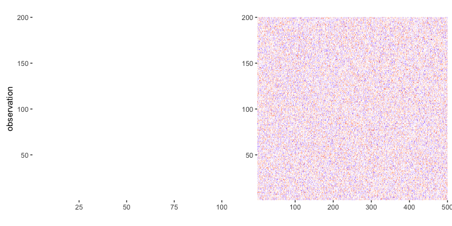

<!-- README.md is generated from README.Rmd. Please edit that file -->
ajive: Angle based Joint and Individual Variation Explained
-----------------------------------------------------------

**Author:** [Iain Carmichael](https://idc9.github.io/)<br/> **License:** [MIT](https://opensource.org/licenses/MIT)

This package is still under development -- more examples and code revisions coming soon.

Overview
========

Angle based Joint and Individual Variation Explained (AJIVE) is a dimensionality reduction algorithm for the multi-block setting[1] i.e. *K* different data matrices, with the same set of observations and (possibly) different numbers of variables) **AJIVE finds *joint* modes of variation which are common to all *K* data blocks as well as modes of *individual* variation which are specific to each block.** For a detailed discussion of AJIVE see [Angle-Based Joint and Individual Variation Explained](https://arxiv.org/pdf/1704.02060.pdf).

Installation
============

The `ajive` package is currently available using devtools

``` r
install.packages('devtools')
devtools::install_github("idc9/r_jive")
```

Usage
=====

Consider the following two block toy example: the first block has 200 observations (rows) and 100 variables; the second block has the same set of 200 observations and 500 variables (similar to Figure 2 of the AJIVE paper).

``` r
library(ajive)
toy_data <- sample_toy_data(n=200, dx=100, dy=500)
blocks <- lapply(toy_data, function(x) x[['obs']])
data_blocks_heatmap(blocks, show_color_bar=FALSE)
```



[1] Similar algorithms include [Cannonical Correlation Analysis](https://en.wikipedia.org/wiki/Canonical_correlation), [Partial Least Squares](https://www.stat.washington.edu/research/reports/2000/tr371.pdf), and [Principal Components Analysis](https://en.wikipedia.org/wiki/Principal_component_analysis) after concatenating the data blocks.
